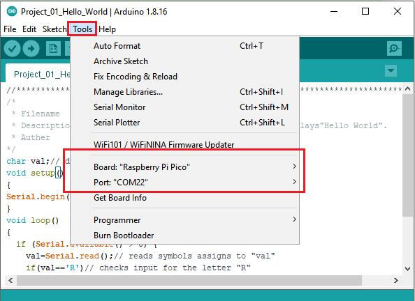
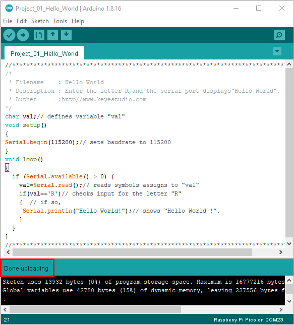

# Project 01: Hello World

1.**Introduction**

For Raspberry Pi Pico beginners, we will start with some simple things. In this project, you only need a Raspberry Pi Pico and a USB cable to complete the "Hello World\!" project, which is a test of communication between Raspberry Pi Pico and the PC as well as a primary project.

2.**Components**

|  |  |
| ------------------------------------------------------------ | ------------------------------------------------------------ |
| Raspberry Pi Pico*1                                          | USB Cable*1                                                  |


3.**Wiring Up**

In this project, we use a USB cable to connect the Raspberry Pi Pico to the compute


4.**Test Code**

You can open the code we provide:

```c
/*
 * Filename    : Hello World
 * Description : Enter the letter R,and the serial port displays"Hello World".
 * Auther      :http//www.keyestudio.com
*/
char val;// defines variable "val"
void setup()
{
Serial.begin(115200);// sets baudrate to 115200
}
void loop()
{
  if (Serial.available() > 0) {
    val=Serial.read();// reads symbols assigns to "val"
    if(val=='R')// checks input for the letter "R"
    {  // if so,    
     Serial.println("Hello World!");// shows “Hello World !”.
    }
  }
}
```


Before uploading the code to the Raspberry Pi Pico, please check the configuration of the Arduino IDE.

Click“**Tools**”，confirm the board type and port as follows:



Click to upload the text code to the Raspberry Pi Pico.


The code is uploaded successfully\!



5.**Test Result:**

After uploading successfully, click the icon to enter the serial display.

Set baud rate to 115200 and type "R" in the text box. Click "Send", the serial monitor will display "Hello World\!”.


