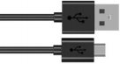

# Project 02: Onboard LED Flashing

**1. Description：**

There is an onboard LED in Raspberry Pi Pico,which is a GP25 pin attached to the Raspberry Pi Pico. In this project, we will learn the effect of making the onboard LED blink.


**2. Components**

|  |  |
| ------------------------------------------------------------ | ------------------------------------------------------------ |
| Raspberry Pi Pico*1                                          | USB Cable*1                                                  |


**3. Wiring up**

In this project, Raspberry Pi Pico is connected to a computer using a USB cable. 


**4. Test Code：**

The onboard LED of Raspberry Pi Pico is controlled by GP25. When the GP25 outputs high, the LED will be on; when outputting LOW, the LED will be off.

You can open the code we provide:

```c
/*
 * Filename    : Onboard LED flashing
 * Description : Make an led blinking.
 * Auther      : http//www.keyestudio.com
*/
#define LED_BUILTIN 25

// the setup function runs once when you press reset or power the board
void setup() {
  // initialize digital pin LED_BUILTIN as an output.
  pinMode(LED_BUILTIN, OUTPUT);
}

// the loop function runs over and over again forever
void loop() {
  digitalWrite(LED_BUILTIN, HIGH);   // turn the LED on (HIGH is the voltage level)
  delay(1000);                       // wait for a second
  digitalWrite(LED_BUILTIN, LOW);    // turn the LED off by making the voltage LOW
  delay(1000);                       // wait for a second
}
```


Before uploading Test Code to Raspberry Pi Pico, please check the configuration of Arduino IDE.

Click "Tools" to confirm that the board type and ports.


Click  to upload the test code to the Raspberry Pi Pico board.


The code was uploaded successfully.


**5. Test Result**

After the project code was uploaded successfully, the LED starts flashing.


