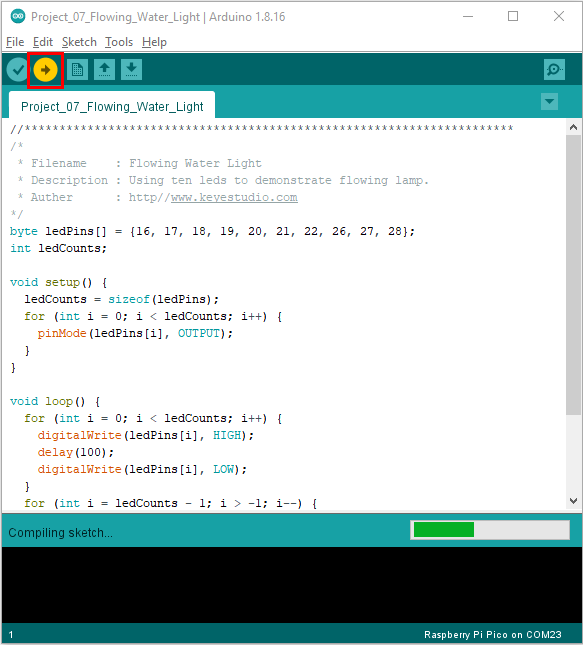

# Project 07: Flowing Light

1.**Introduction**

In our daily life, we can see many billboards made up of different colors of LED. They constantly change the light to attract the attention of customers. In this project, we will use Plus control board with 5 LEDs to achieve the effect of flowing water.

2.**Components Required**

|   |   |  |                                        |
| -------------------------------------- | -------------------------------------- | -------------------------------------- | -------------------------------------- |
| Raspberry Pi Pico*1                    | Raspberry Pi Pico Expansion Board*1    | Red LED*10                             |                                        |
|  |  |  |  |
| 220Ω Resistor*10                       | Breadboard*1                           | Jumper Wires                           | USB Cable*1                            |


3.**Circuit Diagram and Wiring Diagram**


**Note:**

How to connect the LED


How to identify the 220Ω 5-band resistor


4.**Test Code：**

You can open the code we provide:


```c
/* 
 * Filename    : Flowing Water Light
 * Description : Using ten leds to demonstrate flowing lamp.
 * Auther      : http//www.keyestudio.com
*/
byte ledPins[] = {16, 17, 18, 19, 20, 21, 22, 26, 27, 28};
int ledCounts;

void setup() {
  ledCounts = sizeof(ledPins);
  for (int i = 0; i < ledCounts; i++) {
    pinMode(ledPins[i], OUTPUT);
  }
}

void loop() {
  for (int i = 0; i < ledCounts; i++) {
    digitalWrite(ledPins[i], HIGH);
    delay(100);
    digitalWrite(ledPins[i], LOW);
  }
  for (int i = ledCounts - 1; i > -1; i--) {
    digitalWrite(ledPins[i], HIGH);
    delay(100);
    digitalWrite(ledPins[i], LOW);
  }
}
```


Before uploading Test Code to Raspberry Pi Pico, please check the configuration of Arduino IDE.

Click "Tools" to confirm that the board type and ports.


Click  to upload the test code to the Raspberry Pi Pico board



The code was uploaded successfully.


5.**Test Result：**

After burning the project code, connecting the wires and powering on, the 10 LEDs will gradually light up and then gradually go off.


