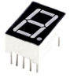
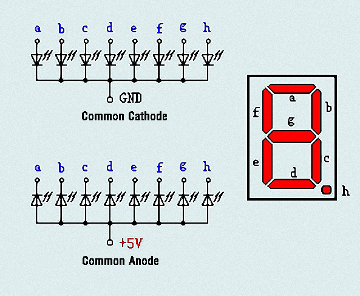
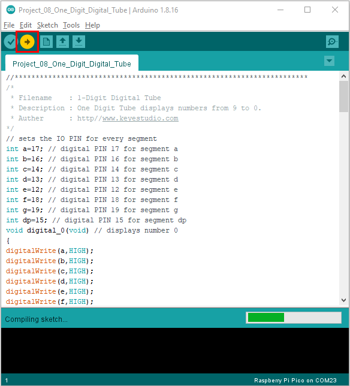
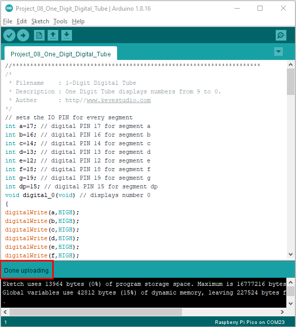

# Project 08: 1-Digit Digital Tube

1.**Introduction**

The seven-segment digital tube is an electronic display device that displays decimal numbers. It is widely used in digital clocks,
electronic meters, basic calculators and other electronic devices that display digital information. 

The tubes are an alternative to more complex dot-matrix displays that are easy to use in both limited light conditions and strong sunlight. In this project, we will use the PLUS control board to control 1-digit digital tube to display numbers.

2.**Components Required**

|                   |   |                  |                                         |
| --------------------------------------- | --------------------------------------- | --------------------------------------- | --------------------------------------- |
| Raspberry Pi Pico*1                     | Raspberry Pi Pico Expansion Board*1     | 1-digit Digital Tube*1                  |                                         |
|  |  |  |  |
| 220Ω Resistor*8                         | Breadboard*1                            | Jumper Wires                            | USB Cable*1                             |


3.**Component Knowledge**


**Display principle:** the digital tube display is a semiconductor light-emitting device. Its basic unit is a light-emitting diode (LED). The digital tube display can be divided into 7-segment digital tube and 8-segment digital tube according to the number of segments. 

The 8-segment digital tube has one more LED unit than the 7-segment digital tube (used for decimal point display). Each segment of the 7-segment LED display is a separate LED. According to the connection mode of the LED unit, the digital tube can be divided into a common anode digital tube and a common cathode digital tube.

In the common cathode 7-segment digital tube, all the cathodes (or negative electrodes) of the segmented LEDs are connected together, so you should connect the common cathode to GND. To light up a segmented LED, you can set its associated pin to “HIGH”.

In the common anode 7-segment digital tube, the LED anodes (positive electrodes) of all segments are connected together, so you should connect the common anode to “+5V”. To light up a segmented LED, you can set its associated pin to“LOW”.



Each part of the digital tube is composed of an LED. So when you use it, you also need to use a current limiting resistor. Otherwise, the LED will be damaged. In this experiment, we use an ordinary common cathode one-bit digital tube. 

As we mentioned above, you should connect the common cathode to GND. To light up a segmented LED, you can set its associated pin to“HIGH”.

4.**Circuit Diagram and Wiring Diagram**


**Note:** The direction of the 7-segment digital tube inserted into the breadboard is the same as the wiring diagram, and there is one more point in the lower right corner.


5.**Test Code：**

The number display is divided into 7 segments, and the decimal point display is divided into 1 segment. When certain numbers are displayed, the corresponding segment will be lit. For example, when the number 1 is displayed, segments b and c will be turned on.

You can open the code we provide:


```c
/* 
 * Filename    : 1-Digit Digital Tube
 * Description : One Digit Tube displays numbers from 9 to 0.
 * Auther      : http//www.keyestudio.com
*/
// sets the IO PIN for every segment
int a=17; // digital PIN 17 for segment a
int b=16; // digital PIN 16 for segment b
int c=14; // digital PIN 14 for segment c
int d=13; // digital PIN 13 for segment d
int e=12; // digital PIN 12 for segment e
int f=18; // digital PIN 18 for segment f
int g=19; // digital PIN 19 for segment g
int dp=15; // digital PIN 15 for segment dp
void digital_0(void) // displays number 0
{
digitalWrite(a,HIGH);
digitalWrite(b,HIGH);
digitalWrite(c,HIGH);
digitalWrite(d,HIGH);
digitalWrite(e,HIGH);
digitalWrite(f,HIGH);
digitalWrite(g,LOW);
digitalWrite(dp,LOW);
}
void digital_1(void) // displays number 1
{
digitalWrite(a,LOW);
digitalWrite(b,HIGH);
digitalWrite(c,HIGH);
digitalWrite(d,LOW);
digitalWrite(e,LOW);
digitalWrite(f,LOW);
digitalWrite(g,LOW);
digitalWrite(dp,LOW);
}
void digital_2(void) // displays number 2
{
digitalWrite(a,HIGH);
digitalWrite(b,HIGH);
digitalWrite(c,LOW);
digitalWrite(d,HIGH);
digitalWrite(e,HIGH);
digitalWrite(f,LOW);
digitalWrite(g,HIGH);
digitalWrite(dp,LOW);
}
void digital_3(void) // displays number 3
{
digitalWrite(a,HIGH);
digitalWrite(b,HIGH);
digitalWrite(c,HIGH);
digitalWrite(d,HIGH);
digitalWrite(f,LOW);
digitalWrite(e,LOW);
digitalWrite(dp,LOW);
digitalWrite(g,HIGH);
}
void digital_4(void) // displays number 4
{
digitalWrite(a,LOW);
digitalWrite(b,HIGH);
digitalWrite(c,HIGH);
digitalWrite(d,LOW);
digitalWrite(e,LOW);
digitalWrite(f,HIGH);
digitalWrite(g,HIGH);
digitalWrite(dp,LOW);
}
void digital_5(void) // displays number 5
{
digitalWrite(a,HIGH);
digitalWrite(b,LOW);
digitalWrite(c,HIGH);
digitalWrite(d,HIGH);
digitalWrite(e,LOW);
digitalWrite(f,HIGH);
digitalWrite(g,HIGH);
digitalWrite(dp,LOW);
}
void digital_6(void) // displays number 6
{
digitalWrite(a,HIGH);
digitalWrite(b,LOW);
digitalWrite(c,HIGH);
digitalWrite(d,HIGH);
digitalWrite(e,HIGH);
digitalWrite(f,HIGH);
digitalWrite(g,HIGH);
digitalWrite(dp,LOW);
}
void digital_7(void) // displays number 7
{
digitalWrite(a,HIGH);
digitalWrite(b,HIGH);
digitalWrite(c,HIGH);
digitalWrite(d,LOW);
digitalWrite(e,LOW);
digitalWrite(f,LOW);
digitalWrite(g,LOW);
digitalWrite(dp,LOW);
}
void digital_8(void) // displays number 8
{
digitalWrite(a,HIGH);
digitalWrite(b,HIGH);
digitalWrite(c,HIGH);
digitalWrite(d,HIGH);
digitalWrite(e,HIGH);
digitalWrite(f,HIGH);
digitalWrite(g,HIGH);
digitalWrite(dp,LOW);
}
void digital_9(void) // displays number 9
{
digitalWrite(a,HIGH);
digitalWrite(b,HIGH);
digitalWrite(c,HIGH);
digitalWrite(d,HIGH);
digitalWrite(e,LOW);
digitalWrite(f,HIGH);
digitalWrite(g,HIGH);
digitalWrite(dp,LOW);
}
void setup()
{
int i;// declares a Variable
for(i=12;i<=19;i++)
pinMode(i,OUTPUT);// sets PIN 12-19 to "output"
}
void loop()
{
while(1)
{
digital_9();// displays number 9
delay(1000); // waits a sencond
digital_8();// displays number 8
delay(1000); // waits a sencond
digital_7();// displays number 7
delay(1000); // waits a sencond
digital_6();// displays number 6
delay(1000); // waits a sencond
digital_5();// displays number 5
delay(1000); // waits a sencond
digital_4();// displays number 4
delay(1000); // waits a sencond
digital_3();// displays number 3
delay(1000); // waits a sencond
digital_2();// displays number 2
delay(1000); // waits a sencond
digital_1();// displays number 1
delay(1000);// waits a sencond
digital_0();// displays number 0
delay(1000);// waits a sencond
}}
```


Before uploading Test Code to Raspberry Pi Pico, please check the configuration of Arduino IDE.

Click "Tools" to confirm that the board type and ports.


Click  to upload the test code to the Raspberry Pi Pico board



The code was uploaded successfully.



6.**Result**

After burning the project code, connecting the wires and powering on, 1-digit digital tube will display numbers from 9 to 0.
