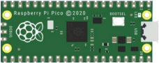
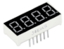
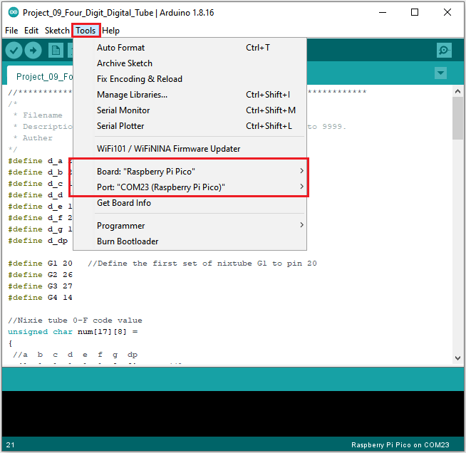
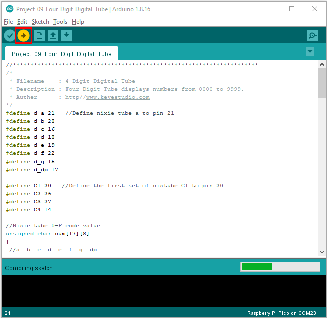
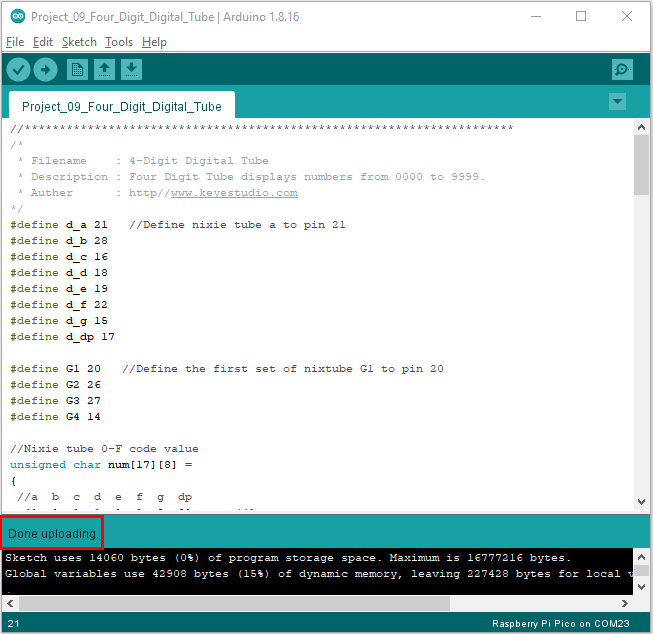

# Project 09：4-Digit Digital Tube

1.**Introduction**

The 4-digit 7-segment digital tube is a very practical display device, and it is used for devices such as electronic clocks and score counters.

Due to the low price and it is easy to use, more and more projects will use 4-digit 7-segment digital tubes. In this project, we will use the PLUS control board to control a 4-bit 7-segment digital tube to create a manual counter.

2.**Components Required**

|  |  |  |                                        |
| ------------------------------------- | ------------------------------------- | ------------------------------------- | -------------------------------------- |
| Raspberry Pi Pico*1                   | Raspberry Pi Pico Development Board*1 | 220Ω Resistor*8                       |                                        |
|  |  |  |  |
| Breadboard*1                          | Jumper Wires                          | 4-digit Tube Display*1                | USB Cable*1                            |


3.**Component Knowledge**


**4-digital tube display:**

The 4-digital tube display is is a semiconductor light-emitting device. Its basic unit is a light-emitting diode (LED). The digital tube display can be divided into 7-segment digital tube and 8-segment digital tube according to the number of segments. The 8-segment digital tube has one more LED unit than the 7-segment digital tube (used for decimal point display). Each segment of the 7-segment LED display is a separate LED.

According to the connection mode of the LED unit, the digital tube can be divided into a common anode digital tube and a common cathode digital tube.

In the common cathode 7-segment digital tube, all the cathodes (or negative electrodes) of the segmented LEDs are connected together, so you should connect the common cathode to GND. To light up a segmented LED, you can set its associated pin to“HIGH”.

Pins of control bit are G1, G2, G3 and G4.


4.**Wiring Diagram**


5.**Test Code**

You can open the code we provide:

```c
/* 
 * Filename    : 4-Digit Digital Tube
 * Description : Four Digit Tube displays numbers from 0000 to 9999.
 * Auther      : http//www.keyestudio.com
*/
#define d_a 21   //Define nixie tube a to pin 21
#define d_b 28
#define d_c 16
#define d_d 18
#define d_e 19
#define d_f 22
#define d_g 15
#define d_dp 17

#define G1 20   //Define the first set of nixtube G1 to pin 20
#define G2 26
#define G3 27
#define G4 14

//Nixie tube 0-F code value
unsigned char num[17][8] =
{
 //a  b  c  d  e  f  g  dp 
  {1, 1, 1, 1, 1, 1, 0, 0},     //0
  {0, 1, 1, 0, 0, 0, 0, 0},     //1
  {1, 1, 0, 1, 1, 0, 1, 0},     //2
  {1, 1, 1, 1, 0, 0, 1, 0},     //3
  {0, 1, 1, 0, 0, 1, 1, 0},     //4
  {1, 0, 1, 1, 0, 1, 1, 0},     //5
  {1, 0, 1, 1, 1, 1, 1, 0},     //6
  {1, 1, 1, 0, 0, 0, 0, 0},     //7
  {1, 1, 1, 1, 1, 1, 1, 0},     //8
  {1, 1, 1, 1, 0, 1, 1, 0},     //9
  {1, 1, 1, 0, 1, 1, 1, 1},     //A
  {1, 1, 1, 1, 1, 1, 1, 1},     //B
  {1, 0, 0, 1, 1, 1, 0, 1},     //C
  {1, 1, 1, 1, 1, 1, 0, 1},     //D
  {1, 0, 0, 1, 1, 1, 1, 1},     //E
  {1, 0, 0, 0, 1, 1, 1, 1},     //F
  {0, 0, 0, 0, 0, 0, 0, 1},     //.
};

void setup()
{
  pinMode(d_a,OUTPUT);    //Set to output pin
  pinMode(d_b,OUTPUT);
  pinMode(d_c,OUTPUT);
  pinMode(d_d,OUTPUT);
  pinMode(d_e,OUTPUT);
  pinMode(d_f,OUTPUT);
  pinMode(d_g,OUTPUT);
  pinMode(d_dp,OUTPUT);

  pinMode(G1,OUTPUT);
  pinMode(G2,OUTPUT);
  pinMode(G3,OUTPUT);
  pinMode(G4,OUTPUT);
}

void loop()
{

  //Start counting from 0 and gradually increase by 1 to 9999, repeating.
  for(int l = 0;l < 10;l++ )
  {
    for(int k = 0; k < 10;k++)
    {
      for(int j = 0; j < 10; j++)
      {
        for(int i = 0;i < 10;i++)
        {
          //125 flashes a second equals one second.
          //1000/8=125
          for(int q = 0;q<125;q++)
          {
            Display(1,l);//The first nixie tube shows the value of L.
            delay(2);
            Display(2,k);
            delay(2);
            Display(3,j);
            delay(2);
            Display(4,i);
            delay(2);
          }

        }
      }
    }
  }
  

}

//Display functions: g ranges from 1 to 4,num ranges from 0 to 9
void Display(unsigned char g,unsigned char n) 
{
  digitalWrite(d_a,LOW);      //Remove the light
  digitalWrite(d_b,LOW);
  digitalWrite(d_c,LOW);
  digitalWrite(d_d,LOW);
  digitalWrite(d_e,LOW);
  digitalWrite(d_f,LOW);
  digitalWrite(d_g,LOW);
  digitalWrite(d_dp,LOW);

  switch(g)           //Gate a choice
  {
    case 1:
      digitalWrite(G1,LOW);   //Choose the first digit
      digitalWrite(G2,HIGH);
      digitalWrite(G3,HIGH);
      digitalWrite(G4,HIGH);
      break;
    case 2:
      digitalWrite(G1,HIGH);
      digitalWrite(G2,LOW);   //Choose the second bit
      digitalWrite(G3,HIGH);
      digitalWrite(G4,HIGH);
      break;
    case 3:
      digitalWrite(G1,HIGH);
      digitalWrite(G2,HIGH);
      digitalWrite(G3,LOW);   //Choose the third bit
      digitalWrite(G4,HIGH);
      break;
    case 4:
      digitalWrite(G1,HIGH);
      digitalWrite(G2,HIGH);
      digitalWrite(G3,HIGH);
      digitalWrite(G4,LOW);   //Choose the fourth bit
      break;
    default:break;
  }

  digitalWrite(d_a,num[n][0]);      //a Queries the code value table
  digitalWrite(d_b,num[n][1]);
  digitalWrite(d_c,num[n][2]);
  digitalWrite(d_d,num[n][3]);
  digitalWrite(d_e,num[n][4]);
  digitalWrite(d_f,num[n][5]);
  digitalWrite(d_g,num[n][6]);
  digitalWrite(d_dp,num[n][7]);
}
```


Before uploading Test Code to Raspberry Pi Pico, please check the configuration of Arduino IDE.

Click "Tools" to confirm that the board type and ports.



Click  to upload the test code to the Raspberry Pi Pico board



The code was uploaded successfully.



6.**Result**

Upload the project code, wire up and power on, 4-digit digital tube circularly displays numbers from 0000 to 9999.
