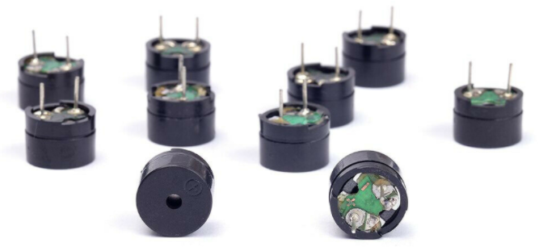
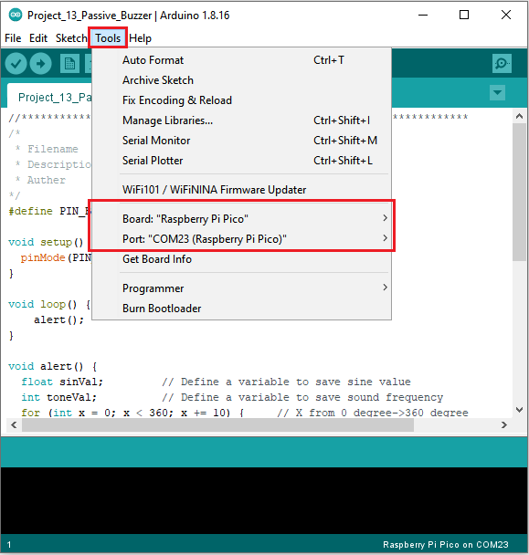
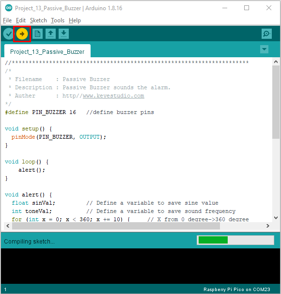
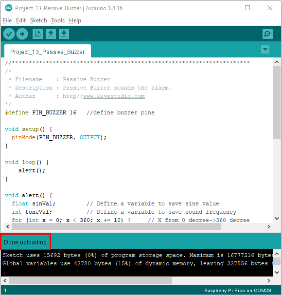

# Project 13：Passive Buzzer

1.**Introduction**

In this project, we will learn the passive buzzer and use the Plus control board to control the passive buzzer to play a song. Unlike an active buzzer, a passive buzzer can emit sounds of different
frequencies.

2.**Components Required**

|                   |   |   |
| --------------------------------------- | --------------------------------------- | --------------------------------------- |
| Raspberry Pi Pico*1                     | Raspberry Pi Pico Expansion Board*1     | Passive Buzzer*1                        |
|  |  |  |
| Breadboard*1                            | Jumper Wires                            | USB Cable*1                             |


3.**Component Knowledge**



A passive buzzer is an integrated electronic buzzer with no internal vibration source. It must be driven by 2K to 5K square wave, not a DC signal. 

The two buzzers are very similar in appearance, but one buzzer with a green circuit board is a passive buzzer, while the other with black tape is an active buzzer. Passive buzzers cannot distinguishbetween positive polarity while active buzzers can.


4.**Circuit Diagram and Wiring Diagram**


5.**Test Code：**

You can open the code we provide:


```C
/*
 * Filename    : Passive Buzzer
 * Description : Passive Buzzer sounds the alarm.
 * Auther      : http//www.keyestudio.com
*/
#define PIN_BUZZER 16   //define buzzer pins

void setup() {
  pinMode(PIN_BUZZER, OUTPUT);
}

void loop() {
    alert();
}

void alert() {
  float sinVal;         // Define a variable to save sine value
  int toneVal;          // Define a variable to save sound frequency
  for (int x = 0; x < 360; x += 10) {     // X from 0 degree->360 degree
    sinVal = sin(x * (PI / 180));       // Calculate the sine of x
    toneVal = 2000 + sinVal * 500;      // Calculate sound frequency according to the sine of x
    freq(PIN_BUZZER, toneVal, 10);
  }
}

void freq(int PIN, int freqs, int times) {
  if (freqs == 0) {
    digitalWrite(PIN, LOW);
  }
  else {
    for (int i = 0; i < times * freqs / 1000; i ++) {
      digitalWrite(PIN, HIGH);
      delayMicroseconds(1000000 / freqs / 2);
      digitalWrite(PIN, LOW);
      delayMicroseconds(1000000 / freqs / 2);
    }
  }
}
```


Before uploading Test Code to Raspberry Pi Pico, please check the configuration of Arduino IDE.

Click "Tools" to confirm that the board type and ports.



Click  to upload the test code to the Raspberry Pi Pico board



The code was uploaded successfully.



6.**Result**

Upload the project code, wire up and power on, then the passive buzzer will alarm.
