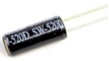
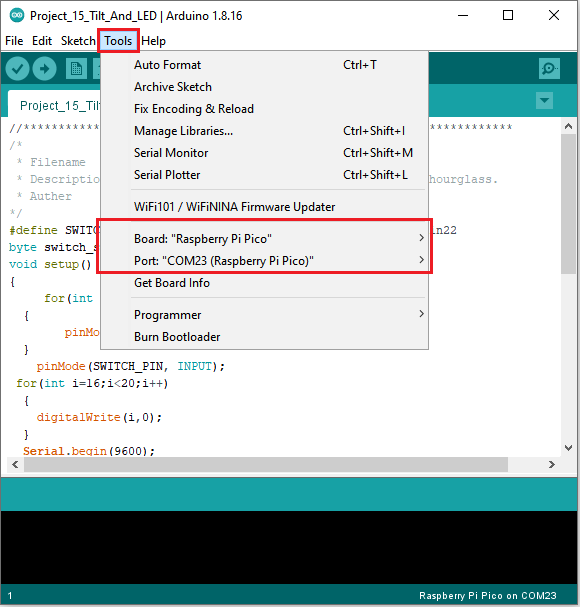

# Project 15：Tilt And LED

1.**Introduction**

In this lesson, we will use a PLUS mainboard , a tilt switch and 4 LED to make an electronic hourglass.

2.**Components Required**

|  |  |  |
| --------------------------------------- | --------------------------------------- | --------------------------------------- |
| Raspberry Pi Pico*1                     | Raspberry Pi Pico Expansion Board*1     | Tilt Switch*1                           |
|  |  |  |
| Breadboard*1                            | 220Ω Resistor*4                         | USB Cable*1                             |
|  |  |  |
| Red LED*4                               | 10KΩ Resistor*1                         | Jumper Wires                            |


3.**Component Knowledge**


Tilt switch is also called digital switch. Inside is a metal ball that can roll. The principle of rolling the metal ball to contact with the conductive plate at the bottom, which is used to control the on and off of the circuit. 

When it is a rolling ball tilt sensing switch with single directional trigger, the tilt sensor is tilted toward the trigger end (two gold-plated pin ends), the tilt switch is in a closed circuit and the voltage at the analog port is about 5V (binary number is 1023).

In this way, the LED will light up. When the tilt switch is in a horizontal position or tilted to the other end, it is open and the voltage of the analog port is about 0V (binary number is 0), the LED will turn off. 

In the program, we judge the state of the switch based on whether the voltage value of the analog port is greater than 2.5V (binary number is 512).

As shown in the figure, use the internal structure of the tilt switch to illustrate how it works.


4. **Circuit Diagram and Wiring Diagram**


Note:

How to connect the LED


How to identify the 220Ω 5-band resistor and 10KΩ 5-band resistor


5.**Test Code**


```C
/* 
 * Filename    : Tilt And LED
 * Description : Tilt switches and four leds to simulate an hourglass.
 * Auther      : http//www.keyestudio.com
*/
#define SWITCH_PIN  22  // the tilt switch is connected to Pin22
byte switch_state = 0;
void setup()
{
     for(int i=16;i<20;i++)
  {
        pinMode(i, OUTPUT);
  } 
    pinMode(SWITCH_PIN, INPUT);
 for(int i=16;i<20;i++)
  {
    digitalWrite(i,0);
  } 
  Serial.begin(9600);
}
void loop()
{
switch_state = digitalRead(SWITCH_PIN); 
Serial.println(switch_state);
 if (switch_state == 0) 
 {
 for(int i=16;i<20;i++)
  {
    digitalWrite(i,1);
    delay(500);
  } 
  }
   if (switch_state == 1) 
 {
   for(int i=19;i>15;i--)
   {
    digitalWrite(i,0);
    delay(500);
   }
  }
}
```


Before uploading Test Code to Raspberry Pi Pico, please check the configuration of Arduino IDE.

Click "Tools" to confirm that the board type and ports.



Click  to upload the test code to the Raspberry Pi Pico board.


The code was uploaded successfully.


6.**Result**

Upload project code, wire up and power up, hold the breadboard. When you tilt the breadboard to any angle, the LEDs will light up one by one.

When you turn the breadboard to the original angle, the LEDs will turn off one by one.
