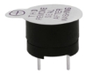
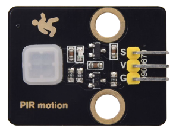
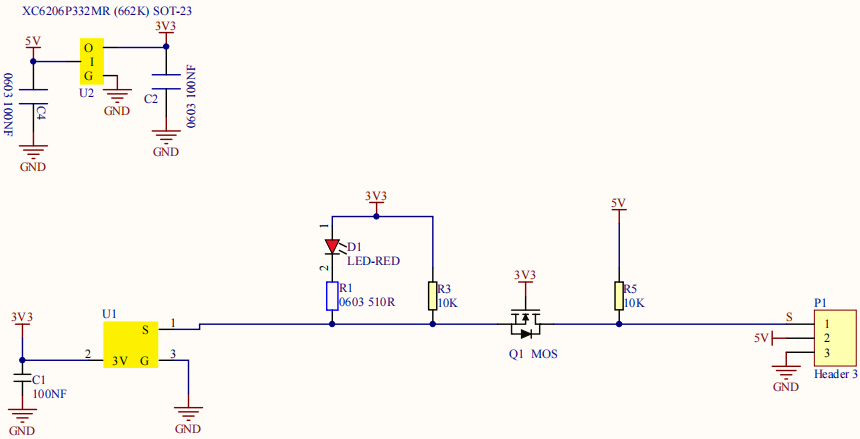
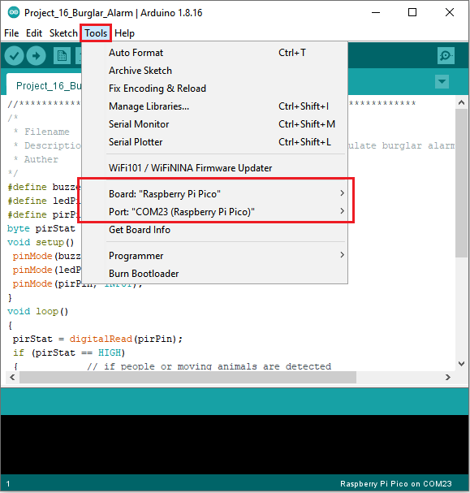
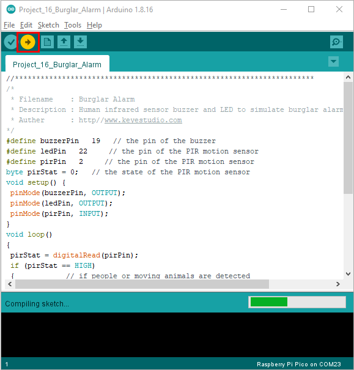
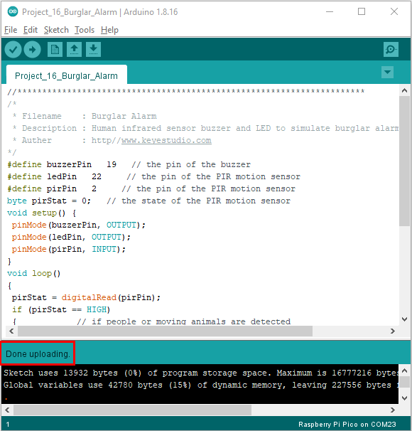

# Project 16：Burglar Alarm

1.**Introduction**

PIR motion sensor measures the thermal infrared (IR) light emitted by moving objects. The sensor can detect the movement of people, animals, and cars to trigger safety alarms and lighting. They are used to detect movement and ideal for security such as burglar alarms and security lighting systems. 

In this project, we will use a PIR motion sensor and buzzer to detect sounds when people or animals approach.

2.**Components Required**

|                  |  |  |  |  |
| --------------------------------------- | --------------------------------------- | --------------------------------------- | --------------------------------------- | --------------------------------------- |
| Raspberry Pi Pico*1                     | Raspberry Pi Pico Expansion Board*1     | PIR Motion Sensor*1                     | Active Buzzer*1                         | Red LED*1                               |
|  |  |                  |                  |                  |
| Breadboard*1                            | F-F Dupont Wires                        | 220Ω Resistor*1                         | USB Cable*1                             | Jumper Wires                            |

3.**Component Knowledge**



**PIR motion sensor:** 

The principle is that when certain crystals, such as lithium tantalate and triglyceride sulfate, are heated, the two ends of the crystal will generate an equal number of charges with opposite signs. These charges can be converted into voltage output by an amplifier. 

And the human body will release infrared light, although
relatively weak, but still can be detected. When the PIR motion sensor detects the movement of a nearby person, the sensor signal terminal outputs a high level 1. 

Otherwise, it outputs a low level 0. Pay special attention that this sensor can detect people, animals and cars in motion. People, animals and cars at rest cannot be detected. The maximum detection distance is about 7 meters.

**Note:** 

Since vulnerable to radio frequency radiation and temperature changes, the PIR motion sensor should be kept away from heat sources like radiators, heaters and air conditioners, as well as direct irradiation of sunlight, headlights and incandescent light.


4.**Features:**

- Maximum input voltage: DC 3.3 ~ 5V

- Maximum operating current: 50MA

- Maximum power: 0.3W

- Operating temperature: -20 ~ 85℃

- Output high level is 3V, low level is 0V.

- Delay time: about 2.3 to 3 seconds

- Detection Angle: about 100 degrees

- Maximum detection distance: about 7 meters

- Indicator light output (when the output is high, it will light up)

- Pin limiting current: 50MA


5.**Schematic diagram:**




6.**Circuit Diagram and Wiring Diagram**


7.**Test Code：**

You can open the code we provide:


```C
/* 
 * Filename    : Burglar Alarm
 * Description : Human infrared sensor buzzer and LED to simulate burglar alarm.
 * Auther      : http//www.keyestudio.com
*/
#define buzzerPin   19   // the pin of the buzzer
#define ledPin   22     // the pin of the PIR motion sensor
#define pirPin   2     // the pin of the PIR motion sensor
byte pirStat = 0;   // the state of the PIR motion sensor
void setup() {
 pinMode(buzzerPin, OUTPUT); 
 pinMode(ledPin, OUTPUT);    
 pinMode(pirPin, INPUT);     
}
void loop()
{
 pirStat = digitalRead(pirPin); 
 if (pirStat == HIGH)
 {            // if people or moving animals are detected
   digitalWrite(buzzerPin, HIGH);  // the buzzer buzzes
   digitalWrite(ledPin, HIGH);  // the led turn on
   delay(500);
   digitalWrite(buzzerPin, LOW);  // the buzzer doesn't sound
   digitalWrite(ledPin, LOW);  // the led turn off
   delay(500);
 } 
 else {
   digitalWrite(buzzerPin, LOW); // if people or moving animals are not detected, turn off buzzers
   digitalWrite(ledPin, LOW);  // the led turn off
 }
}
```


Before uploading Test Code to Raspberry Pi Pico, please check the configuration of Arduino IDE.

Click "Tools" to confirm that the board type and ports.



Click  to upload the test code to the Raspberry Pi Pico board



The code was uploaded successfully.



8.**Test Result：**

Upload the code and power up. The active buzzer will alarm and LED will flash, if people are detected
