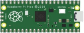

# Project 17: I2C 128×32 LCD

1.**Introduction**

We can use modules such as monitors to do various experiments in life. You can also DIY a variety of small objects. For example, you can make a temperature meter with a temperature sensor and display, or make a distance meter with an ultrasonic module and display.

In this project, we will use the LCD\_128X32\_DOT module as a display and connect it to the Plus control board. The pico board will be used to control the LCD\_128X32\_DOT display to show various English characters, common symbols and numbers.


2.**Components Required**

|  |  |  |  |
| ----------------------- | ----------------------- | ----------------------- | ----------------------- |
| Raspberry Pi Pico*1     | LCD_128X32_DOT*1        | 10CM M-F Dupont Wires   | USB Cable*1             |

3.**Component Knowledge**


**LCD\_128X32\_DOT:** 

It is an LCD module with 128\*32 pixels and its driver chip is ST7567A. 

The module uses the IIC communication mode, while the code contains a library of all alphabets and common symbols that can be called directly. 

When using, we can also set it in the code so that the English letters and symbols show different text sizes.


4.**Schematic diagram:**


5.**Features:**

- Pixel：128\*32 character

- Operating voltage(chip)：4.5V to 5.5V

- Operating current：100mA (5.0V)

- Optimal operating voltage(module):5.0V


6.**Connection Diagram**

**Attention**: 

You must use a 10CM short male-to-female DuPont cable to connect the LCD\_128X32\_DOT, and the LCD\_128X32\_DOT will display normally.

Otherwise, using a 20CM long male-to-female DuPont cable may cause the LCD\_128X32\_DOT to display abnormally.


7.**Adding the lcd128\_32\_io library：**

We need the **lcd128\_32\_io library.** You can add it as follows:

Open the Arduino IDE，click“Sketch”→“Include Library”→“Add .zip Library...”.

Then go to the folder ...\\Libraries\\LCD\_128X32.Zip，Click LCD\_128X32.Zip，and then click “Open”.


8.**Test Code：**

After adding the **lcd128\_32\_io library**, you can open the code we provide.

You can open the code we provide:


```C
/*
 * Filename    : LCD 128*32
 * Description : LCD 128*32 display string
 * Auther      : http//www.keyestudio.com
*/
#include "lcd128_32_io.h"

//Create lCD128 *32 pin，sda--->20， scl--->21
lcd lcd(20, 21);

void setup() {
  lcd.Init(); //initialize
  lcd.Clear();  //clear
}

void loop() {
  lcd.Cursor(0, 4); //Set display position
  lcd.Display("KEYESTUDIO"); //Setting the display
  lcd.Cursor(1, 0);
  lcd.Display("ABCDEFGHIJKLMNOPQR");
  lcd.Cursor(2, 0);
  lcd.Display("123456789+-*/<>=$@");
  lcd.Cursor(3, 0);
  lcd.Display("%^&(){}:;'|?,.~\\[]");
}
```


Before uploading Test Code to Raspberry Pi Pico, please check the configuration of Arduino IDE.

Click "Tools" to confirm that the board type and ports.


Click  to upload the test code to the Raspberry Pi Pico board.


The code was uploaded successfully.


9.**Test Result：**

Upload the test code, wire up and power on, the LCD module display will show "KEYESTUDIO" at the first line. 

"ABCDEFGHIJKLMNOPQR" will be displayed at the second line. 

"123456789 + - \* / \<\> = $ @ " will shown at the third line and "% ^ & () {} :; '|?,. \~ \\\\ \[\] " will be displayed at the fourth line.
