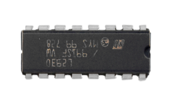

# Project 18：Small Fan

1.**Introduction**

In the hot summer, we need an electric fan to cool us down, so in this project, we will use the Plus control board to control 130 motor module and small blade to make a small fan.

2.**Components Required**

|  |              |                         |
| ----------------------- | ----------------------------------- | ----------------------- |
| Raspberry Pi Pico*1     | Raspberry Pi Pico Expansion Board*1 |                         |
|  |              |  |
| L293D Chip*1            | DC Motor*1                          | Breadboard*1            |
|  |              |  |
| Fan*1                   | Jumper Wires                        | USB Cable*1             |


3. **Component Knowledge:**



**L293D Chip：**

L293D is a direct current drive IC, which can be used to drive DC motor or stepper motor in some robot projects.

It has a total of 16 pins and can drive two-channel DC motors at the same time.

Its Input voltage range is 4.5 V \~ 36 V, the output current of per channel is MAX 600mA, which can drive inductive loads. What’s more, its input end can be directly connected and controlled by the single-chip microcomputer.

When driving a small DC motor, the control of two-channel motors and the forward and reverse rotation can be realized by changing the high and low level of the input terminal. There are many motor drive boards using L293D chips on the market, of course, we can also use it via simply connecting.

**L293D Pin out：**


|  No  |    Name    | Description                                 |
| :--: | :--------: | ------------------------------------------- |
|  1   | Enable1,2  | Enable pin Input 1(2)and Input 2(7)         |
|  2   |   Input1   | Directly input pin 1via digital circuit     |
|  3   |  Output1   | Connected to one end of motor1              |
|  4   |    GND     | Grounded(0V)                                |
|  5   |    GND     | Grounded(0V)                                |
|  6   |  Output2   | Connected to one end of motor1              |
|  7   |   Input2   | Directly output pin 2 via digital circuit   |
|  8   | Vcc2 (Vss) | Connected to voltage pin of motor(4.5V-36V) |
|  9   | Enable3,4  | Enable pin 3(10)and 4(15)                   |
|  10  |   Input3   | Input3 pin, controlled by digital circuit   |
|  11  |  Output3   | Connected to one end of motor2              |
|  12  |    GND     | Grounded(0V)                                |
|  13  |    GND     | Grounded(0V)                                |
|  14  |  Output4   | Connected to one end of motor2              |
|  15  |   Input4   | Input4 pin, controlled by digital circuit   |
|  16  | Vcc1(Vss)  | Connect + 5V to enable IC function          |


4.**Circuit diagram and wiring diagram：**


5.**Test Code：**

You can open the code we provide:

```C
/*
 * Filename    : Small Fan
 * Description : Fan clockwise rotation,stop,counterclockwise rotation,stop,cycle.
 * Auther      : http//www.keyestudio.com
*/
#define IN1 17  // the IN1 pin of the L293D
#define IN2 16  //the IN2 pin of the L293D
#define ENA 18  //the ENA pin of the L293D
void setup()
{
pinMode(IN1,OUTPUT); //set N1 to OUTPUT
pinMode(IN2,OUTPUT); //set N2 to OUTPUT
pinMode(ENA,OUTPUT); //set ENA to OUTPUT
}
void loop()
{
//rotate clockwise for 5s
digitalWrite(IN1,LOW);
digitalWrite(IN2,HIGH);
analogWrite(ENA,250);
delay(5000);
//stop for 2s 
analogWrite(ENA,0);
delay(2000);
//rotate anticlockwise for 5s
digitalWrite(IN1,HIGH);
digitalWrite(IN2,LOW);
analogWrite(ENA,250);
delay(5000);
//stop for 2s
analogWrite(ENA,0);
delay(2000);
}
```


Before uploading Test Code to Raspberry Pi Pico, please check the configuration of Arduino IDE.

Click "Tools" to confirm that the board type and ports.


Click  to upload the test code to the Raspberry Pi Pico board


6.**Test Result：**

Upload the code and power up with a USB cable. You can see the fan rotate anticlockwise for 5s, stop for 2s, clockwise for 5s and stop for 2s.
