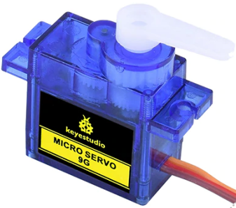
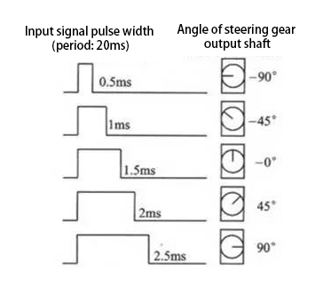
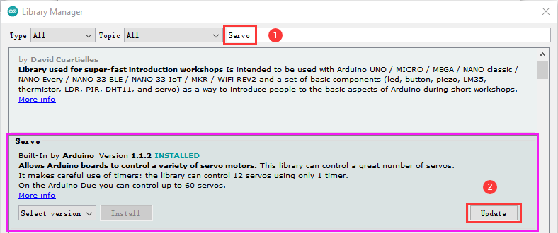
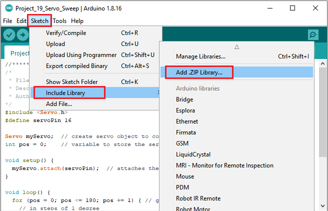
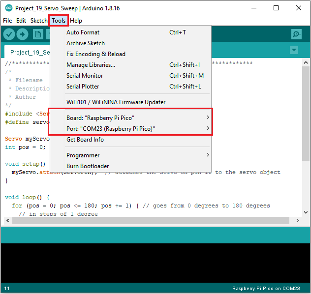
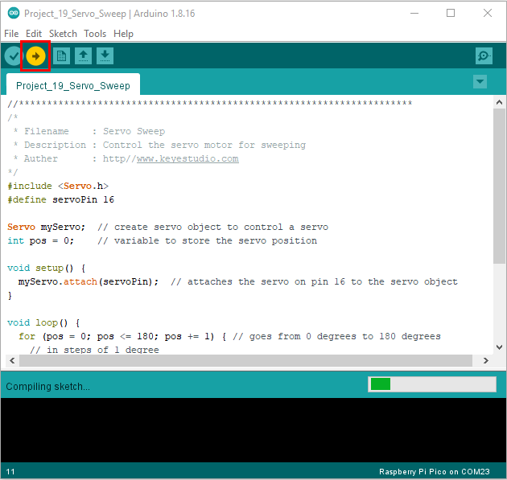
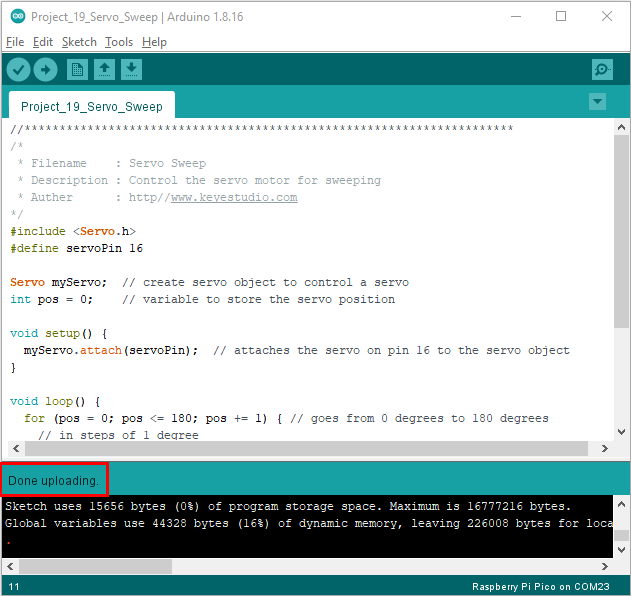

# Project 19：Servo Sweep

1.**Introduction**

Servo is a kind of motor that can rotate very precisely. It has been widely used in toy cars, RC helicopters, airplanes, robots, etc. 

In this project, we will use the pico board to control the rotation of the servo.


2.**Components Required**

|  |              |                         |
| ----------------------- | ----------------------------------- | ----------------------- |
| Raspberry Pi Pico*1     | Raspberry Pi Pico Expansion Board*1 |                         |
|  |              |  |
| Servo*1                 | Jumper Wires                        | USB Cable*1             |


3.**Component Knowledge**

**Servo:**



The servo is a kind of position servo driver, which is mainly composed of housing, circuit board, coreless motor, gear and position detector.

The working principle is that the receiver or microcontroller sends a signal to the servo, which has an internal reference circuit that generates a reference signal with a period of 20ms and a width of 1.5ms, and compares the DC bias voltage with the voltage of the potentiometer to output voltage difference. 

The IC on the circuit board determines the direction of rotation, and then drives the coreless motor to start rotation and transmits the power to the swing arm through the reduction gear, while the position detector sends back a signal to determine whether it has reached the positioning. It is suitable for those control systems that require constant change of angle and can be maintained.

When the motor rotates at a certain speed, the potentiometer is driven by the cascade reduction gear to rotate so that the voltage difference is 0 and the motor stops rotating. The angle range of general servo rotation is 0 to 180 degrees.

The pulse period for controlling the servo is 20ms, the pulse width is 0.5ms to 2.5ms, and the corresponding position is -90° to +90°. The following is an example of a 180 degree servo.



Servo motors have many specifications, but they all have three connecting wires, which are brown, red, and orange (different brands may have different colors). 

The brown is GND, the red is the positive power supply, and the orange is the signal line.


4.**Wiring Diagram**

The supply voltage should be 3.3V-5V. Make sure you don't get any errors when connecting the servos to the power supply


5.**Adding the Servo library：**

If you added the **Servo library,** just skip this step.

Method 1：

Search Servo, select Servo and click Update.




Method 2：

Open Arduino IDE，click“Sketch”→“Include Library”→“Add .zip Library...”.

Go to the folder ...\\Libraries\\Servo.Zip. Click“Servo.Zip”and“Open”.




6.**Test Code：**

You can open the code we provide:

```C
/*
 * Filename    : Servo Sweep
 * Description : Control the servo motor for sweeping
 * Auther      : http//www.keyestudio.com
*/
#include <Servo.h>
#define servoPin 16

Servo myServo;  // create servo object to control a servo
int pos = 0;    // variable to store the servo position

void setup() {
  myServo.attach(servoPin);  // attaches the servo on pin 16 to the servo object
}

void loop() {
  for (pos = 0; pos <= 180; pos += 1) { // goes from 0 degrees to 180 degrees
    // in steps of 1 degree
    myServo.write(pos);              // tell servo to go to position in variable 'pos'
    delay(15);                       // waits 15 ms for the servo to reach the position
  }
  for (pos = 180; pos >= 0; pos -= 1) { // goes from 180 degrees to 0 degrees
    myServo.write(pos);              // tell servo to go to position in variable 'pos'
    delay(15);                       // waits 15 ms for the servo to reach the position
  }
}
```


Before uploading Test Code to Raspberry Pi Pico, please check the configuration of Arduino IDE.

Click "Tools" to confirm that the board type and ports.



Click  to upload the test code to the Raspberry Pi Pico board



The code was uploaded successfully.



7.**Test Result：**

Upload the code and power up with a USB cable. The servo will rotate from 0° to 180°, then from 180° to 0° .


