# Project 20：Stepping Motor

1.**Introduction**

Stepper motors are accurately positioned and are the most important components in industrial robots, 3D printers, large lathes, and other mechanical devices. In this project, we will use a stepper motor and a clock paper card to make a clock model.


2.**Components Required**

| 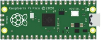 | 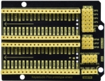             |              |
| ----------------------- | ----------------------------------- | ----------------------------------- |
| Raspberry Pi Pico*1     | Raspberry Pi Pico Expansion Board*1 | ULN2003 Stepper Motor Drive Board*1 |
| 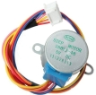 | 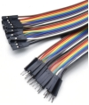             |              |
| Stepper Motor *1        | M-F Dupont Wires                    | USB Cable*1                         |


3.**Component Knowledge**

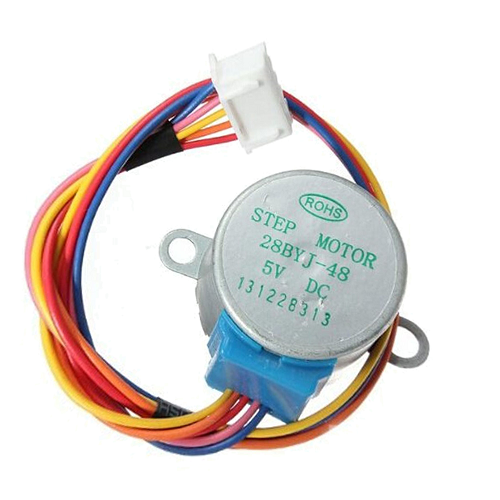

**Stepper motor:** 

It is a motor controlled by a series of electromagnetic coils. It can rotate by the exact number of degrees (or steps) needed, allowing you to move it to a precise position and keep it there. It does this by supplying power to the coil inside the motor in a very short time, but you must always supply power to the motor to keep it in the position you want. 

There are two basic types of stepping motors, namely unipolar stepping motor and bipolar stepping motor. In this project, we use a 28-BYJ48 unipolar stepper motor.

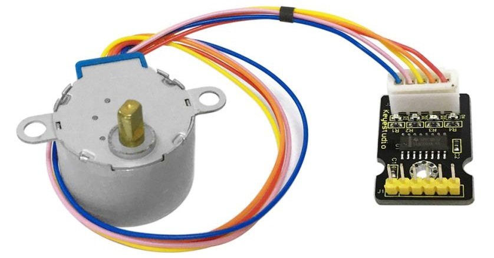

**Working Principle:**

The stepper motor is mainly composed of a stator and a rotor. The stator is fixed. As shown in the figure below, the part of the coil group A, B,C, and D will generate a magnetic field when the coil group is energized. The rotor is the rotating part. As follows, the middle part of the stator, two poles are permanent magnets.


Single -phase four beat: 

At the beginning, the coils of group A are turned on, and the poles of the rotor point at A coil. Next, the group A coil are disconnected, and the group B coils are turned on. 

The rotor will turn clockwise to the group B. Then, group B is disconnected, group C is turned on, and the rotor is turned to group C. After that, group C is disconnected, and group D is turned on, and the rotor is turned to group D. Finally, group D is disconnected, group A is turned on, and the rotor is turned to group A coils. 

Therefore, rotor turns 180° and continuously rotates B-C-D-A, which means it runs a circle (eight phase). As shown below, he rotation principle of stepper motor is A - B- C - D - A.

You make order inverse(D - C - B - A - D .....) if you want to make stepper motor rotate anticlockwise.


Half-phase and eight beat: 

8 beat adopts single and dual beat way，A - AB - B - BC - C - CD - D - DA - A ...... ，rotor will rotate half phase in this order. For example, when A coil is electrified，rotor faces to A coil then A and B coil are connected, on this condition, the strongest magnetic field produced lies in the central part of AB coil, which means rotating half-phase clockwise.

**Stepper Motor Parameters:**

The rotor rotates one circle when the stepper motor we provide rotates 32 phases and with the output shaft driven by 1:64 reduction geared set. Therefore the rotation (a circle) of output shaft requires 2048 phases.

The step angle of 4-beat mode of 5V and 4-phase stepper motor is 11.25. And the step angle of 8-beat mode is 5.625, the reduction ratio is 1:64.

**ULN2003Stepper Motor Drive Board:** 

It is stepper motor driver.

The following schematic diagram shows how to use the ULN2003 stepper motor driver board interface to connect a unipolar stepper motor to the pins of the Plus control board, and shows how to use four TIP120 interfaces.

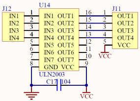

4.**Schematic Diagram and Wiring Diagram**

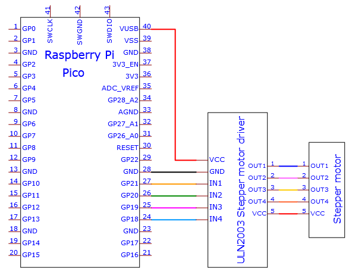

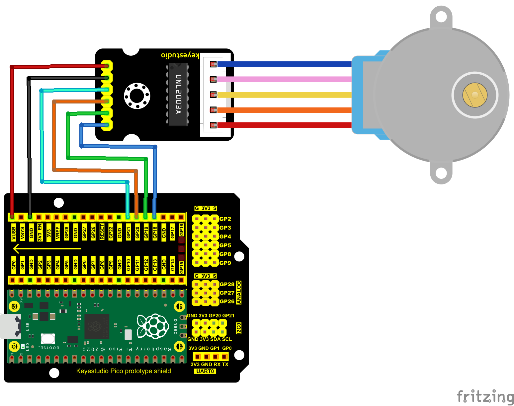

5.**Test Code：**

You can open the code we provide:

```C
/*
 * Filename    : Drive Stepper Motor
 * Description : Use ULN2003 to drive the stepper motor.
 * Auther      : http//www.keyestudio.com
*/
// Conncet the port of the stepper motor driver
int outPorts[] = {21, 20, 19, 18};

void setup() {
  // set pins to output
  for (int i = 0; i < 4; i++) {
    pinMode(outPorts[i], OUTPUT);
  }
}

void loop()
{
  // Rotate a full turn
  moveSteps(true, 32 * 64, 3);
  delay(1000);
  // Rotate a full turn towards another direction
  moveSteps(false, 32 * 64, 3);
  delay(1000);
}

//Suggestion: the motor turns precisely when the ms range is between 3 and 20
void moveSteps(bool dir, int steps, byte ms) {
  for (unsigned long i = 0; i < steps; i++) {
    moveOneStep(dir); // Rotate a step
    delay(constrain(ms,3,20));        // Control the speed
  }
}

void moveOneStep(bool dir) {
  // Define a variable, use four low bit to indicate the state of port
  static byte out = 0x01;
  // Decide the shift direction according to the rotation direction
  if (dir) {  // ring shift left
    out != 0x08 ? out = out << 1 : out = 0x01;
  }
  else {      // ring shift right
    out != 0x01 ? out = out >> 1 : out = 0x08;
  }
  // Output singal to each port
  for (int i = 0; i < 4; i++) {
    digitalWrite(outPorts[i], (out & (0x01 << i)) ? HIGH : LOW);
  }
}

void moveAround(bool dir, int turns, byte ms){
  for(int i=0;i<turns;i++)
    moveSteps(dir,32*64,ms);
}
void moveAngle(bool dir, int angle, byte ms){
  moveSteps(dir,(angle*32*64/360),ms);
}
```


Before uploading Test Code to Raspberry Pi Pico, please check the configuration of Arduino IDE.

Click "Tools" to confirm that the board type and ports.

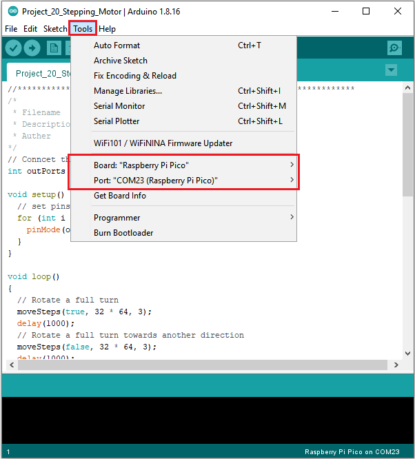

The code was uploaded successfully.

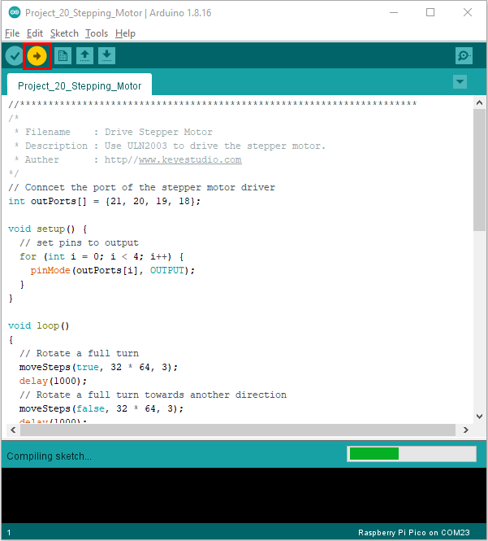

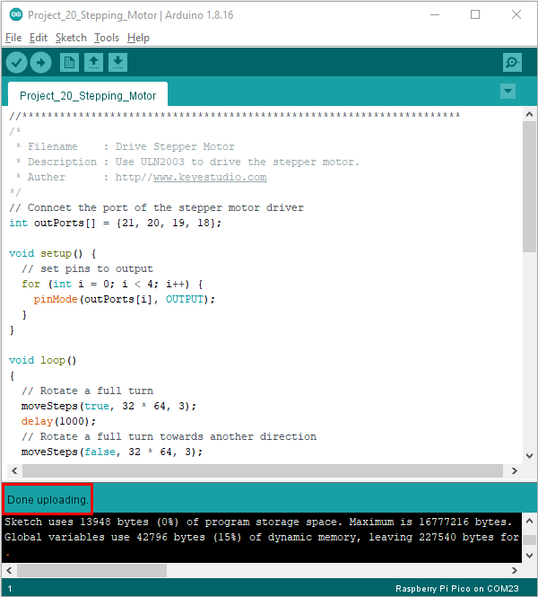

6.**Result**

Upload the project code to the pico board, wire up and power on first. The four LEDs D1D2D3D4 on the ULN2003 driving module will be turned on and the stepper motor will rotate clockwise first, then counterclockwise.


