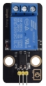
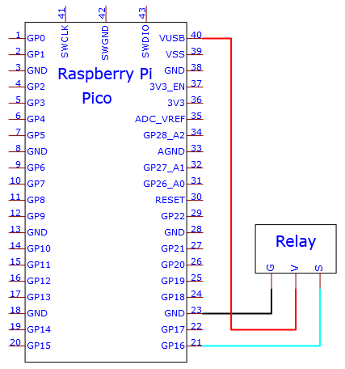

# Project 21: Relay

1.**Introduction**

In daily life, we generally use AC to drive electrical equipment, and sometimes we use switches to control electrical appliances. If the switch is directly connected to the AC circuit, once electricity leakage occurs, people are in danger. 

From a safety point of view, we specially designed this relay module with NO (normally open) and NC (normally closed) terminals. 

In this lesson we will learn a special and easy-to-use switch, which is the relay module.


2.**Components Required**

|  |  |  |  |  |
| -------------------------------------- | -------------------------------------- | -------------------------------------- | -------------------------------------- | -------------------------------------- |
| Raspberry Pi Pico*1                    | Raspberry Pi Pico Expansion Board*1    | Relay Module*1                         | M-F Dupont Wire                        | USB Cable*1                            |

3.**Component Knowledge**

**Relay:** It is an "automatic switch" that uses a small current to control the operation of a large current.

Input voltage：5V

Rated load：5A 250VAC (NO/NC) 5A 24VDC (NO/NC)

The rated load means that a 5V Arduino can be used to control a device with a 24V DC voltage or a 250V AC voltage.


4.**Schematic Diagram and Wiring Diagram**




5.**Test Code：**

You can open the code we provide:


```C
/*
 * Filename    : Relay
 * Description : Relay turn on and off.
 * Auther      : http//www.keyestudio.com
*/
#define  Relay  16 // defines digital 16
void setup()
{
pinMode(Relay, OUTPUT); // sets "Relay" to "output"
}
void loop()
{
digitalWrite(Relay, HIGH); // turns on the relay
delay(1000); //delays 1 seconds
digitalWrite(Relay, LOW); // turns off the relay
delay(1000); // delays 1 seconds
}
```


Before uploading Test Code to Raspberry Pi Pico, please check the configuration of Arduino IDE.

Click "Tools" to confirm that the board type and ports.


Click  to upload the test code to the Raspberry Pi Pico board


The code was uploaded successfully.


6.**Result**

Upload the code to successfully, wire up and power on, the relay will be turned on (ON end is connected) for 1 second, and stop (NC end is connected) for 1s.
