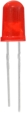
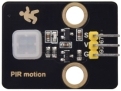
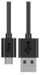

# Project 25：Human Induction Lamp

1.**Introduction**

With the development of science and technology, the use of human induction lamp that usually used in the dark corridor area is very common in our real life, such as the corridor of the community, the bedroom of the room, the garage of the dungeon, the bathroom and so on. The human induction lamp are generally composed of a PIR Motion Sensor, a lamp, a photoresistor sensor and so on. 

In this project, we will learn how to use a PIR Motion Sensor, LEDs, and a photoresistor to make a human induction lamp .


2.**Components Required**

|  |  |  |  |    |                                         |
| ------------------------------------- | ------------------------------------- | ------------------------------------- | ------------------------------------- | --------------------------------------- | --------------------------------------- |
| Raspberry Pi Pico*1                   | Raspberry Pi Pico Expansion Board*1   | Photoresistor*1                       | Red LED*1                             | 10KΩResistor*1                          |                                         |
|  |  |  |  |  |  |
| Breadboard*1                          | PIR Motion Sensor*1                   | 220ΩResistor*1                        | F-F Dupont Wires                      | Jumper Wires                            | USB Cable*1                             |


**3.Circuit Diagram and Wiring Diagram**


You can open the code we provide:


```c
/*  
 * Filename    : Human Induction Lamp
 * Description : Controlling the LED by photosensitive sensor and PIR motion sensor.
 * Auther      : http//www.keyestudio.com
*/
#define PIN_ADC0  26   //the pin of the photosensitive sensor
#define PIN_LED1   16  // the pin of the External LED
#define PIN_LED2   25  // the pin of the built-in LED on the Pico board
#define pirPin   2     // the pin of the PIR motion sensor
byte pirStat = 0;   // the state of the PIR motion sensor
void setup() {
  pinMode(PIN_LED1, OUTPUT);
  pinMode(PIN_LED2, OUTPUT);
  pinMode(PIN_ADC0, INPUT);
  pinMode(pirPin, INPUT);
}

void loop() {
  int adcVal = analogRead(PIN_ADC0); //read the ADC value of photosensitive sensor
  pirStat = digitalRead(pirPin); //read the value of PIR motion sensor
  if (adcVal >= 500) {
      digitalWrite(PIN_LED2, HIGH); //turn on the built-in LED on the Pico board 
      if (pirStat == HIGH){
         digitalWrite(PIN_LED1, HIGH);//turn on the External LED
         } 
      else{
         digitalWrite(PIN_LED1, LOW);//turn off the External LED   
        }
  }
   else{
      digitalWrite(PIN_LED1, LOW);//turn off the External LED
      digitalWrite(PIN_LED2, LOW);//turn off the built-in LED on the Pico board
      }
}
```


Before uploading Test Code to Raspberry Pi Pico, please check the configuration of Arduino IDE.

Click "Tools" to confirm that the board type and ports.


Click  to upload the test code to the Raspberry Pi Pico board


4.**Test Result：**

Upload the code and power up with a USB cable. If you cover the photoresistor, the light intensity will gets dim and the LED on the pico board will be on. If you wave your hand in front of the PIR motion sensor, the external LED will be on. Once you stop waving, the LED will be off.

If the photoresistor is not covered, LED will be off and at this time, if you wave your hands in front of the PIR sensor, the external LED will be off.
