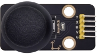
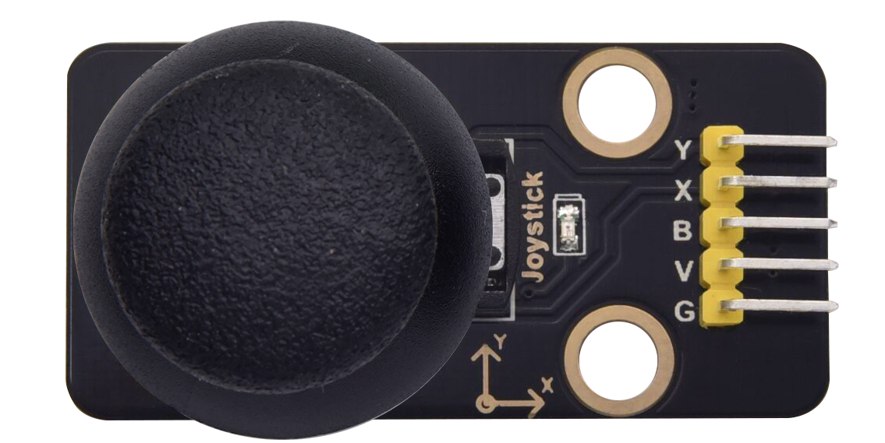

# Project 26：Rocker control light

1.**Introduction**

The joystick module is a component with two analog inputs and one digital input. It is widely used in game operation, robot control, drone control and other fields.

In this project, we will use a Raspberry Pi Pico and a joystick module to control RGB. You can have a deeper understanding of the principle and operation of the joystick module in practice.


2.**Components Required**

|                  |  |  |
| --------------------------------------- | --------------------------------------- | --------------------------------------- |
| Raspberry Pi Pico*1                     | Raspberry Pi Pico Expansion Board*1     | Joystick Module*1                       |
|  |  |  |
| RGB LED*1                               | 220ΩResistor*3                          | Jumper Wires                            |
|  |  |  |
| USB Cable*1                             | M-F Dupont Wires                        | Breadboard*1                            |


3.**Component Knowledge**



**Joystick module**: 

It mainly uses PS2 joystick components. In fact, the joystick module has 3 signal terminal pins, which simulate a three-dimensional space. The pins of the joystick module are GND, VCC, and signal terminals (B, X, Y). The signal terminals X and Y simulate the X-axis and Y-axis of the space. 

When controlling, the X and Y signal terminals of the module are connected to the analog port of the microcontroller. The signal terminal B simulates the Z axis of the space, it is generally connected to the digital port and used as a button.

VCC is connected to the microcontroller power output VCC (3.3V or 5V), GND is connected to the microcontroller GND, the voltage in the original state is about 1.65V or 2.5V. 

In the X-axis direction, when moving in the direction of the arrow, the voltage value increases, and the maximum voltage can be reached. Moving in the opposite direction of the arrow, the voltage value gradually decreases to the minimum voltage. 

In the Y-axis direction, the voltage value decreases gradually as it moves in the direction of the arrow on the module, decreasing to the minimum voltage. 

As the arrow is moved in the opposite direction, the voltage value increases and can reach the maximum voltage. In the Z-axis direction, the signal terminal B is connected to the digital port and outputs 0 in the original state and outputs 1 when pressed. 

In this way, we can read the two analog values and the high and low level conditions of the digital port to determine the operating status of the joystick on the module.


4.**Features:**

- Input Voltage: DC 3.3V \~ 5V

- Output Signal: X/Y dual axis analog value +Z axis digital signal

- Range of Application: Suitable for control point coordinate movement in plane as well as control of two degrees of freedom steering gear, etc.  

- Product features: Exquisite appearance, joystick feel superior, simple operation, sensitive response, long service life.  


5.**Read the Value**

We have to use analog Raspberry Pi Pico pin IO to read the data from X or Y pins, and use digital IO port to read the values of the button. Please follow the wiring diagram below for wiring.


You can open the code we provide:


```c
/*  
 * Filename    : Read Rocker Value
 * Description : Read data from Rocker.
 * Auther      : http//www.keyestudio.com
*/
int xyzPins[] = {27, 26, 28};   //x,y,z pins
void setup() {
  Serial.begin(115200);
  pinMode(xyzPins[0], INPUT); //x axis. 
  pinMode(xyzPins[0], INPUT); //y axis. 
  pinMode(xyzPins[2], INPUT_PULLUP);   //z axis is a button.
}

// In loop(), use analogRead () to read the value of axes X and Y 
//and use digitalRead () to read the value of axis Z, then display them.
void loop() {
  int xVal = analogRead(xyzPins[0]);
  int yVal = analogRead(xyzPins[1]);
  int zVal = digitalRead(xyzPins[2]);
  Serial.println("X,Y,Z: " + String(xVal) + ", " +  String(yVal) + ", " + String(zVal));
  delay(500);
}
```


Click  to upload the test code to the Raspberry Pi Pico board


The code was uploaded successfully.


Upload the code to the pico board, power up with a USB cable and open the serial monitor and set baud rate to 115200.

The monitor will show values of the joystick module while moving the joystick.


6.**Circuit Diagram and Wiring Diagram**

We just read the value of the joystick module. Now we need to do something with the joystick module and RGB, connecting according to the following diagram.


7.**Test Result：**

You can open the code we provide:


```c
/*  
 * Filename    : Rocker Control Light
 * Description : Control RGB to light different colors by Rocker.
 * Auther      : http//www.keyestudio.com
*/
int xyzPins[] = {27, 26, 28};   //x,y,z pins
int ledPins[] = {18, 17, 16};    //define red, green, blue led pins
void setup() {
  pinMode(xyzPins[0], INPUT); //x axis. 
  pinMode(xyzPins[0], INPUT); //y axis. 
  pinMode(xyzPins[2], INPUT_PULLUP);   //z axis is a button.
  for (int i = 0; i < 3; i++) {   //setup the pwm channels,1KHz,8bit
    pinMode(ledPins[i], OUTPUT);
  }
}

// In loop(), use analogRead () to read the value of axes X and Y 
//and use digitalRead () to read the value of axis Z, then display them.
void loop() {
  int xVal = analogRead(xyzPins[0]);
  int yVal = analogRead(xyzPins[1]);
  int zVal = digitalRead(xyzPins[2]);
  if (xVal < 200){
     analogWrite(ledPins[0], 255); //Common cathode LED, high level to turn on the led.
     analogWrite(ledPins[1], 0);
     analogWrite(ledPins[2], 0);
   }
  else if (xVal > 800){
     analogWrite(ledPins[0], 0); 
     analogWrite(ledPins[1], 255);
     analogWrite(ledPins[2], 0);
   }
  else if (yVal < 200){
     analogWrite(ledPins[0], 0); 
     analogWrite(ledPins[1], 0);
     analogWrite(ledPins[2], 255);
   }
  else if (yVal > 800){
     analogWrite(ledPins[0], 255); 
     analogWrite(ledPins[1], 255);
     analogWrite(ledPins[2], 255);
   }
}
```


Before uploading Test Code to Raspberry Pi Pico, please check the configuration of Arduino IDE.

Click "Tools" to confirm that the board type and ports.


Click  to upload the test code to the Raspberry Pi Pico board


The code was uploaded successfully.


8.**Test Result：**

Upload the code and power up. If you move the joystick to the left, the RGB will turn red. If moving it to the right, the RGB will turn green; if moving it upward, the RGB will show white; if moving it downward, the RGB will become into blue.


