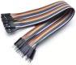
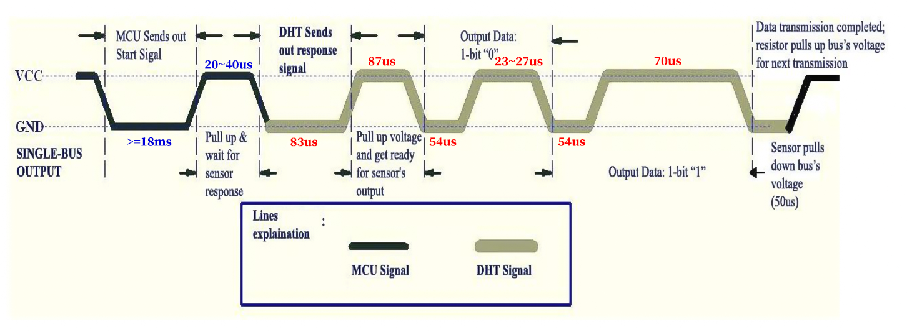
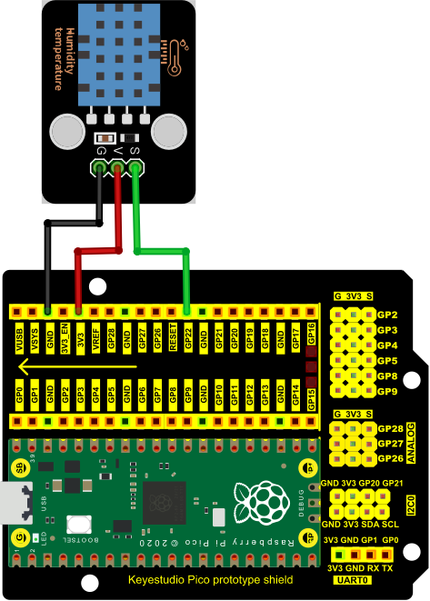

# Project 27：Temperature Humidity Meter 

1.**Introduction**

In winter, the humidity in the air is very low, that is, the air is very dry. Coupled with the cold, the human skin is prone to crack from excessive dryness. Therefore, you need to use a humidifier to increase the humidity of the air at home. But how do you know that the air is too dry? Then you need equipment to detect air humidity.

In this lesson, we will learn how to use the XHT11 temperature and humidity sensor. We use the sensor to create a thermohygrometer and also combined with an LCD\_128X32\_DOT to display the temperature and humidity values.


2.**Components Required**

|                  |  |  |
| --------------------------------------- | --------------------------------------- | --------------------------------------- |
| Raspberry Pi Pico*1                     | Temperature and Humidity sensor*1       | LCD 128X32 DOT*1                        |
|  |  |  |
| 20CM M-F Dupont Wires                   | 10CM M-F Dupont Wires                   | USB Cable*1                             |


3.**Component Knowledge**


**XHT11 temperature and humidity sensor:** 

It is a temperature and humidity composite sensor with calibrated digital signal output. Its accuracy humidity is ±5%RH, temperature is ±2℃. Range humidity is 20 to 90%RH, and temperature is 0 to 50℃.

The XHT11 temperature and humidity sensor applies dedicated digital module acquisition technology and temperature and humidity sensing technology to ensure extremely high reliability and excellent long-term stability of the product. 

It includes a resistive-type humidity measurement and an NTC temperature measurement component, which is very suitable for temperature and humidity measurement applications where accuracy and real-time performance are not required.

The operating voltage is in the range of 3.3V to 5.5V.

XHT11 has three pins, which are VCC, GND, and S. S is the pin for data output, using serial communication.

**Single bus format definition:**

|   Description   | Definition                                                   |
| :-------------: | ------------------------------------------------------------ |
|  Start signal   | Microprocessor pulls data bus (SDA) down at least 18ms for a period of time(Maximum is 30ms), notifying the sensor to prepare data. |
| Response signal | The sensor pulls the data bus (SDA) low for 83µs, and then pulls up for 87µs to respond to the host's start signal. |
|    Humidity     | The high humidity is an integer part of the humidity data, and the low humidity is a fractional part of the humidity data. |
|   Temperature   | The high temperature is the integer part of the temperature data, the low temperature is the fractional part of the temperature data. And the low temperature Bit8 is 1, indicating a negative temperature, otherwise, it is a positive temperature. |
|   Parity bit    | Parity bit=Humidity high bit+ Humidity low bit+temperature high bit+temperature low bit |


**Data sequence diagram:**

When MCU sends a start signal, XHT11 changes from the low-power-consumption mode to the high-speed mode, waiting for MCU completing the start signal. 

Once it is completed, XHT11 sends a response signal of 40-bit data and triggers a signal acquisition. The signal is sent as shown in the figure.



Combined with the code, you can understand better.

The XHT11 temperature and humidity sensor can easily add temperature and humidity data to your DIY electronic projects. It is perfect for remote weather stations, home environmental control systems, and farm or garden monitoring systems.


**Specification:**

- Working voltage: +5V

- Temperature range: 0°C to 50°C, error of ± 2°C

- Humidity range: 20% to 90% RH,± 5% RH error

- Digital interface


**Schematic diagram:**


4.**Read the Value**

First we learned how to use the serial monitor to print the values of the XHT11 sensor. Please connect the wires according to the wiring diagram below.




**Adding the DHT library：**

Open Arduino IDE and click“Sketch”→“Include Library”→“Add .zip Library...”.

Go to the folder ...\\Libraries\\DHT.Zip, click “DHT.Zip”then“Open”


You can open the code we provide:


```c
/*
 * Filename    : Temperature and Humidity Sensor
 * Description : Use DHT11 to measure temperature and humidity.Print the result to the serial port.
 * Auther      : http//www.keyestudio.com
*/
//Before using dht11, we need to include a header file. 
//Apply for a DHT object and define the pin controlling DHT as GPIO22.
#include <dht.h>

dht DHT;

#define DHT11_PIN 22

void setup(){
  Serial.begin(115200);
  delay(2000);
  Serial.println("Type,\tstatus,\tHumidity (%),\tTemperature (C)");
}

void loop(){
  int chk = DHT.read11(DHT11_PIN);//Read11() is used to read DHT11 data and assign the return value to variable chk.
//If the return value of the read11() function is not equal to DHTLIB_OK, it means that the data reading failed; If they equals, humuduty() and temperature() are called to obtain the temperature and humidity data of the current environment, and print it out through the serial port. 
  if(chk == DHTLIB_OK){
    Serial.println("humidity: " + String(DHT.humidity) + "%, temperature: " + String(DHT.temperature) + "C");
  }else{
    Serial.println("DHT11 Reading data error!");
  }
  delay(1000);
}
```


Before uploading Test Code to Raspberry Pi Pico, please check the configuration of Arduino IDE.

Click "Tools" to confirm that the board type and ports.


The code was uploaded successfully.


Upload the code to the pico board, power up with a USB cable and open the serial monitor and set baud rate to 115200.

You will see the current temperature and humidity value detected by the sensor.


5.**Circuit Diagram and Wiring Diagram**

Now we start printing the value of the XHT11 temperature and humidity sensor with LCD screen. We will see the corresponding values on the LCD screen. Let's get started with this project. Please follow the wiring diagram below.

<span style="color: rgb(255, 76, 65);">Note:</span> You would better use the 10CM short male-to-female DuPont wire to connect LCD\_128X32\_DOT. The 20cm M-F Dupont wire is not proper.


6.**Test Code**

If the library DHT and lcd128\_32\_io are added, just skip this step.

If not, just follow the instruction above.

You can open the code we provide:


```c
/*
 * Filename    : Temperature Humidity Meter
 * Description : LCD displays the value of temperature and humidity.
 * Auther      : http//www.keyestudio.com
*/
//Before using dht11, we need to include a header file. 
//Apply for a DHT object and define the pin controlling DHT as GPIO22.
#include <dht.h>
dht DHT;
#define DHT11_PIN 22
//the Library of LCD128_32 and lCD128 *32 pin
#include "lcd128_32_io.h"
lcd lcd(20, 21); //Create lCD128*32 pin，sda->20， scl->21

void setup(){
  lcd.Init(); //initialize
  lcd.Clear();  //clear
}
char string[10];

//lcd displays humidity and temperature values
void loop(){
  int chk = DHT.read11(DHT11_PIN);//Read11() is used to read DHT11 data and assign the return value to variable chk.
  lcd.Cursor(0,0); //Set display position
  lcd.Display("Temper:"); //Setting the display
  lcd.Cursor(0,8);
  lcd.DisplayNum(DHT.temperature);
  lcd.Cursor(0,11);
  lcd.Display("C");
  lcd.Cursor(2,0); 
  lcd.Display("humid:");
  lcd.Cursor(2,8);
  lcd.DisplayNum(DHT.humidity);
  lcd.Cursor(2,11);
  lcd.Display("%");
  delay(200);
}
```


Before uploading Test Code to Raspberry Pi Pico, please check the configuration of Arduino IDE.

Click "Tools" to confirm that the board type and ports.


Click  to upload the test code to the Raspberry Pi Pico board


The code was uploaded successfully.


7.**Test Result**

Upload the code to the pico board and power up. The LCD\_128X32\_DOT displays temperature and humidity in the current environment.
