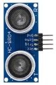
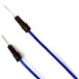

# Project 28：Ultrasonic Ranger

**1. Introduction**

The HC-SR04 ultrasonic sensor is a very affordable distance sensor, mainly used for obstacle avoidance in various robotic projects. It is also used for water level sensing and even as a parking sensor. We treat the ultrasonic sensors as bat's eyes. 

In the dark, bats can still identify objects in front of them and directions through ultrasound.


**2. Components Required**

|                  |  |  |
| --------------------------------------- | --------------------------------------- | --------------------------------------- |
| Raspberry Pi Pico*1                     | Raspberry Pi Pico Expansion Board*1     | Ultrasonic Sensor*1                     |
|  |  |  |
| Red LED*4                               | M-F Dupont Wires                        | 220ΩResistor*4                          |
|                  |  |  |
| Jumper Wires                            | Breadboard*1                            | USB Cable*1                             |


**3. Component Knowledge**

**HC-SR04 ultrasonic sensor:** 

Like bats, sonar is used to determine the distance to an object. It provides accurate non-contact range detection, high-precision and stable readings. 

Its operation is not affected by sunlight or black materials, just like a precision camera (acoustically softer materials like cloth are difficult to detect). It has an ultrasonic transmitter and receiver.


In front of the ultrasonic sensor are two metal cylinders, these are the converters. The converters convert the mechanical energy into an electrical signal. 

In the ultrasonic sensor, there are transmitting converters and receiving converters. The transmitting converter converts the electric signal into an ultrasonic pulse, and the receiving converter converts the reflected ultrasonic pulse back to an electric signal. 

If you look at the back of the ultrasonic sensor, you will see an IC behind the transmitting converter, which controls the transmitting converter. There is also an IC behind the receiving converter, which is a quad operational amplifier that amplifies the signal generated by the receiving converter into a signal large enough to be transmitted to the Arduino.


**4. Sequence Diagram:**

The figure shows the sequence diagram of the HC-SR04. To start the measurement, the Trig of SR04 must receive at least 10us high pulse(5V), which will activate the sensor to emit 8 cycles of 40kHz ultrasonic pulses, and wait for the reflected ultrasonic pulses. 

When the sensor detects ultrasound from the receiver, it sets the Echo pin to high (5V) and delays it by one cycle (width), proportional to the distance. To get the distance, measure the width of the Echo pin.


Time = Echo pulse width, its unit is “us” (microseconds)

Distance in centimeters = time / 58

Distance in inches = time / 148


**5. Read the Distance Value**

We will start with a simple ultrasonic distance measurement and output the measured distance on the serial monitor.


The HC-SR04 ultrasonic sensor has four pins, they are Vcc, Trig, Echo and GND. 

The Vcc pin provides the power source for generating ultrasonic pulses and is connected to Vcc (+5V). 

The GND pin is grounded. 

The Trig pin is where the Arduino sends a signal to start the ultrasonic pulse. 

The Echo pin is where the ultrasonic sensor sends information about the duration of the ultrasonic pulse to the Plus control board. 

Wiring as shown below.


You can open the code we provide:


```c
/*  
 * Filename    : Ultrasonic Ranging
 * Description : Use the ultrasonic module to measure the distance.
 * Auther      : http//www.keyestudio.com
*/
const int TrigPin = 27; // define TrigPin
const int EchoPin = 26; // define EchoPin.
int duration = 0; // Define the initial value of the duration to be 0
int distance = 0;//Define the initial value of the distance to be 0
void setup() 
{
  pinMode(TrigPin , OUTPUT); // set trigPin to output mode
  pinMode(EchoPin , INPUT); // set echoPin to input mode
  Serial.begin(115200);  // Open serial monitor at 115200 baud to see ping results.
}
void loop()
{
 // make trigPin output high level lasting for 10μs to triger HC_SR04 
  digitalWrite(TrigPin , HIGH);
  delayMicroseconds(10);
  digitalWrite(TrigPin , LOW);
  // Wait HC-SR04 returning to the high level and measure out this waitting time
  duration = pulseIn(EchoPin , HIGH);
  // calculate the distance according to the time
  distance = (duration/2) / 28.5 ;
  Serial.print("Distance: ");
  Serial.print(distance); //Serial port print distance value
  Serial.println("cm");
  delay(100); // Wait 100ms between pings (about 20 pings/sec).
}
```


Before uploading Test Code to Raspberry Pi Pico, please check the configuration of Arduino IDE.

Click "Tools" to confirm that the board type and ports.


Click  to upload the test code to the Raspberry Pi Pico board.


The code was uploaded successfully.


Upload the code to the pico board, power up with a USB cable and open the serial monitor and set baud rate to 115200.

The monitor will show distance vales between the sensor and the obstacle.


**6. Circuit Diagram and Wiring Diagram**

Next, we will make a simple ultrasonic ranger using a Raspberry Pi Pico to control an ultrasonic sensor and 4 LED lights. Connect the wires as shown below.


You can open the code we provide:


```c
/*  
 * Filename    : Ultrasonic Ranger
 * Description : four leds are controlled by ultrasonic ranging.
 * Auther      : http//www.keyestudio.com
*/
const int TrigPin = 27;    // define TrigPin
const int EchoPin = 26;    // define EchoPin.
const int PIN_LED1 = 19;    // define PIN_LED1
const int PIN_LED2 = 18;    // define PIN_LED2
const int PIN_LED3 = 17;    // define PIN_LED3
const int PIN_LED4 = 16;    // define PIN_LED4
int duration = 0;    // define the initial value of the duration to be 0
int distance = 0;   // define the initial value of the distance to be 0
void setup() 
{
  pinMode(TrigPin , OUTPUT); // set trigPin to output mode
  pinMode(EchoPin , INPUT); // set echoPin to input mode
  pinMode(PIN_LED1 , OUTPUT);  // set PIN_LED1 to output mode
  pinMode(PIN_LED2 , OUTPUT);  // set PIN_LED2 to output mode
  pinMode(PIN_LED3 , OUTPUT);  // set PIN_LED3 to output mode
  pinMode(PIN_LED4 , OUTPUT);  // set PIN_LED4 to output mode
  Serial.begin(115200);  // Open serial monitor at 115200 baud to see ping results.
}
void loop()
{
// make trigPin output high level lasting for 10μs to triger HC_SR04 
  digitalWrite(TrigPin , HIGH);
  delayMicroseconds(10);
  digitalWrite(TrigPin , LOW);
// Wait HC-SR04 returning to the high level and measure out this waitting time
  duration = pulseIn(EchoPin , HIGH);
// calculate the distance according to the time
  distance = (duration/2) / 28.5 ;
  Serial.print("Distance: ");
  Serial.print(distance); //Serial port print distance value
  Serial.println("cm");
  if ( distance <= 7 )
  {
    digitalWrite(PIN_LED1, HIGH);
  }
  else
  {
    digitalWrite(PIN_LED1, LOW);
  }
  if ( distance <= 14 )
  {
    digitalWrite(PIN_LED2, HIGH);
  }
  else
  {
    digitalWrite(PIN_LED2, LOW);
  }
  if ( distance <= 21 )
  {
    digitalWrite(PIN_LED3, HIGH);
  }
  else
  {
    digitalWrite(PIN_LED3, LOW);
  }
  if ( distance <= 28 )
  {
    digitalWrite(PIN_LED4, HIGH);
  }
  else
  {
    digitalWrite(PIN_LED4, LOW);
  }
}     
```


Before uploading Test Code to Raspberry Pi Pico, please check the configuration of Arduino IDE.

Click "Tools" to confirm that the board type and ports.


Click  to upload the test code to the Raspberry Pi Pico board.


The code was uploaded successfully.


**7. Test Result：**

Upload the code to the pico board, power up with a USB cable and open the serial monitor and set baud rate to 115200.

The monitor will show distance values between the sensor and the obstacle. If put your hand before the sensor, the LED will be on.
