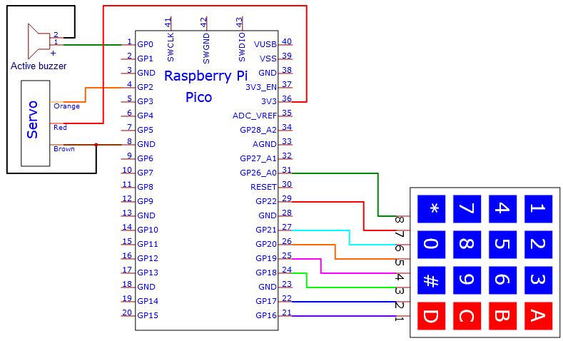

# Project 30：Keypad Door

1.**Introduction**

Matrix keypads are the kind of keypads you see on cell phones, calculators, microwaves ovens, door locks, etc. They’re practically everywhere.

In this project, we will learn Raspberry Pi Pico and membrane 4\*4 matrix keyboard to control servos and buzzers in the future.


2.**Components Required**

|  |  |  |  |
| -------------------------------------- | -------------------------------------- | -------------------------------------- | -------------------------------------- |
| Raspberry Pi Pico*1                    | Raspberry Pi Pico Expansion Board*1    | Servo*1                                | Active Buzzer*1                        |
|                  |  |  |  |
| 4\*4 Membrane Matrix Keyboard*1        | Jumper Wires                           | Breadboard*1                           | USB Cable*1                            |


3.**Component Knowledge**

**4\*4 Matrix keyboard:**

The keyboard is a device that integrates many keys. As shown in the figure below, a 4x4 keyboard integrates 16 keys.


As with the LED matrix integration, in the 4x4 keyboard, each row of keys is connected to a pin, each column of keys is the same. This connection reduces the use of processor ports. 

The internal circuit is shown below.


You can use row scan or column scan methods to detect the state of the keys on each column or each line. 

Take the column scan method as an example. Send a low level to column 4 (Pin4), detect the state of rows 1, 2, 3 and 4, and determine whether the A, B, C and D keys are pressed. Then send the low level to columns 3, 2, 1 in turn, and detect whether other keys are pressed. Then you can get the state of all keys.


4.**Read the Value**

We start with a simple code to read the values of the 4\*4 matrix keyboard and print them in the serial monitor. 

Its wiring diagram is shown below.


You can open the code we provide:


```c
/*  
 * Filename    : 4x4 Matrix Keypad Display 
 * Description : Get the value for the matrix keyboard
 * Auther      : http//www.keyestudio.com
*/
#include "Keypad.h"

void setup(){
  Serial.begin(115200);
  keyInit();
}

void loop(){
  char keyValue = getKey(0);
  if (keyValue != '\0')
    Serial.println(keyValue);
  delay(50);
}
```


Before uploading Test Code to Raspberry Pi Pico, please check the configuration of Arduino IDE.

Click "Tools" to confirm that the board type and ports.


Click  to upload the test code to the Raspberry Pi Pico board


The code was uploaded successfully.


Upload the code and power up with a USB cable, open the monitor and set baud rate to 115200. Then you will see key values on the monitor.


5.**Circuit diagram and wiring diagram:**

We control the servo and the buzzer with a 4\*4 dot matrix module.




6.**Test Code：**

You can open the code we provide: 


```c
/*  
 * Filename    : Keypad_Door
 * Description : Make a simple combination lock.
 * Auther      : http//www.keyestudio.com
*/
#include "Keypad.h"
#include <Servo.h>

Servo  myservo;     // Create servo object to control a servo
int servoPin = 2;   // Define the servo pin
int buzzerPin = 0; // Define the buzzer pin

String passWord = "1234"; // Save the correct password
String keyIn; 

void setup() {
  keyInit();
  myservo.attach(servoPin);  // attaches the servo on servoPin to the servo object
  myservo.write(0);                     // Set the starting position of the servo motor
  pinMode(buzzerPin, OUTPUT);
  Serial.begin(115200);
  keyIn = "";
  Serial.println(keyIn);
}

void loop() {
  char keyPressed = getKey(0);        // Get the character input
  if (keyPressed!='\0') {             // Handle the input characters
    digitalWrite(buzzerPin, HIGH);    // Make a prompt tone each time press the key
    delay(200);
    digitalWrite(buzzerPin, LOW);
    keyIn += keyPressed;              // Save the input characters
    Serial.println(keyPressed);       // Judge the correctness after input
    if (keyIn.length() == 4) {
      bool isRight = true;            // Save password is correct or not
      if( passWord != keyIn){
        isRight = !true;
      }
      if (isRight) {                  // If the input password is right
        myservo.attach(servoPin);
        myservo.write(90);            // Open the switch
        delay(2000);                  // Delay a period of time
        myservo.write(0);             // Close the switch
        Serial.println("passWord right!");
      }
      else {                          // If the input password is wrong
        digitalWrite(buzzerPin, HIGH);// Make a wrong password prompt tone
        delay(1000);
        digitalWrite(buzzerPin, LOW);
        Serial.println("passWord error!");
      }
      keyIn = ""; // Reset the number of the input characters to 0
    }
  }
  delay(200);
}
```


Before uploading Test Code to Raspberry Pi Pico, please check the configuration of Arduino IDE.

Click "Tools" to confirm that the board type and ports.


Click  to upload the test code to the Raspberry Pi Pico board.


The code was uploaded successfully.


7. **Test Result:**

Upload the code and power up with a USB cable. to power on, you will see the phenomenon: press the keyboard to enter a 4-character password, if the input is correct (correct password: 1234), the servo will rotate a certain angle, and then return to the original location. 

An input error alert will be issued if an input is made incorrectly.


Keypad.cpp

```c
#include "Keypad.h"

byte rowPin[4] = {26, 22, 21, 20};
byte colPin[4] = {19, 18, 17, 16};

char keyStrings[4][4] = {
  {'1', '2', '3', 'A'},
  {'4', '5', '6', 'B'},
  {'7', '8', '9', 'C'},
  {'*', '0', '#', 'D'}
};

int lastTime = 0;
int debounceTime = 20;

int pressKeyRow=0;
int pressKeyCol=0;
bool pressState=false;

void keyInit(void){
  for (int r = 0; r < sizeof(rowPin); r++){
    pinMode(colPin[r], OUTPUT);
    digitalWrite(colPin[r], HIGH);
    pinMode(rowPin[r], INPUT_PULLUP);
  }
  for (int c = 0; c < sizeof(colPin); c++){
    pinMode(colPin[c], OUTPUT);
    digitalWrite(colPin[c], HIGH);
  }
}

void keyScan(bool state){
  for (int c = 0; c < sizeof(colPin); c++){
    digitalWrite(colPin[c], LOW);
    for (int r = 0; r < sizeof(rowPin); r++){
      if (digitalRead(rowPin[r]) == LOW){
        while (state == true && digitalRead(rowPin[r]) == LOW);
        digitalWrite(colPin[c], HIGH);
        pressKeyRow=r;
        pressKeyCol=c;
        pressState=true;
      }
    }
    digitalWrite(colPin[c], HIGH);
  }
}

char getKey(bool state){
  if (millis() - lastTime > debounceTime){
    pressState = false;
    keyScan(state);
    lastTime = millis();
    if(pressState==true)
      return keyStrings[pressKeyRow][pressKeyCol];
    else
      return '\0';
  }
}
```

