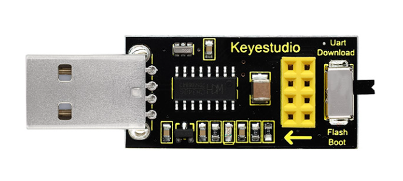
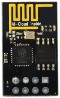
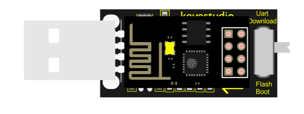
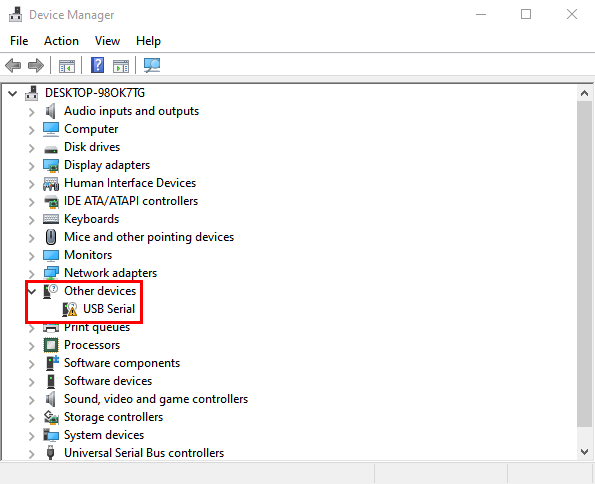
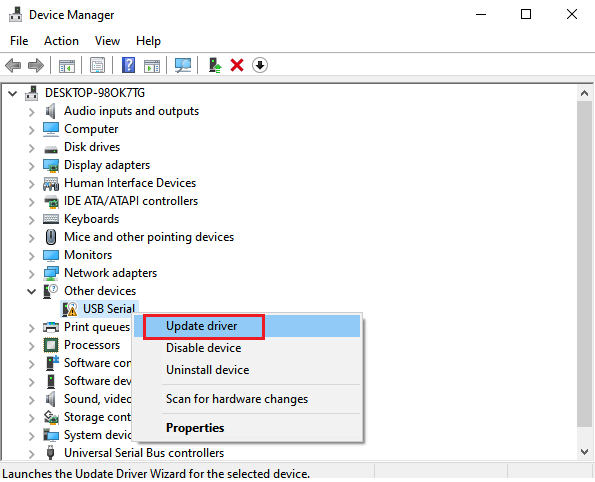
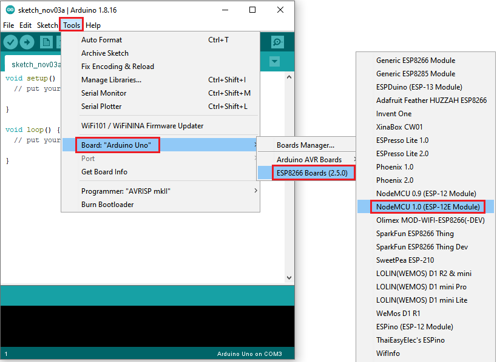
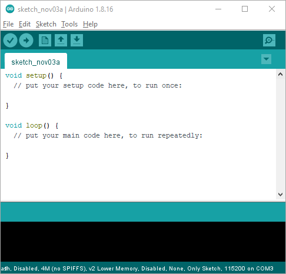
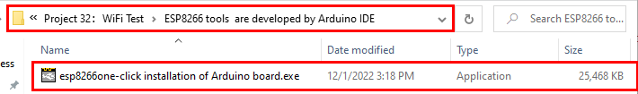
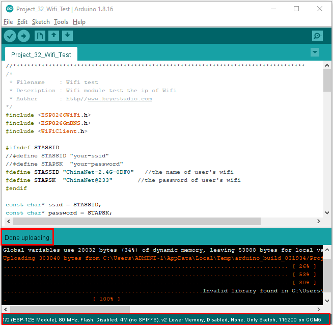
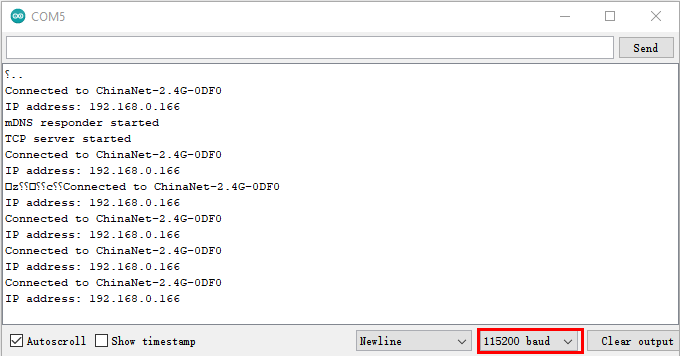

# Project 32：WiFi Test

1.**Introduction**

ESP8266 serial WiFi ESP-01 module is an ultra-low-power UART-WiFi transparent transmission module and designed for mobile devices and IoT applications. The physical device of the user can be connected to Wi-Fi wireless network for Internet or LAN communication to realize networking functions.


2.**Components Required**

|  |     |
| --------------------------------------- | ------------------------------------------ |
| ESP8266 Serial WiFi ESP-01 Module*1     | USB to ESP-01S WiFi Module Serial Shield*1 |


3.**Component Knowledge**



**USB to ESP-01S WiFi module serial shield:**

It is suitable for the ESP-01S WiFi module. Turn the DIP switch on the USB to ESP-01S WiFi module serial shield to Flash Boot, and plug into computer’s USB port. You can use serial debugging tool to test the AT command.

Turn the DIP switch on the USB to ESP-01S WiFi module serial shield to
the UartDownload, ESP-01 module is at download mode. You can download the firmware to ESP-01 module using AT firmware.



**ESP8266 serial WiFi ESP-01:** 

ESP8266 serial WiFi ESP-01 is an ultra-low-power UART-WiFi transparent transmission module. It can be widely used in smart grids, intelligent transportation, smart furniture, handheld devices, industrial control and other fields.


4.**Interface the Shield with the Computer**

Insert the ESP8266 serial WiFi ESP-01 module in the correct orientation into the USB to ESP-01S WiFi module serial shield.



First, turn the DIP switch on the USB to ESP-01S WiFi module serial shield to the UartDownload, and then insert the shield into the USB port of the computer.


The USB to serial port chip of this shield is CH340, We need to install the chip driver. 

The driver is usb\_ch341\_3.1.2009.06. We put this driver on the D: drive (i.e.: copyto D: drive). 

Then start installing the driver. The way to install drivers in different systems is pretty much the same, we will start installing drivers on the Windows 10. 

When you connect the shield to your computer at the first time, right click“Computer”—\>“Properties”—\>“Device manager”, you can see“**USB-Serial**”.



Click“**USB-Serial**”and select“**Update Driver** ”.



Then click on "**Browse my computer for drivers**".


Find the "**Drive File**" folder provided.(Here I put the driver file USb\_CH341\_3.1.2009.06 on disk D).


Click "**Close**" when installation is complete.


After the driver installation is complete,  click“Computer”—\>“Properties”—\>“Device manager”, you can see that the CH340 driver has been successfully installed on your computer, as follows.


5.**Set up** **the Development Environment**

Insert the ESP8266 serial WiFi ESP-01 module into the USB to ESP-01S WiFi module serial shield correctly, and then plug the shield into the USB port of the computer. 

Click to enter the arduino-1.8.16 folder (you can also use the latest version). Find and click to enter the 1.8.16 version of the IDE interface.


Click **File** →**Preferences**, copy and paste this address [http://arduino.esp8266.com/stable/package\_esp8266com\_index.json](http://arduino.esp8266.com/stable/package\_esp8266com\_index.json) in the ”**Additional Boards Manager URLs:**”, then click "**OK**" to save this address.


Click“**Tools**”→“**Board:**”, then click on "**Board Manager...**" to enter the "**Board Manager**" page, type "ESP8266" in the space after "All". 

Then click the following search content, select the latest version to install. 

The installation package is not large, click "**Install**" to start to install the relevant plug-ins. (There may be an error in downloading and installing, possibly due to the server, so you need to click "Install" again. 

However, due to network reasons, most users may not be able to search esp8266 by esp8266 Community, so this method is not recommended for beginners, and **the following method 2 is recommended**.)


After successful installation, Click“**Close**”to close the page, and then click“**Tools**”→“**Board:**”, you can view different models of ESP8266 development boards in it. 

Select the corresponding ESP8266 development board model and COM port to program ESP8266.






**Installation of ESP8266 by tools** **(Recommended)**

Click “**File”** →“**Preferences**”, copy [http://arduino.esp8266.com/stable/package\_esp8266com\_index.json](http://arduino.esp8266.com/stable/package\_esp8266com\_index.json) as follows; and click “**OK**”.




Double click“ESP8266 one-click installation of Arduino board version 2.5.0.exe”, then the installation is finished.


After the above tool is installed, restart the Arduino IDE software and click on the Arduino menu bar “**Tools**”→“**Board:**” , you can view different models of ESP8266 development boards in it. 

Select the corresponding ESP8266 development board model and COM port to program ESP8266.


6.**WiFi Test Code**

<span style="color: rgb(255, 76, 65);">Note:</span> After opening the IDE, set the board type and COM port first. If you don't have WiFi at home, you can turn your phone hotspot on to share WiFi.

```c
/*  
 * Filename    : Wifi test
 * Description : Wifi module test the ip of Wifi
 * Auther      : http//www.keyestudio.com
*/
#include <ESP8266WiFi.h>
#include <ESP8266mDNS.h>
#include <WiFiClient.h>

#ifndef STASSID
//#define STASSID "your-ssid"
//#define STAPSK  "your-password"
#define STASSID "ChinaNet-2.4G-0DF0"   //the name of user's wifi
#define STAPSK  "ChinaNet@233"       //the password of user's wifi
#endif

const char* ssid = STASSID;
const char* password = STAPSK;

// TCP server at port 80 will response the HTTP requirement
WiFiServer server(80);

void setup(void) {
  Serial.begin(115200);

  //  connect WiFi 
  WiFi.mode(WIFI_STA);
  WiFi.begin(ssid, password);
  Serial.println("");

  // wait connection
  while (WiFi.status() != WL_CONNECTED) {
    delay(500);
    Serial.print(".");
  }
  Serial.println("");
  Serial.print("Connected to ");
  Serial.println(ssid);
  Serial.print("IP address: ");
  Serial.println(WiFi.localIP());

  // set the mDNS responder::
  // - in this example. the first parameter is domain name
  //   The fully qualified domain name is “esp8266.local”
  // - the second parameter is IP address
  //   send the IP address via WiFi
  if (!MDNS.begin("esp8266")) {
    Serial.println("Error setting up MDNS responder!");
    while (1) {
      delay(1000);
    }
  }
  Serial.println("mDNS responder started");

  // activate TCP (HTTP) server
  server.begin();
  Serial.println("TCP server started");

  // add the server to MDNS-SD
  MDNS.addService("http", "tcp", 80);
}

void loop(void) {

  MDNS.update();
  Serial.print("Connected to ");
  Serial.println(ssid);
  Serial.print("IP address: ");
  Serial.println(WiFi.localIP());
  delay(1000); 
  // check the client side is connected or not
  WiFiClient client = server.available();
  if (!client) {
    return;
  }
  Serial.println("");
  Serial.println("New client");

  // wait the effective data from the client side
  while (client.connected() && !client.available()) {
    delay(1);
  }

  // read the first row of HTTP requirement
  String req = client.readStringUntil('\r');

  // the first row of the HTTP requirement is shown below: "GET /path HTTP/1.1"
  // Retrieve the "/path" part by finding the spaces
  int addr_start = req.indexOf(' ');
  int addr_end = req.indexOf(' ', addr_start + 1);
  if (addr_start == -1 || addr_end == -1) {
    Serial.print("Invalid request: ");
    Serial.println(req);
    return;
  }
  req = req.substring(addr_start + 1, addr_end);
  Serial.print("Request: ");
  Serial.println(req);
  client.flush();

  String s;
  if (req == "/") {
    IPAddress ip = WiFi.localIP();
    String ipStr = String(ip[0]) + '.' + String(ip[1]) + '.' + String(ip[2]) + '.' + String(ip[3]);
    s = "HTTP/1.1 200 OK\r\nContent-Type: text/html\r\n\r\n<!DOCTYPE HTML>\r\n<html>Hello from ESP8266 at ";
    s += ipStr;
    s += "</html>\r\n\r\n";
    Serial.println("Sending 200");
  } else {
    s = "HTTP/1.1 404 Not Found\r\n\r\n";
    Serial.println("Sending 404");
  }
  client.print(s);

  Serial.println("Done with client");
}
```


7.**Result**

Note: You need to change the user WiFi name and user WiFi password in the project code to your own WiFi name and WiFi password.


Next, turn the DIP switch of the shield to the UartDownload end and interface the shield to the USB port of a computer.

Then set the board type and COM port.

The corresponding board type and COM port are displayed in the lower right corner of the IDE. 

Click  to upload the test code to the ESP8266 serial WiFi ESP-01 module, the upload is complete.

<span style="color: rgb(255, 76, 65);">Note:</span> If uploading unsuccessfully, reconnect the shield to the computer.



After the test code is uploaded successfully, first unplug the shield from the USB port of the computer, then turn DIP switch on the shield to the Flash Boot , and interface the shield to your PC. 

Open the serial monitor, set the baud rate to **115200**, and you can see your WiFi information, as shown below.



