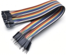
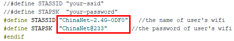
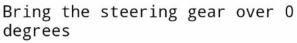

# Project 33：WiFi Smart Home

**1. Introduction**

In the previous project 32, we already knew how to connect the APP to WiFi and also use the APP to control the LED on and off on the pico board through WiFi for a simple experiment.

In this project, we will use APP to control multiple sensors or modules through WiFi to achieve the effect of smart home.


**2. Components Required**

|                  |                       |  |
| --------------------------------------- | ------------------------------------------------------------ | --------------------------------------- |
| Raspberry Pi Pico*1                     | Raspberry Pi Pico Expansion Board*1                          | Temperature and Humidity Sensor*1       |
|  |                                       |                                         |
| ESP8266 Serial WIFI ESP-01*1            | USB to ESP-01S WiFi Module Serial Shield*1                   |                                         |
|  |  |  |
| 5V Relay Module*1                       | Mobile Phone/iPad*1                                          | M-F Dupont Wires                        |
|  |                                       |  |
| Servo*1                                 | Ultrasonic sensor*1                                          | USB Cable*1                             |
|  |                       |                  |
| Breadboard*1                            | F-F Dupont Wires                                             | Jumper Wires                            |


**3. Plug the WiFi Module Serial Shield into the USB port of the computer**

Insert the ESP8266 serial WiFi ESP-01 module into the USB to ESP-01S WiFi module serial shield.


First, turn the DIP switch on the USB to ESP-01S WiFi module serial shield to the UartDownload, and then insert the shield into the USB port of the computer.


**4. ESP8266 Code**

<span style="color: rgb(255, 76, 65);">Note：</span>open Arduino IDE, set the ESP8266 board type and COM ports. If youdon’t have wifi in your home, just open your hotspot of your cellphone to connect with the device.
<br>
<br>

<span style="color: rgb(255, 76, 65);">Note:</span> You need to change WiFi name and password into your own WiFi name and WiFi password.




```c
/*
ESP8266_Code
*/
// generated by KidsBlock
#include <Arduino.h>
#include <ESP8266WiFi.h>
#include <ESP8266mDNS.h>
#include <WiFiClient.h>
#include <WiFi.h>

#ifndef STASSID
#define STASSID "ChinaNet-2.4G-0DF0"  //the name of user's Wifi
#define STAPSK  "ChinaNet@233"       //the password of the user's wifi
#endif
const char* ssid = STASSID;
const char* password = STAPSK;

IPAddress local_IP(192,168,4,22);
IPAddress gateway(192,168,4,22);
IPAddress subnet(255,255,255,0);

const char *ssid = "ESP8266_AP_TEST";
const char *password = "12345678";

WiFiServer server(80);
String unoData = "";
int ip_flag = 0;
int ultra_state = 1;
String ip_str;


void setup() {
  Serial.begin(9600); 
  WiFi.mode(WIFI_AP); //Set to work in AP mode
  WiFi.softAPConfig(local_IP, gateway, subnet); //Setting an AP Address
  while(!WiFi.softAP(ssid, password)){}; //Start AP
  Serial.println("AP starting success");
  Serial.print("IP address: ");
  Serial.println(WiFi.softAPIP()); // Printing the IP Address
  WiFi.softAPsetHostname("myHostName"); //Set host name
  Serial.print("HostName: ");
  Serial.println(WiFi.softAPgetHostname()); //print host name
  Serial.print("mac Address: ");
  Serial.println(WiFi.softAPmacAddress()); //prnt mac add

  WiFi.mode(WIFI_STA);
  WiFi.begin(ssid, password);
  while (WiFi.status() != WL_CONNECTED) {
    delay(500);
    Serial.print(".");
  }
  Serial.print("IP ADDRESS: ");
  Serial.println(WiFi.localIP());
  if (!MDNS.begin("esp8266")) {
    Serial.println("Error setting up MDNS responder!");
    while (1) {
      delay(1000);
    }
  }
  Serial.println("mDNS responder started");
  server.begin();
  Serial.println("TCP server started");
  MDNS.addService("http", "tcp", 80);
  ip_flag = 1;
}

void loop() {
  Serial.println(WiFi.softAPgetStationNum()); //Prints the number of client connections
  if(ip_flag == 1)
  {
    for(int i=3; i>0; i--)
    {
      Serial.print("IP: ");
      Serial.print(WiFi.localIP());
      Serial.println('#');
      delay(500);
    }
    ip_flag = 0;
    
  }
    MDNS.update();
    WiFiClient client = server.available();
    if (!client) {
      return;
    }
    Serial.println("");
    while (client.connected() && !client.available()) {
      delay(1);
    }
    String req = client.readStringUntil('\r');
    int addr_start = req.indexOf(' ');
    int addr_end = req.indexOf(' ', addr_start + 1);
    if (addr_start == -1 || addr_end == -1) {
      Serial.print("Invalid request: ");
      Serial.println(req);
      return;
    }
    req = req.substring(addr_start + 1, addr_end);
    int len_val = String(req).length();
    String M_req = String(req).substring(0,6);
    Serial.println(M_req);
    if(M_req == "/")
    {
      String s_M_req = String(req).substring(5,len_val);
      Serial.print(s_M_req);
      Serial.print("#");
    }
    if(M_req == "/btn/v")
    {
      String s_M_req = String(req).substring(5,len_val);
      Serial.print(s_M_req);
      Serial.print("#");
    }
    client.flush();
    String s;
    if (req == "/") {
      IPAddress ip = WiFi.localIP();
      String ipStr = String(ip[0]) + '.' + String(ip[1]) + '.' + String(ip[2]) + '.' + String(ip[3]);
      s = "HTTP/1.1 200 OK\r\nContent-Type: text/html\r\n\r\n<!DOCTYPE HTML>\r\n<html>Hello from ESP8266 at ";
      s += ipStr;
      s += "</html>\r\n\r\n";
      Serial.println("Sending 200");
      Serial.println(WiFi.localIP());
      Serial.write('*');
      client.println(WiFi.localIP());
      ip_flag = 0;
    }
    else if(req == "/btn/0")
    {
      Serial.write('a');
      client.println("turn on the relay");
    }
    else if(req == "/btn/1")
    {
      Serial.write('b');
      client.println("turn off the relay");
    }
    else if(req == "/btn/2")
    {
      Serial.write('c');
      client.println("Bring the steering gear over 180 degrees");
    }
    else if(req == "/btn/3")
    {
      Serial.write('d');
      client.println("Bring the steering gear over 0 degrees");
    }
    else if(req == "/btn/4")
    {
      Serial.write('e');
      client.println("esp8266 already turn on the fans");
    }
    else if(req == "/btn/5")
    {
      Serial.write('f');
      client.println("esp8266 already turn off the fans");
    }
    else if(req == "/btn/6")
    {
      Serial.write('g');
      while(Serial.available() > 0)
      {
        unoData = Serial.readStringUntil('#');
        client.println(unoData);
      }
    }
    else if(req == "/btn/7")
    {
      Serial.write('h');
      client.println("turn off the ultrasonic");
    }
    else if(req == "/btn/8")
    {
      Serial.write('i');
      while(Serial.available() > 0)
      {
        unoData = Serial.readStringUntil('#');
        client.println(unoData);
        //client.flush();
      }
    }
    else if(req == "/btn/9")
    {
      Serial.write('j');
      client.println("turn off the temperature");
    }
    else if(req == "/btn/10")
    {
      Serial.write('k');
      while(Serial.available() > 0)
      {
        unoData = Serial.readStringUntil('#');
        client.println(unoData);
        //client.flush();
      }
    }
    else if(req == "/btn/11")
    {
      Serial.write('l');
      client.println("turn off the humidity");
    }
    else if(req == "/btn/12")
    {
      Serial.write('m');
      client.println(F("m"));
    }
    else if(req == "/btn/13")
    {
      Serial.write('n');
      client.println(F("n"));
    }
    else if(req == "/btn/14")
    {
      Serial.write('o');
      client.println(F("o"));
    }
    else if(req == "/btn/15")
    {
      Serial.write('p');
      client.println(F("p"));
    }
    else if(req == "/btn/16")
    {
      Serial.write('q');
      client.println(F("q"));
    }
    else if(req == "/btn/17")
    {
      Serial.write('r');
      client.println(F("r"));
    }
    else if(req == "/btn/18")
    {
      Serial.write('s');
      client.println(F("s"));
    }
    else if(req == "/btn/19")
    {
      Serial.write('t');
      client.println(F("t"));
    }
    else if(req == "/btn/20")
    {
      Serial.write('u');
      client.println(F("u"));
    }
    else if(req == "/btn/21")
    {
      Serial.write('v');
      client.println(F("v"));
    }
    else if(req == "/btn/22")
    {
      Serial.write('w');
      client.println(F("w"));
    }
    else if(req == "/btn/23")
    {
      Serial.write('x');
      client.println(F("x"));
    }
    else {
      s = "HTTP/1.1 404 Not Found\r\n\r\n";
      Serial.println("Sending 404");
    }

    client.print(F("IP : "));
    client.println(WiFi.localIP());
}
```


After changing the WiFi name and WiFi password, ensure that the DIP switch on the shield has been turned to the UartDownload end and the shield has been plugged into the computer. 

Then set the board type and COM port according to the method in Project 32, and the corresponding board type and COM port are displayed in the lower right corner of the IDE. 

Click  to upload the test code to the ESP8266 serial WiFi ESP-01 module, the upload is complete. 

<span style="color: rgb(255, 76, 65);">Note:</span> If uploading unsuccessfully, unplug the WIF shield and reboot it again.


After the test code is uploaded successfully, first unplug the shield from the USB port of the computer, and then unplug the ESP8266 serial WiFi ESP-01 module from the shield.


**5. Wiring Diagram**

|     Relay module      |   Raspberry Pi Pico Expansion Board   |      | Temperature and Humidity sensor |   Raspberry Pi Pico Expansion Board   |
| :-------------------: | :-----------------------------------: | ---- | :-----------------------------: | :-----------------------------------: |
|           G           |                   G                   |      |                G                |                   G                   |
|           V           |                  5V                   |      |                V                |                  3V3                  |
|           S           |                 GP27                  |      |                S                |                GP2(S)                 |
|                       |                                       |      |                                 |                                       |
| **Ultrasonic sensor** | **Raspberry Pi Pico Expansion Board** |      |            **Servo**            | **Raspberry Pi Pico Expansion Board** |
|          Vcc          |                  5V                   |      |            Red line             |                  3V3                  |
|         Trig          |                 GP17                  |      |           Brown line            |                   G                   |
|         Echo          |                 GP16                  |      |           Orange line           |                GP9(S)                 |
|          Gnd          |                   G                   |      |                                 |                                       |
|                       |                                       |      |                                 |                                       |
|    **WIFI module**    | **Raspberry Pi Pico Expansion Board** |      |                                 |                                       |
|          3V3          |                  3V3                  |      |                                 |                                       |
|         EN/CP         |                  3V3                  |      |                                 |                                       |
|          TX           |                RX(GP1)                |      |                                 |                                       |
|          RX           |                TX(GP0)                |      |                                 |                                       |
|          GND          |                  GND                  |      |                                 |                                       |


5.**Add the DHT and Servo libraries**

This code uses two libraries named "DHT" and "Servo" , if you haven't installed them yet, please do so before learning. The steps to add third-party libraries are as follows:
Add the **DHT** library first:
Open the Arduino IDE，click“Sketch”→“Include Library”→“Add .zip Library...”. In the pop-up window, find the file named “...\Libraries\DHT.ZIP”, which locates in the directory. Select the <span style="color: rgb(255, 76, 65);">DHT.ZIP</span> file and then click“Open”.


Then Add the **ESP32Servo** library:
Open the Arduino IDE，click “Sketch”→“Include Library”→“Add .ZIP Library...”. In the pop-up window, find the file named“...\Libraries\Servo.ZIP”, which locates in this directory. Select the <span style="color: rgb(255, 76, 65);">Servo.ZIP</span> file，and then click“Open”.


**6. Project Code**

<span style="color: rgb(255, 76, 65);">Note:</span> After opening the IDE, be sure to set the board type and COM port first. If you don't have WiFi at home, you need to turn your phone hotspot on to share WiFi.

```c
/*  
 * Filename    : WiFi Smart Home.
 * Description : WiFi APP controls Multiple sensors/modules work to achieve the effect of WiFi smart home.
 * Auther      : http//www.keyestudio.com
*/
#include <dht.h>
dht DHT;

#include<Servo.h>
Servo myservo;

char wifiData;
int distance1;
String dis_str;

const int dhtPin = 2;
const int relayPin = 27;
const int IN1 = 3;
const int IN2 = 5;
const int trigPin = 17;
const int echoPin = 16;
const int servoPin = 9;

int ip_flag = 1;
int ultra_state = 1;
int temp_state = 1;
int humidity_state = 1;

void setup() {
  Serial1.begin(9600);
  pinMode(dhtPin, INPUT);
  pinMode(relayPin, OUTPUT);
  pinMode(servoPin, OUTPUT);
  pinMode(IN1, OUTPUT);
  pinMode(IN2, OUTPUT);
  pinMode(trigPin, OUTPUT);
  pinMode(echoPin, INPUT);

  //turn off the fan
  digitalWrite(IN1, LOW);
  digitalWrite(IN2, LOW);

  digitalWrite(relayPin, LOW); //turn off the relay module

  myservo.attach(9);

  //dht.begin();
}

void loop() {
  int chk = DHT.read11(dhtPin);
  if(Serial1.available() > 0)
  {
    wifiData = Serial1.read();
    Serial.print(wifiData);
    if(wifiData == '#')
    {
      ip_flag = 0;
    }
    
    if(ip_flag == 1)
    {
      //String ip_addr = Serial.readStringUntil('#');
      Serial.print(wifiData);
      if(wifiData == '#')
      {
        Serial.println("");
      }
      delay(100);
    }
  }

  switch(wifiData)
    {
      case 'a': digitalWrite(relayPin, HIGH); break;
      case 'b': digitalWrite(relayPin, LOW); break;
      case 'c': myservo.write(180); delay(200); break;
      case 'd': myservo.write(0); delay(200); break;
      case 'e': digitalWrite(IN1, HIGH); digitalWrite(IN2, LOW); break;
      case 'f': digitalWrite(IN1, LOW); digitalWrite(IN2, LOW); break;
      case 'g': while(ultra_state>0)
                  {
                    Serial.print("Distance = "); 
                    Serial.print(checkdistance());
                    Serial.println("#"); 
                    Serial1.print("Distance = "); 
                    Serial1.print(checkdistance());
                    Serial1.println("#"); 
                    ultra_state = 0;
                  }
                  break;
      case 'h': ultra_state = 1; break;
      case 'i': while(temp_state>0)
                {
                  Serial.print("Temperature = "); 
                  Serial.print(DHT.temperature,1);
                  Serial.println("#");
                  Serial1.print("Temperature = "); 
                  Serial1.print(DHT.temperature,1);
                  Serial1.println("#");
                  temp_state = 0;
                }
                break;
      case 'j': temp_state = 1; break;
      case 'k': while(humidity_state > 0)
                {
                  Serial.print("Humidity = "); 
                  Serial.print(DHT.humidity,1);
                  Serial.println("#");
                  Serial1.print("Humidity = "); 
                  Serial1.print(DHT.humidity,1);
                  Serial1.println("#");
                  humidity_state = 0;
                }
                break;
      case 'l': humidity_state = 1; break;
    }
  
}

int checkdistance() {
  digitalWrite(17, LOW);
  delayMicroseconds(2);
  digitalWrite(17, HIGH);
  delayMicroseconds(10);
  digitalWrite(17, LOW);
  int distance = pulseIn(16, HIGH) / 58;
  
  delay(10);
  return distance;
}
```


**7. Result**

<span style="color: rgb(255, 76, 65);">Note:</span> Before uploading the project code, you need to unplug the TX and RX cables connected to the pico board first, otherwise the code will not be uploaded successfully. 

Then click "Tools" → "Board:", select the Raspberry Pi Pico and choose the correct COM port. Finally, upload the project code to the pico board. 

After uploading the code successfully, connect the other end of the TX Dupont wire on the ESP8266 serial WiFi ESP-01 module to the RX(0) pin on the pico board. 

The other end of RX Dupont wire is connected to the TX (1) pin on the pico board. 

Click  to open the serial monitor window and set the baud rate to 9600. In this way, the serial monitor shows the IP address of your WiFi. 

(The IP address of WiFi sometimes changes. If the original IP address does not work, you need to detect the IP address again.)


**8. App for Android system devices(mobile phone/iPad)**

Now transfer the“**keyes wifi.apk**” file from the folder to your Android phone or iPad, click the “keyes wifi.apk”file to enter the installation page. 

Click the "**ALLOW**" button, and then click the "**INSTALL**" button. Click the "**Open**" button to enter the APP interface after the installation is completed.


Enter the detected WiFi IP address in the text box in front of the WiFi button (For example, the IP address detected by the serial monitor above is 192.168.0.119), then click the WiFi button, “403 Forbidden” or "Webpage not available" will become "192.168.0.119". 

This shows that the App has been connected to WiFi.


**9. App for IOS system devices (mobile phone/iPad)**

1). Open App Store.
    


2). Enter “**keyes link**” in the search box, search and the download screen will appear. 

3). Click“”, you can download and install “**keyes link** “APP. 

The following operations are similar to those of Android system. You can refer to the steps of Android system above for operation.

Click the button on APP, the blue light on ESP8266 serial WiFi ESP-01 module will flash, indicating that APP has connected to WiFi.

After the APP has been connected to the WiFi, start the following operations.


1)  Click .Relay opens and the APP shows ,the indicator light on the module lights up. 
2)  Click again, relay is closed and the APP shows , indicator light on the module goes out.
3)  Click . The servo rotates 180° and the APP shows . Clickagain, the APP shows ，the servo rotates 0°.
4)  Click , ultrasonic sensor measures distance. Put an object in front of the ultrasonic sensor, and the APP shows（Different distance shows different numbers). It means that the distance of the object from the ultrasonic sensor is 14cm at this time. Click . Turn off ultrasound, the APP shows.
5)  Click ,temperature and humidity sensor measures the temperature in the environment. The APP show , which means that the temperature in the environment is 28℃ at this time. Click , turn off the temperature and humidity sensor, the APP shows.
6)  Click , temperature and humidity sensor measures the humidity in the environment. The APP shows , it means that the humidity in the environment is 52% at this time. Click ，turn off the temperature and humidity sensor, the APP shows.


