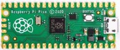
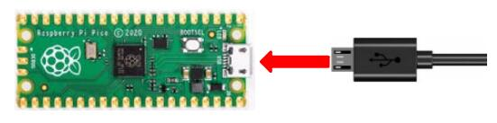
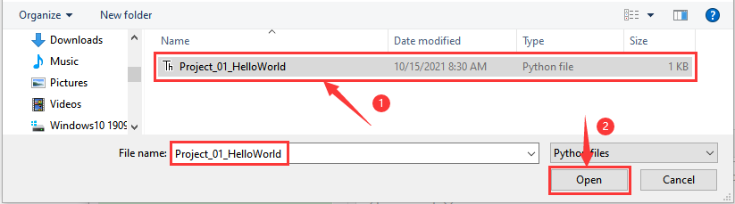
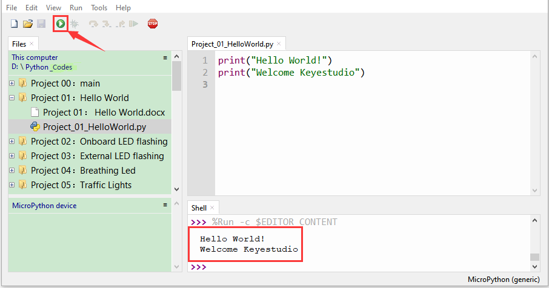
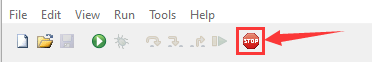

# Project 01: Hello World

1. **Introduction**
    

For Raspberry Pi Pico beginners, we will start with some simple things. In this project, you only need a Raspberry Pi Pico and a USB cable to complete the "Hello World\!" project, which is a test of communication between Raspberry Pi Pico and the PC as well as a primary project.
    
2. **Components**

|  |  |
| -------------------------------------- | -------------------------------------- |
| Raspberry Pi Pico*1                    | USB Cable*1                            |


3. **Wiring Up**

In this project, we use a USB cable to connect the Raspberry Pi Pico to the computer.

    

4. **Online running code:**
    

To run the Raspberry Pi Pico online, you need to connect the Raspberry Pi Pico to your computer, which allows you to compile or debug programs using Thonny software.  
    
<span style="color: rgb(255, 76, 65);">Advantages:</span>
    
1). You can use the Thonny software to compile or debug programs.
   
2). Through the "Shell" window, you can view error messages and output results generated during the running of the program as well as query related function information online to help improve the program.  
   

<span style="color: rgb(255, 76, 65);">Disadvantages:</span>

1). To run the Raspberry Pi Pico online, you must connect the Raspberry Pi Pico to a computer and run it with the Thonny software.  

2). If the Raspberry Pi Pico is disconnected from the computer, when they reconnect, the program won't run again.  
    

<span style="color: rgb(255, 76, 65);">**Basic Operation:**</span>
<br>
<br>

1. Open Thonny and click“**Open...**”.
    


2. Click“This computer”in the new pop-up window.
    


    
In the new dialog box，select“**Project\_01\_HelloWorld.py**”,click“**Open**”.

The code used in this tutorial is saved in the file **...\\Python_Codes**. You can move the code to anywhere,for example,we can save the **Python_Codes** file in the Disk(D), the route is <span style="color: rgb(0, 209, 0);">**D:\\Python_Codes**</span>.
<br>



3. Click  “Run current script”to execute the program“Hello World\!”, "Welcome Keyestudio" , which will be printed in the“Shell”window.



**Exit running online**

When running online, click  “Stop /Restart Backend” or press “Ctrl+C” to exit the program.  



**5. Test Code**

```Python
print("Hello World!")
print("Welcome Keyestudio")
```
