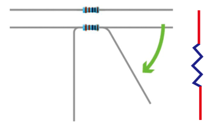
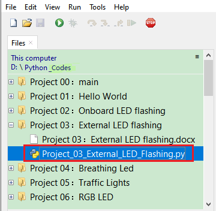
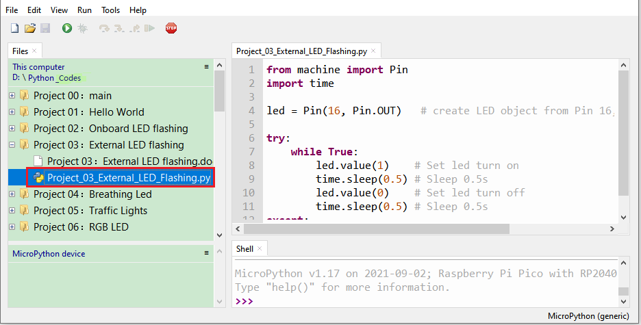
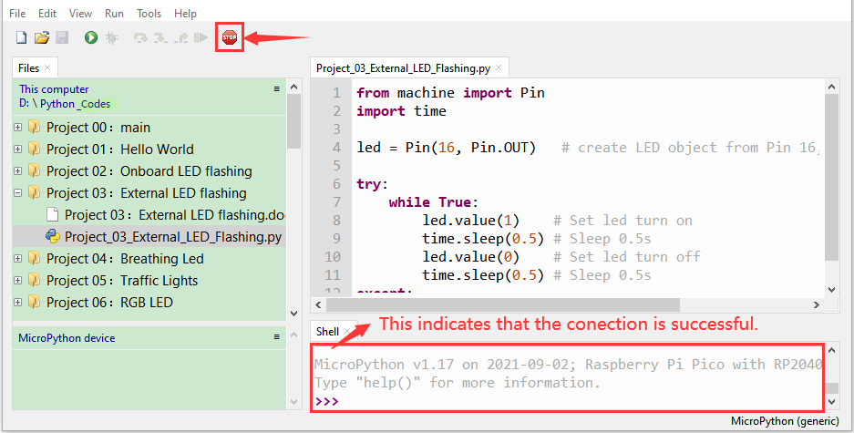
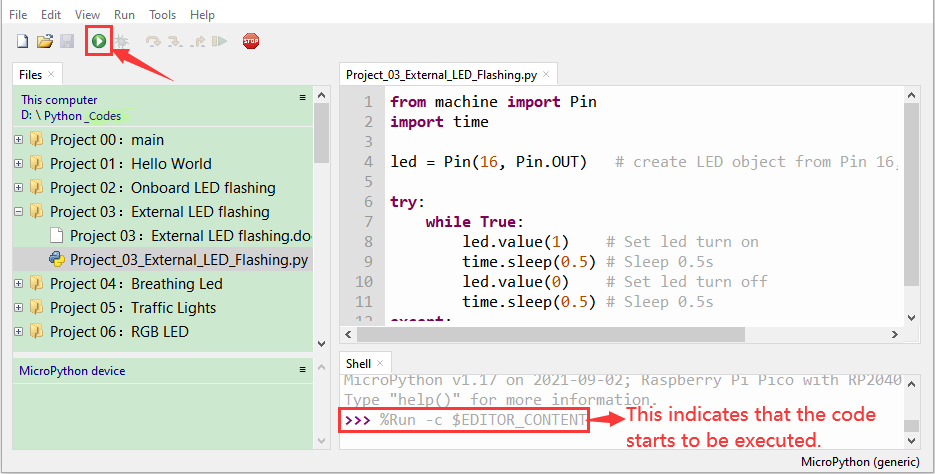
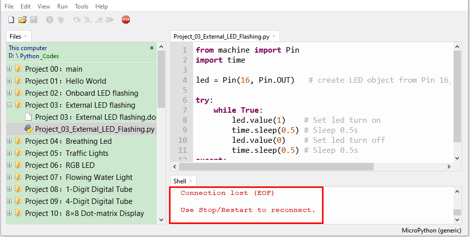
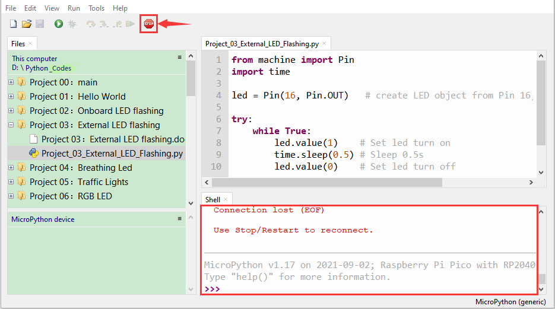
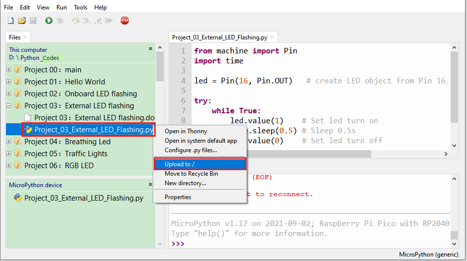

# Project 03：External LED flashing

1. **Introduction**
    

In this project, we are going to show you the external LED flashing effect.  We will use the Raspberry Pi Pico's digital pins to turn on the LED and make it flash.
    
2. **Components**

|                        |                        |                        |
| ------------------------------------------------------------ | ------------------------------------------------------------ | ------------------------------------------------------------ |
| Raspberry Pi Pico*1                                          | Raspberry Pi Pico Expansion Board*1                          | Red LED*1                                                    |
|  |  |  |
| 220Ω Resistor*1                                              | Breadboard*1                                                 | Jumper Wire*2                                                |
|                        |                                                              |                                                              |
| USB Cable*1                                                  |                                                              |                                                              |


3.  **Knowledge**

**（1）LED:**


The LED is a kind of semiconductor called “light-emitting diode”, which is an electronic device made from semiconducting materials (silicon, selenium, germanium, etc.).  It has a anode and a cathode. The short lead is cathode, which connects to GND, the long lead is anode , which connects to3.3V or 5V.


**( 2 )  5-band Resistor**

A resistor is an electronic component in a circuit that restricts or regulates the flow current flow. On the left is the appearance of the resistor and on the right is the symbol for the resistance in the circuit . Its unit is(Ω). 1 mΩ= 1000 kΩ，1kΩ= 1000Ω.




We can use resistors to protect sensitive components, such as LEDs. The strength of the resistance is marked on the body of the resistor with an electronic color code. Each color code represents a number, and you can refer to it in a resistance card.

\-Color 1 – 1st Digit

\-Color 2 – 2nd Digit

\-Color 3 – 3rd Digit

\-Color 4 – Multiplier

\-Color 5 – Tolerance


In this kit, we provide three 5-band resistors with different resistance values. Take three 5-band resistors as an example.

220Ω resistor\*10


10KΩ resistor\*10


1KΩ resistor\*10


In the same voltage, there will be less current and more resistance. The connection between current, voltage, and resistance can be expressed by the formula: I=U/R. In the figure below, if the voltage is 3V, the current through R1 is: I = U / R = 3 V / 10 KΩ= 0.0003A=0.3mA.


Do not directly connect resistors with very low resistance to the two poles of the power supply, as this will cause excessive current to damage the electronic components. Resistors do not have positive and negative poles.

**( 3 )  Breadboard**

A breadboard is used to build and test circuits quickly before finalizing any circuit design. The breadboard has many holes , into
which circuit components like integrated circuits and resistors can be inserted. A typical breadboard is as follows.


The bread board has strips of metal , which run underneath the board and connect the holes on the top of the board. The metal strips are laid out as shown below. Note that the top and bottom rows of holes are connected horizontally while the remaining holes are connected vertically.


The first two rows (top) and the last two rows (bottom) of the breadboard are used for the positive (+) and negative (-) terminals of the power supply, respectively. The conductive layout of the breadboard is shown in the following diagram.


When we connect DIP (Dual In-line Packages) components, such as integrated circuits, microcontrollers, chips and so on, we can see that a groove in the middle isolates the middle part, so the top and bottom of the groove is not connected. DIP components can be connected as shown in the figure below:


### **How to use the keyestudio raspberry pico expansion board.**

Stack the Raspberry Pi Pico on the expansionboardto use, as shown below:


**Power Supply**

In this project, we use a USB to connect the Raspberry Pi Pico to the computer. Please refer to the documentation for connection methods: Preparation for Python.


4. **Circuit Diagram and Wiring Diagram**

First, cut all power to the Raspberry Pi Pico.  Then build the circuit according to the circuit diagram and wiring diagram.  After the circuits are set up and verified, using a USB cable to connect the Raspberry Pi Pico to a computer .  Note: Avoid any possible short circuits(especially connecting 3.3V and GND)\!

<span style="color: rgb(255, 76, 65);">Warning:</span> A short circuit may cause a large current in the circuit, causing components to overheat and permanent damage to the hardware.


**Circuit Diagram**


**Wiring Diagram**

Note:

How to connect a LED


How to identify the 220Ω five-band resistor


5.  **Test Code**

According to the circuit diagram, when the GP16 output of the Pico is high, the LED will light up;  When the output power is low, the LED will light off.  Therefore, we can make the LED flash repeatedly by controlling the GP16 to repeatedly output high and low levels.  

The code used in this tutorial is saved in the file **...\\Python_Codes**. You can move the code to anywhere,for example,we can save the **Python_Codes** file in the Disk(D), the route is <span style="color: rgb(0, 209, 0);">**D:\\Python_Codes**</span>.

Code running online:

Open“Thonny”, click“This computer”→“D:”→“Python_Codes”→“Project 03：External LED flashing”.



Enter the file“Project 03：External LED flashing”, double left-click“Project\_03\_External\_LED\_flashing.py”, open it, as shown below:



```python
from machine import Pin
import time

led = Pin(16, Pin.OUT)   # create LED object from Pin 16, Set Pin 16 to output

try:
    while True:
        led.value(1)    # Set led turn on
        time.sleep(0.5) # Sleep 0.5s
        led.value(0)    # Set led turn off
        time.sleep(0.5) # Sleep 0.5s
except:
    pass
```

Ensure that the Raspberry Pi Pico is connected to the computer, click“Stop/Restart backend”and see what will display in the “Shell”window.



Click“Run current script”, the code starts to execute, and the LED will begin flashing. Press“Ctrl+C”or click“Stop/Restart backend”to exit the program.




<span style="color: rgb(255, 76, 65);">Note:</span> This is the code that runs online, if we disconnect the USB cable, then restart the“Raspberry Pi Pico”, the LED will stop flashing. The following information will be displayed in the "Shell" window of Thonny software:  



Code running offline（Upload the code to the Raspberry Pi Pico）：

Ensure that the Raspberry Pi Pico is connected to the computer, click“Stop/Restart backend”



As shown below, right-click the file“Project\_03\_External\_LED\_flashing.py”，select“**Upload to/**”to upload the code to the Raspberry Pi Pico.



Upload main\.py in the same way.


Disconnect the USB from the Raspberry Pi Pico and reconnect, the LED in the circuit will flash repeatedly.


<span style="color: rgb(255, 76, 65);">Note:</span> The code here runs offline.  If you want to stop and display the information in the Shell window, simply click “Stop/Restart backend” in Thonny software.  


