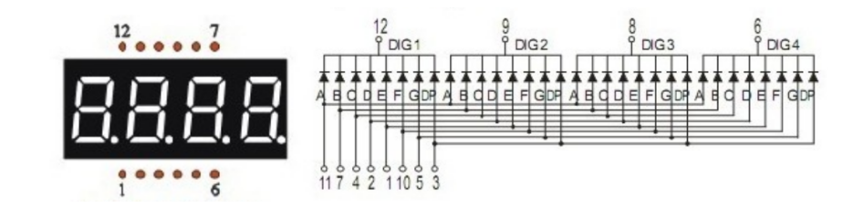
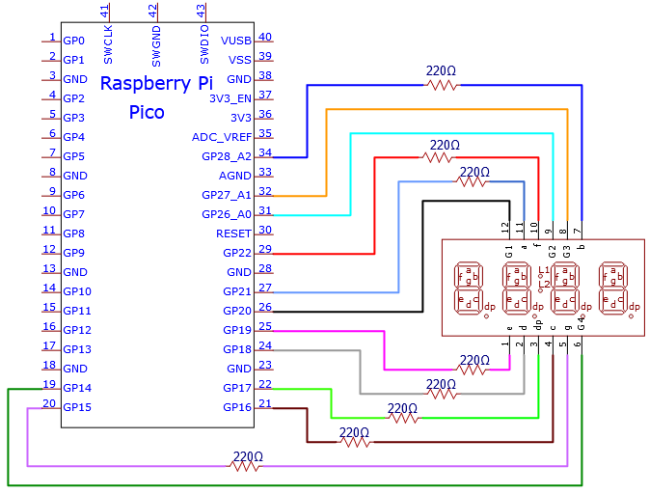
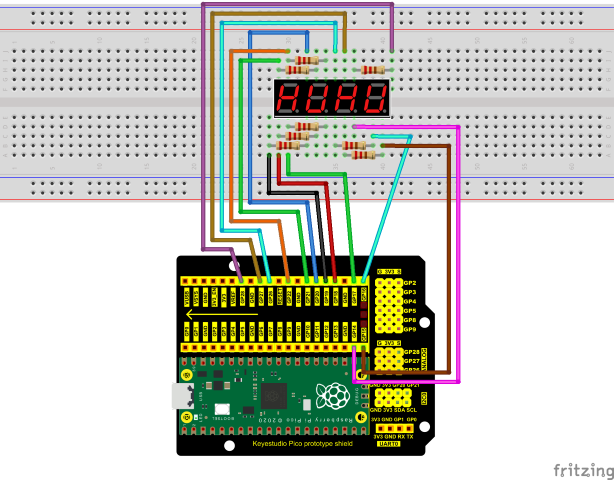
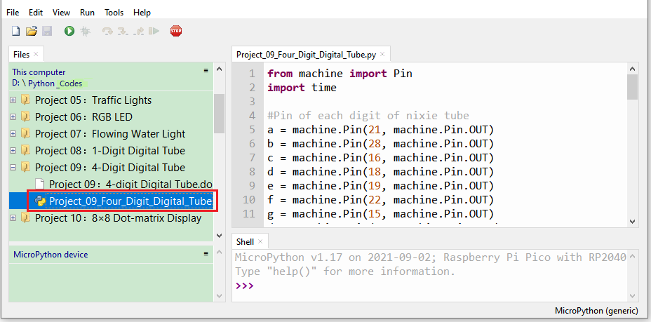
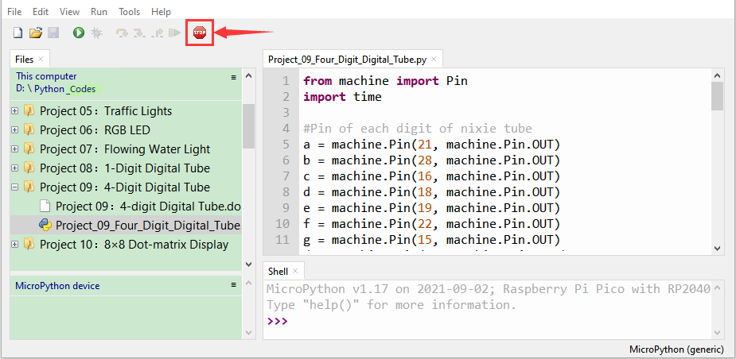
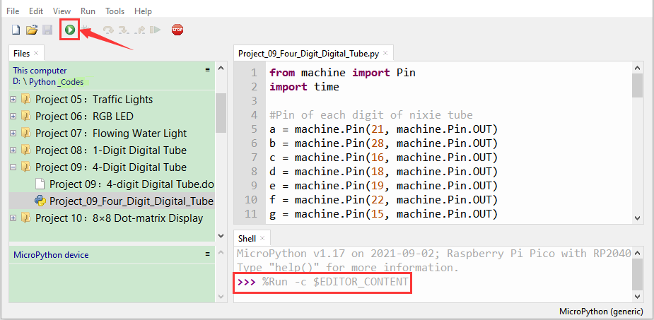

# Project 09：4-Digit Digital Tube

1.  **Introduction**
    

The 4-digit 7-segment digital tube is a very practical display device, and it is used for devices such as electronic clocks and score counters. Due to the low price and it is easy to use, more and more projects will use 4-digit 7-segment digital tubes. In this project, we will use the Raspberry Pi Pico to control a 4-bit 7-segment digital tube to create a manual counter.


2.  **Components Required**

<table>
<tbody>
<tr class="odd">
<td></td>
<td></td>
<td></td>
</tr>
<tr class="even">
<td>Raspberry Pi Pico*1</td>
<td>Raspberry Pi Pico Expansion Board*1</td>
<td></td>
</tr>
<tr class="odd">
<td></td>
<td></td>
<td></td>
</tr>
<tr class="even">
<td>4-Digit Digital Tube Module*1</td>
<td>220Ω Resistor*8</td>
<td>USB Cable*1</td>
</tr>
<tr class="odd">
<td><p></p>
<p></p></td>
<td></td>
<td></td>
</tr>
<tr class="even">
<td>Breadboard*1</td>
<td>Jumper Wires</td>
<td></td>
</tr>
</tbody>
</table>

1.  **Component Knowledge**


4-digital tube display:

The 4-digital tube display is is a semiconductor light-emitting device. Its basic unit is a light-emitting diode (LED). The digital tube display can be divided into 7-segment digital tube and 8-segment digital tube according to the number of segments. The 8-segment digital tube has one more LED unit than the 7-segment digital tube (used for decimal point display). Each segment of the 7-segment LED display is a separate LED.

According to the connection mode of the LED unit, the digital tube can be divided into a common anode digital tube and a common cathode digital tube.

In the common cathode 7-segment digital tube, all the cathodes (or negative electrodes) of the segmented LEDs are connected together, so you should connect the common cathode to GND. To light up a segmented LED, you can set its associated pin to“HIGH”.

Pins of control bit are G1, G2, G3 and G4.





4.  **Circuit Diagram and Wiring Diagram**





5.  **Test Code**

The code used in this tutorial is saved in the file **...\\Python_Codes**. You can move the code to anywhere,for example,we can save the **Python_Codes** file in the Disk(D), the route is <span style="color: rgb(0, 209, 0);">**D:\\Python_Codes**</span>.

Open“Thonny”, click“This computer”→“D:”→“Python_Codes”→“Project 09：4-Digit Digital Tube”. And double left-click the“Project\_09\_Four\_Digit\_Digital\_Tube.py”.



```python
from machine import Pin
import time
#Pin of each digit of nixie tube
a = machine.Pin(21, machine.Pin.OUT)
b = machine.Pin(28, machine.Pin.OUT)
c = machine.Pin(16, machine.Pin.OUT)
d = machine.Pin(18, machine.Pin.OUT)
e = machine.Pin(19, machine.Pin.OUT)
f = machine.Pin(22, machine.Pin.OUT)
g = machine.Pin(15, machine.Pin.OUT)
dp = machine.Pin(17, machine.Pin.OUT)
G1 = machine.Pin(20, machine.Pin.OUT)
G2 = machine.Pin(26, machine.Pin.OUT)
G3 = machine.Pin(27, machine.Pin.OUT)
G4 = machine.Pin(14, machine.Pin.OUT)
#digital tube a to dp corresponding development board pins
d_Pins=[machine.Pin(i,machine.Pin.OUT) for i in [21,28,16,18,19,22,15,17]]
#Pin corresponding to digital tube segment G1, G2, G3, and G4
w_Pins=[machine.Pin(i,machine.Pin.OUT) for i in [20,26,27,14]]
number=
def display(num,dp):
global number
count=0
for pin in d_Pins:#displays the value of num
pin.value(number[num][count])
count+=1
if dp==1:
d_Pins[7].value(0)
def clear():
for i in w_Pins:
i.value(0)
for i in d_Pins:
i.value(1)
def showData(num):
#the hundreds, thousands, ones, and fractional values of a numeric value
d_num=num
location=d_num.find('.')
if location>0:
d_num=d_num.replace('.','')
while len(d_num)<4:
d_num='0'+d_num
for i in range(0,4):
time.sleep(2)
clear()
w_Pins[3-i].value(1)
if i==location-1:
display(d_num[i],1)
else:
display(d_num[i],0)
if location<0:
for i in range(0,4):
time.sleep(2)
clear()
w_Pins[3-i].value(1)
display(d_num[i],0)
while True:
num='9016'
showData(num)
```


6.  **Test Result**
    
Ensure that the Raspberry Pi Pico is connected to the computer，click“Stop/Restart backend”.



Click“Run current script”, the code starts executing, we will see that the 4-digit digital tube circularly displays numbers from 0000 to 9999. Press“Ctrl+C”or click“Stop/Restart backend”to exit the program.


