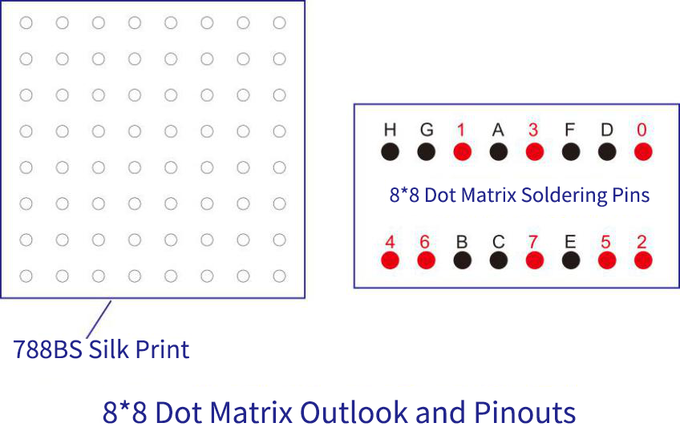

# Project 10：8×8 Dot-matrix Display

1.  **Introduction**

The dot-matrix display is an electronic digital display device that can show information on machines, clocks and many other devices. In this project, we will use the Raspberry Pi Pico to control the 8x8 LED dot matrix to light up.

2.  **Components Required**

<table>
<tbody>
<tr class="odd">
<td></td>
<td></td>
<td></td>
<td></td>
</tr>
<tr class="even">
<td>Raspberry Pi Pico*1</td>
<td>Raspberry Pi Pico Expansion Board*1</td>
<td>220Ω Resistor*8</td>
<td></td>
</tr>
<tr class="odd">
<td></td>
<td></td>
<td></td>
<td></td>
</tr>
<tr class="even">
<td>8*8 Dot-matrix Display *1</td>
<td>M-F Dupont Wires</td>
<td>USB Cable*1</td>
<td>Breadboard*1</td>
</tr>
</tbody>
</table>

3.  **Component Knowledge**

**8\*8 Dot-matrix display module:**

The 8\*8 dot matrix is composed of 64 LEDs, and each LED is placed at the intersection of a row and a column. When using a single-chip microcomputer to drive an 8\*8 dot matrix, we need to use a total of 16 digital ports, which greatly wastes the data of the single-chip microcomputer. For this reason, we specially designed this module, using the HT16K33 chip to drive an 8\*8 dot matrix, and only need to use the I2C communication port of the single-chip microcomputer to control the dot matrix, which greatly saves the microcontroller resources.




**4. Schematic diagram:**


**5. Test Code**

The code used in this tutorial is saved in the file **...\\Python_Codes**. You can move the code to anywhere,for example,we can save the **Python_Codes** file in the Disk(D), the route is <span style="color: rgb(0, 209, 0);">**D:\\Python_Codes**</span>.

Open“Thonny, click“This computer”→“D:”→“Python_Codes”→“Project 10：8×8 Dot-matrix Display”. And double left-click the“Project\_10\_8×8\_Dot\_Matrix\_Display.py”.


```python
from machine import Pin
import time
#Define the pin of the row and Set to output
row1 = machine.Pin(18, machine.Pin.OUT)
row2 = machine.Pin(26, machine.Pin.OUT)
row3 = machine.Pin(17, machine.Pin.OUT)
row4 = machine.Pin(21, machine.Pin.OUT)
row5 = machine.Pin(10, machine.Pin.OUT)
row6 = machine.Pin(16, machine.Pin.OUT)
row7 = machine.Pin(11, machine.Pin.OUT)
row8 = machine.Pin(14, machine.Pin.OUT)
#Define the pins of the column and Set to output
col1 = machine.Pin(22, machine.Pin.OUT)
col2 = machine.Pin(12, machine.Pin.OUT)
col3 = machine.Pin(13, machine.Pin.OUT)
col4 = machine.Pin(19, machine.Pin.OUT)
col5 = machine.Pin(15, machine.Pin.OUT)
col6 = machine.Pin(20, machine.Pin.OUT)
col7 = machine.Pin(27, machine.Pin.OUT)
col8 = machine.Pin(28, machine.Pin.OUT)
#Sets the pin of the column to low level
col1.value(0)
col2.value(0)
col3.value(0)
col4.value(0)
col5.value(0)
col6.value(0)
col7.value(0)
col8.value(0)
#Since the column of the lattice has been set to low level,
#the corresponding row of the lattice will light up when the pin of the row is at high level
def Row(d):
if(d ==1):
row1.value(1) #Light the first line
if(d ==2):
row2.value(1) #Light the second line
if(d ==3):
row3.value(1)
if(d ==4):
row4.value(1)
if(d ==5):
row5.value(1)
if(d ==6):
row6.value(1)
if(d ==7):
row7.value(1)
if(d ==8):
row8.value(1)
#Close the lattice
def off():
row1.value(0)
row2.value(0)
row3.value(0)
row4.value(0)
row5.value(0)
row6.value(0)
row7.value(0)
row8.value(0)
try:
print("test...")
while True:
for num in range(1,10): #Light the lattice line by line
Row(num)
if(num == 9): #Because the lattice has only 8 rows, and I'm limiting it here, is equal to 9
off() #Close the lattice
time.sleep(0.2)
except:
pass
```

6. **Test Result**

Ensure that the Raspberry Pi Pico is connected to the computer，click“Stop/Restart backend”.


Click“Run current script”, the code starts executing, we will see that the 8 x 8 dot matrix light up.

Press“Ctrl+C”or click“Stop/Restart backend”to exit the program.


