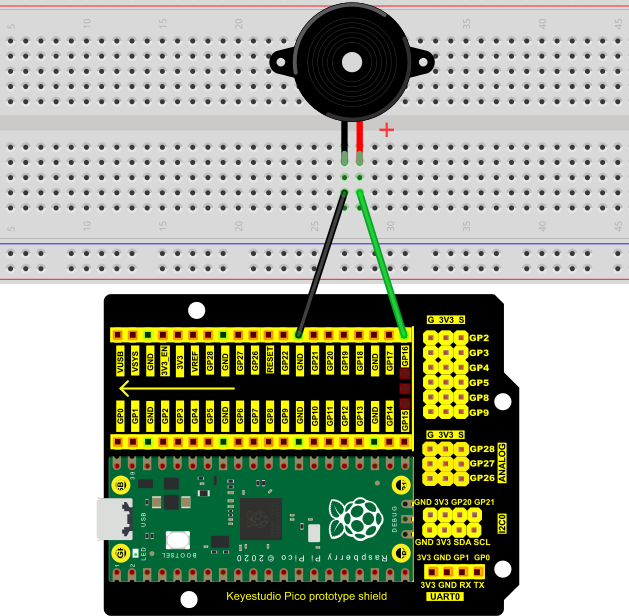
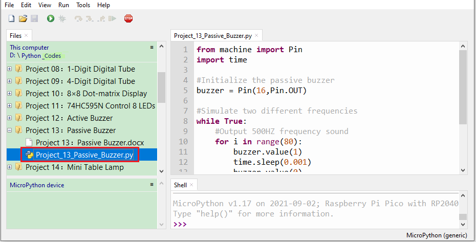
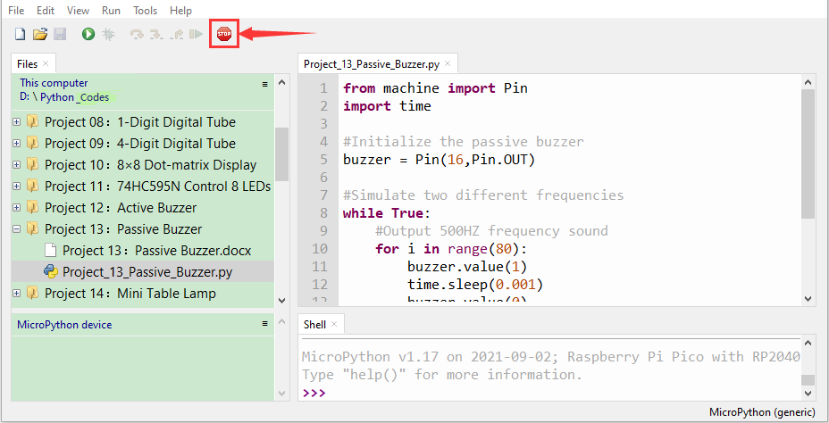
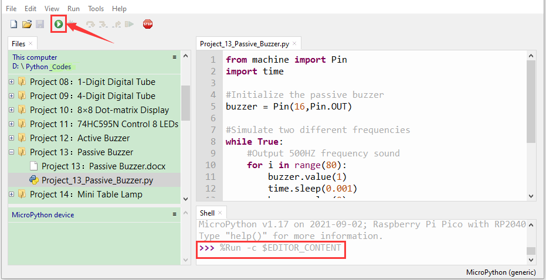

# Project 13：Passive Buzzer

1.  **Introduction**

In a previous project, we have learned an active buzzer, which can only produce one sound and may let you feel monotonous. In this project, we will learn a passive buzzer and use the Raspberry Pi Pico to control the passive buzzer to sound an alarm. Unlike the active buzzer, the passive buzzer can emit sounds of different frequencies.

2.  **Components Required**

<table>
<tbody>
<tr class="odd">
<td></td>
<td></td>
<td></td>
<td></td>
</tr>
<tr class="even">
<td>Raspberry Pi Pico*1</td>
<td>Raspberry Pi PicoExpansion Board*1</td>
<td></td>
<td></td>
</tr>
<tr class="odd">
<td></td>
<td></td>
<td></td>
<td></td>
</tr>
<tr class="even">
<td>Passive Buzzer*1</td>
<td>Breadboard*1</td>
<td>Jumper Wires</td>
<td>USB Cable*1</td>
</tr>
</tbody>
</table>

**3. Component Knowledge**


A passive buzzer is an integrated electronic buzzer with no internal vibration source. It must be driven by 2K to 5K square wave, not a DC signal. The two buzzers are very similar in appearance, but one buzzer with a green circuit board is a passive buzzer, while the other with black tape is an active buzzer. Passive buzzers cannot distinguish between positive polarity while active buzzers can.


**4. Circuit Diagram and Wiring Diagram**




**5. Test Code**

The code used in this tutorial is saved in the file **...\\Python_Codes**. You can move the code to anywhere,for example,we can save the **Python_Codes** file in the Disk(D), the route is <span style="color: rgb(0, 209, 0);">**D:\\Python_Codes**</span>.

Open“Thonny”, click“This computer”→“D:”→“Python_Codes”→“Project 13：Passive Buzzer”. And double left-click the“Project\_13\_Passive\_Buzzer.py”.



```python
from machine import Pin
import time
#Initialize the passive buzzer
buzzer = Pin(16,Pin.OUT)
#Simulate two different frequencies
while True:
#Output 500HZ frequency sound
for i in range(80):
buzzer.value(1)
time.sleep(0.001)
buzzer.value(0)
time.sleep(0.001)
#Output 250HZ frequency sound
for i in range(100):
buzzer.value(1)
time.sleep(0.002)
buzzer.value(0)
time.sleep(0.002)
```

6. **Test Result**

Ensure that the Raspberry Pi Pico is connected to the computer，click“Stop/Restart backend”.



Click“Run current script”, the code starts executing, we will see that the the passive buzzer sounds the alarm. Press“Ctrl+C”or click“Stop/Restart backend”to exit the program.


