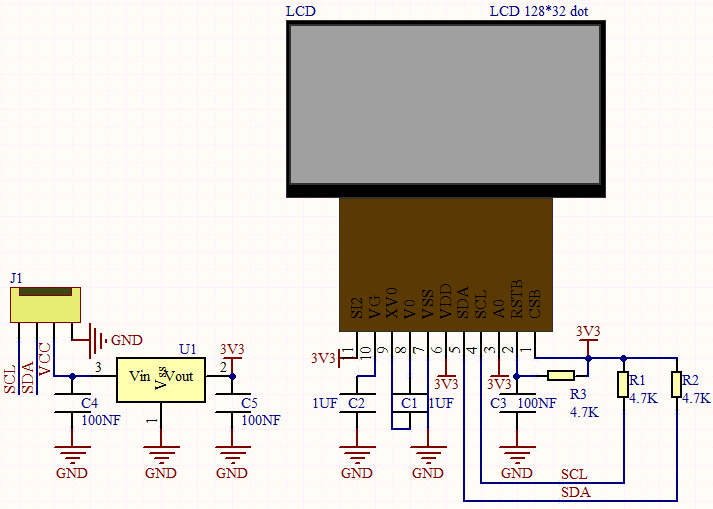
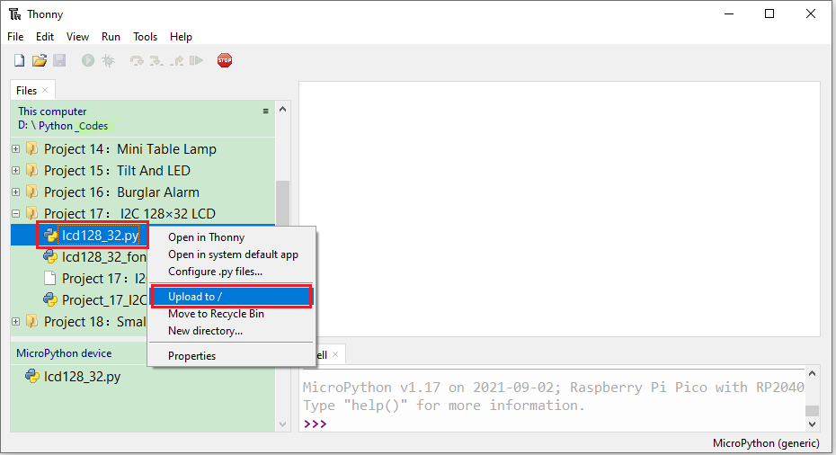
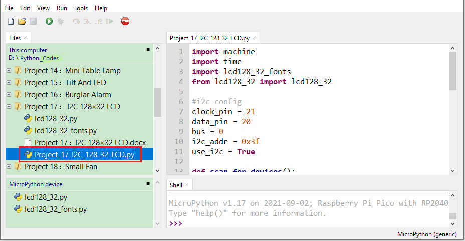
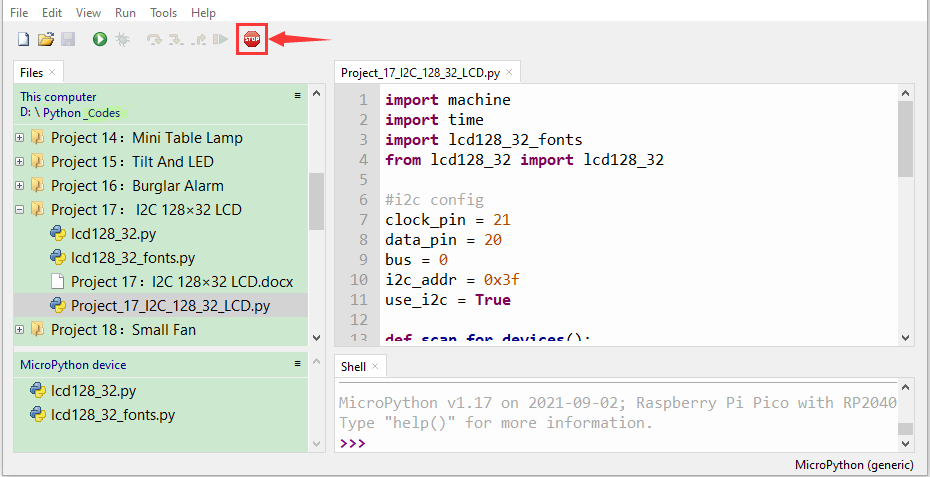
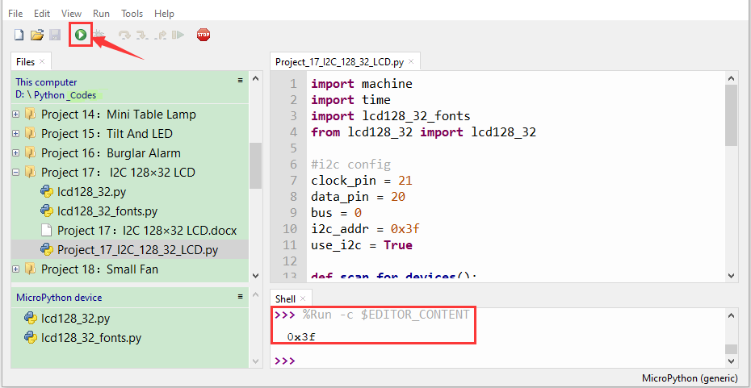

# Project 17: I2C 128×32 LCD

1.  **Introduction**
    

We can use modules such as monitors to do various experiments in life. You can also DIY a variety of small objects. For example, you can make a temperature meter with a temperature sensor and display, or make a distance meter with an ultrasonic module and display.
    
In this project, we will use the LCD\_128X32\_DOT module as a display and connect it to a Raspberry Pi Pico, which will be used to control the LCD\_128X32\_DOT display to show various English characters, common symbols and numbers.
    
2.  **Components Required**

<table>
<tbody>
<tr class="odd">
<td></td>
<td></td>
<td></td>
<td></td>
</tr>
<tr class="even">
<td>Raspberry Pi Pico*1</td>
<td>LCD_128X32_DOT*1</td>
<td>10CM M-F Dupont Wires</td>
<td>USB Cable*1</td>
</tr>
</tbody>
</table>

3.  **Component Knowledge**
    


**LCD\_128X32\_DOT:** It is an LCD module with 128\*32 pixels and its driver chip is ST7567A. The module uses the IIC communication mode, while the code contains a library of all alphabets and common symbols that can be called directly. When using, we can also set it in the code so that the English letters and symbols show different text sizes. To make it easy to set up the pattern display, we also provide a mold capture software that converts a specific pattern into control code and then copies it directly into the test code for use.

**Schematic diagram:**



**Features:**

Pixel: 128\*32 character

Operating voltage(chip)：4.5V to 5.5V

Operating current：100mA (5.0V)

Optimal operating voltage(module):5.0V

4.  **Circuit Diagram and Wiring Diagram**
    
<span style="color: rgb(255, 76, 65);">Note:</span> The LCD\_128X32\_DOT must be connected with 10CM M-F Dupont wires, which can make the LCD\_128X32\_DOT display normally. Otherwise, using 20CM M-F Dupont wires may cause the LCD\_128X32\_DOT display abnormally.  


5.  **Test Code**

The code used in this tutorial is saved in the file **...\\Python_Codes**. You can move the code to anywhere,for example,we can save the **Python_Codes** file in the Disk(D), the route is <span style="color: rgb(0, 209, 0);">**D:\\Python_Codes**</span>.

Open“Thonny”, click“This computer”→“D:”→“Python_Codes”→“Project 17： I2C 128×32 LCD”.

Select“lcd128\_32.py”and“lcd128\_32\_fonts.py”，right-click and select“**Upload to /**”，wait for the“lcd128\_32.py” and the “lcd128\_32\_fonts.py”to be uploaded to the Raspberry Pi Pico. And double left-click the“Project\_17\_I2C\_128\_32\_LCD.py”.






```python
import machine
import time
import lcd128_32_fonts
from lcd128_32 import lcd128_32
#i2c config
clock_pin = 21
data_pin = 20
bus = 0
i2c_addr = 0x3f
use_i2c = True
def scan_for_devices():
    i2c = machine.I2C(bus,sda=machine.Pin(data_pin),scl=machine.Pin(clock_pin))
    devices = i2c.scan()
    if devices:
        for d in devices:
            print(hex(d))
    else:
        print('no i2c devices')
if use_i2c:
    scan_for_devices()
    lcd = lcd128_32(data_pin, clock_pin, bus, i2c_addr)
lcd.Clear()
lcd.Cursor(0, 4)
lcd.Display("KEYESTUDIO")
lcd.Cursor(1, 0)
lcd.Display("ABCDEFGHIJKLMNOPQR")
lcd.Cursor(2, 0)
lcd.Display("123456789+-*/<>=$@")
lcd.Cursor(3, 0)
lcd.Display("%^&(){}:;'|?,.~\\[]")
"""
while True:
    scan_for_devices()
    time.sleep(0.5)
"""
```


6.  **Test Result**
    
Ensure that the Raspberry Pi Pico is connected to the computer，click“Stop/Restart backend”.
    

    
Click“Run current script”, the code starts executing, we will see that the LCD module display will show "KEYESTUDIO" at the first line. "ABCDEFGHIJKLMNOPQR" will be displayed at the second line. "123456789 + - \* / \<\> = $ @ " will be shown at the third line and "% ^ & () {} :; '|?,. \~ \\\\ \[\] " will be displayed at the fourth line. Press“Ctrl+C”or click“Stop/Restart backend”to exit the program.
    

