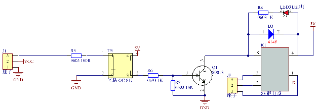
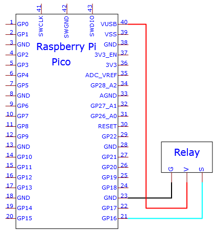
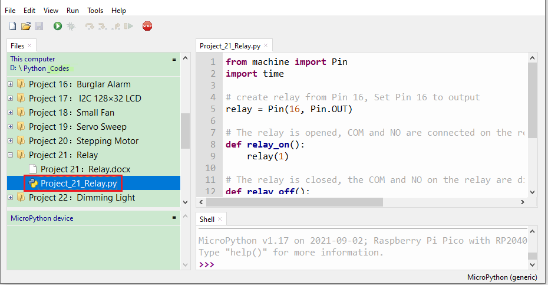
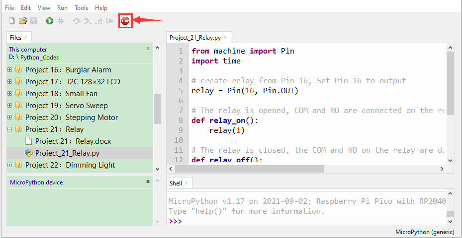
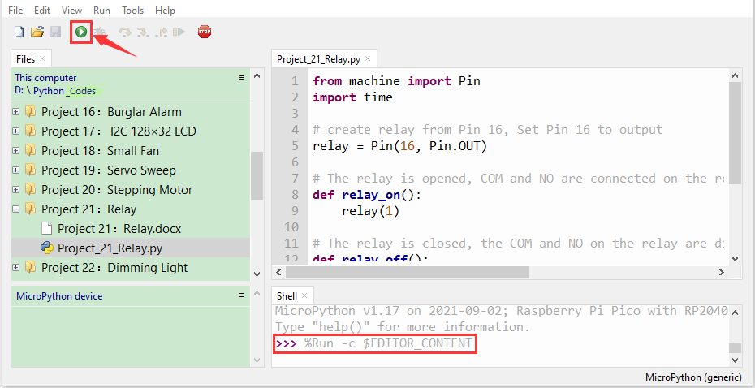

# Project 21：Relay

1.  **Introduction**
    

In daily life, we generally use AC to drive electrical equipment, and sometimes we use switches to control electrical appliances. If the switch is directly connected to the AC circuit, once electricity leakage occurs, people are in danger. From a safety point of view, we specially designed this relay module with NO (normally open) and NC (normally closed) terminals. In this lesson we will learn a special and easy-to-use switch, which is the relay module.
    
2.  **Components Required**

<table>
<tbody>
<tr class="odd">
<td><p></p></td>
<td></td>
<td></td>
<td></td>
<td></td>
</tr>
<tr class="even">
<td>Raspberry Pi Pico*1</td>
<td>Raspberry Pi Pico Expansion Board*1</td>
<td>Relay Module*1</td>
<td>M-F Dupont Wires</td>
<td>USB Cable*1</td>
</tr>
</tbody>
</table>

3.  **Component Knowledge**
    

**Relay:** It is an "automatic switch" that uses a small current to control the operation of a large current.
    
Input voltage：3.3V-5V
    
Rated load：5A 250VAC (NO/NC) 5A 24VDC (NO/NC)
    
The rated load means that devices with dc voltage of 24V or AC voltage of 250V can be controlled using 3.3V-5V microcontrollers.  
    
**Schematic diagram of the Relay:**




4.  **Wiring Diagram**




5.  **Test Code**

The code used in this tutorial is saved in the file **...\\Python_Codes**. You can move the code to anywhere,for example,we can save the **Python_Codes** file in the Disk(D), the route is <span style="color: rgb(0, 209, 0);">**D:\\Python_Codes**</span>.

Open“Thonny”, click“This computer”→“D:”→“Python_Codes”→“Project 21：Relay”. And double left-click the “Project\_21\_Relay.py”.



```python
from machine import Pin
import time
# create relay from Pin 16, Set Pin 16 to output
relay = Pin(16, Pin.OUT)
# The relay is opened, COM and NO are connected on the relay, and COM and NC are disconnected.
def relay_on():
relay(1)
# The relay is closed, the COM and NO on the relay are disconnected, and the COM and NC are connected.
def relay_off():
relay(0)
# Loop, the relay is on for one second and off for one second
while True:
relay_on()
time.sleep(1)
relay_off()
time.sleep(1)
```


6.  **Test Result**
    
Ensure that the Raspberry Pi Pico is connected to the computer，click“Stop/Restart backend”.



Click“Run current script”, the code starts executing, we will see that the relay will cycle on and off, on for 1 second, off for 1 second.  At the same time, you can hear the sound of the relay on and off, and you can also see the change of the indicator light on the relay. Press“Ctrl+C”or click“Stop/Restart backend”to exit the program.


