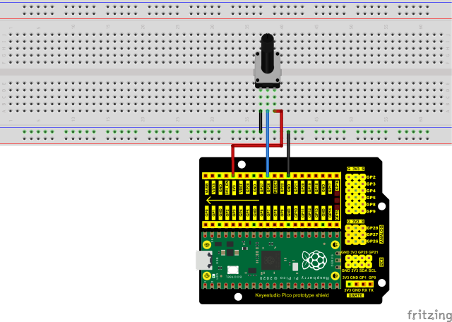
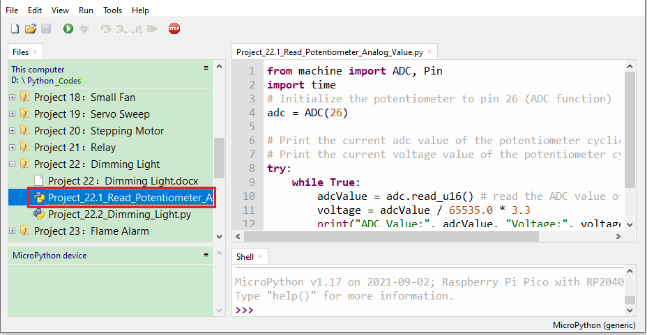
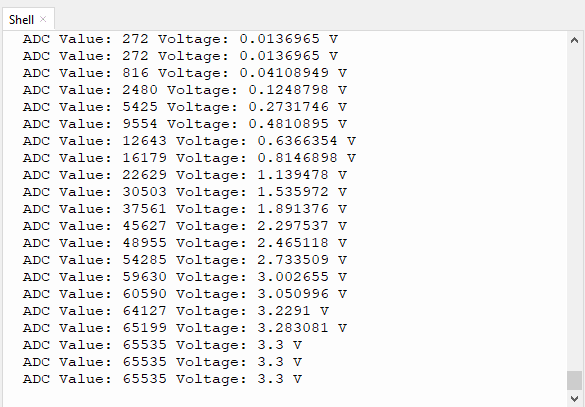

# Project 22 : Dimming Light

1.  **Introduction**

A potentiometer is a three-terminal resistor with a sliding or rotating contact that forms an adjustable voltage divider. It works by varying the position of a sliding contact across a uniform resistance. In a potentiometer, the entire input voltage is applied across the whole length of the resistor, and the output voltage is the voltage drop between the fixed and sliding contact.

In this project, we are going to learn how to use Raspberry Pi Pico to read the values of the potentiometer, and make a dimming lamp with LEDs.

2.  **Components Required**

<table>
<tbody>
<tr class="odd">
<td></td>
<td></td>
<td></td>
<td></td>
</tr>
<tr class="even">
<td>Raspberry Pi Pico*1</td>
<td>Raspberry Pi Pico Expansion Board*1</td>
<td>Potentiometer*1</td>
<td>Red LED*1</td>
</tr>
<tr class="odd">
<td></td>
<td></td>
<td></td>
<td></td>
</tr>
<tr class="even">
<td>Breadboard*1</td>
<td>220ΩResistor*1</td>
<td>Jumper Wires</td>
<td>USB Cable*1</td>
</tr>
</tbody>
</table>

3.  **Component Knowledge**
    


**Adjustable potentiometer:** It is a kind of resistor and an analog electronic component, which has two states of 0 and 1(high level and low level). The analog quantity is different, its data state presents a linear state such as 1 \~ 1024.

4.  **Read the Potentiometer Value**
    
We connect the adjustable potentiometer to the analog IO of the Raspberry Pi Pico to read its value and voltage value . Please refer to the following wiring diagram for wiring.




The code used in this tutorial is saved in the file **...\\Python_Codes**. You can move the code to anywhere,for example,we can save the **Python_Codes** file in the Disk(D), the route is <span "color: rgb(0, 209, 0);">**D:\\Python_Codes**</span>.

Open“Thonny, click“This computer”→“D:”→“Python_Codes”→“Project 22：Dimming Light”. And double left-click the“Project\_22.1\_Read\_Potentiometer\_Analog\_Value.py”.



```python
from machine import ADC, Pin
import time
# Initialize the potentiometer to pin 26 (ADC function)
adc = ADC(26)
# Print the current adc value of the potentiometer cyclically
# Print the current voltage value of the potentiometer cyclically
try:
while True:
adcValue = adc.read_u16() # read the ADC value of potentiometer
voltage = adcValue / 65535.0 * 3.3
print("ADC Value:", adcValue, "Voltage:", voltage, "V")
time.sleep(0.1)
except:
pass
```


Ensure that the Raspberry Pi Pico is connected to the computer，click “Stop/Restart backend”.


Click “Run current script”, the code starts executing, we will see that the "Shell" window of Thonny IDE will print the ADC value and voltage value of the potentiomete, turn the potentiometer handle, the ADC value and voltage value will change. Press“Ctrl+C”or click“Stop/Restart backend”to exit the program.




5.  **Circuit Diagram and Wiring Diagram**

In the last step, we read the value of the potentiometer, and now we need to convert the value of the potentiometer into the brightness of the LED to make a lamp that can adjust the brightness. The wiring diagram is as follows:


6.  **Test Result**

The code used in this tutorial is saved in the file **...\\Python_Codes**. You can move the code to anywhere,for example,we can save the **Python_Codes** file in the Disk(D), the route is <span "color: rgb(0, 209, 0);">**D:\\Python_Codes**</span>.

Open“Thonny”, click“This computer”→“D:”→“Python_Codes”→“Project 22：Dimming Light”. And double left-click the “Project\_22.2\_Dimming\_Light.py”.


```python
from machine import ADC, Pin, PWM
import time
adc = ADC(26) # Initialize the potentiometer to pin 26 (ADC function)
pwm = PWM(Pin(16)) # Initialize the led's PWM to pin 16
pwm.freq(1000) # Define the PWM frequency as 1000
try:
while True:
adcValue = adc.read_u16() # read the ADC value of potentiometer
pwm.duty_u16(adcValue) #map it to the duty cycle of PWM to control led brightness
time.sleep(0.1)
except:
pwm.deinit()
```


7.  **Test Result**
    
Ensure that the Raspberry Pi Pico is connected to the computer，click “Stop/Restart backend”.
    

    
Click “Run current script”, the code starts executing, we will see that turn the potentiometer handle and the brightness of the LED will change accordingly. Press“Ctrl+C”or click“Stop/Restart backend”to exit the program.
    


