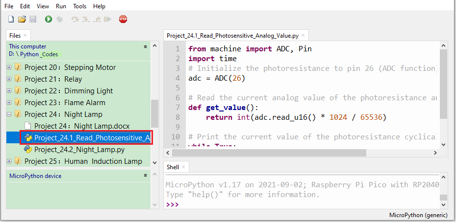
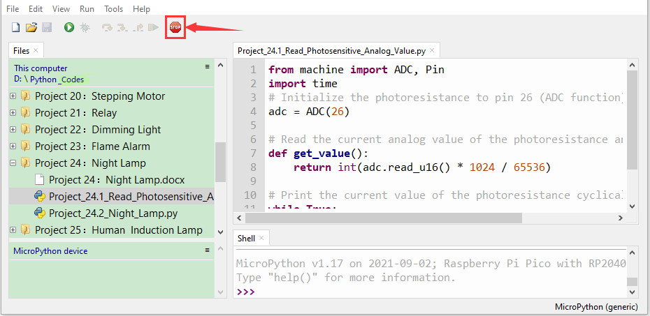
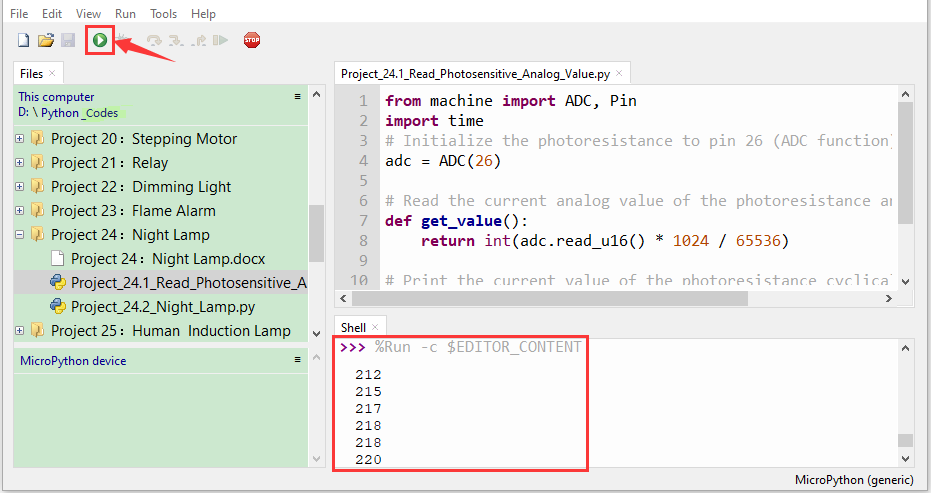
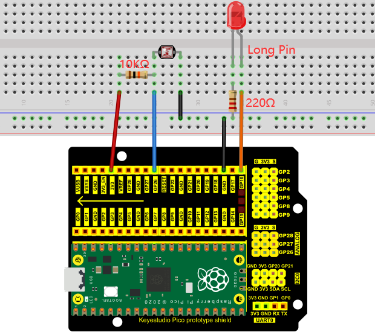
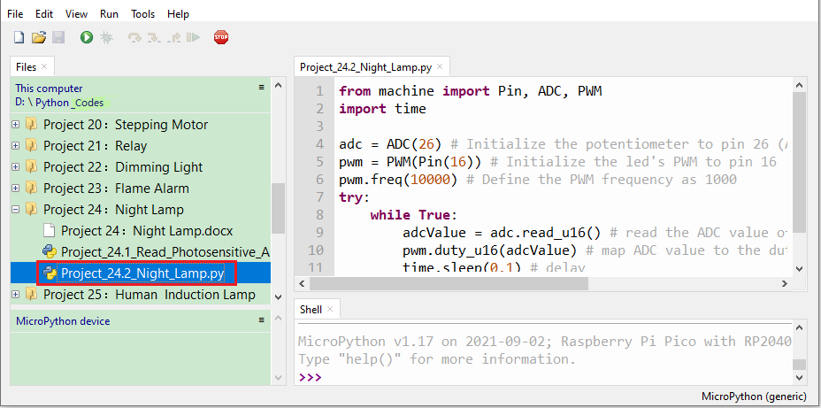
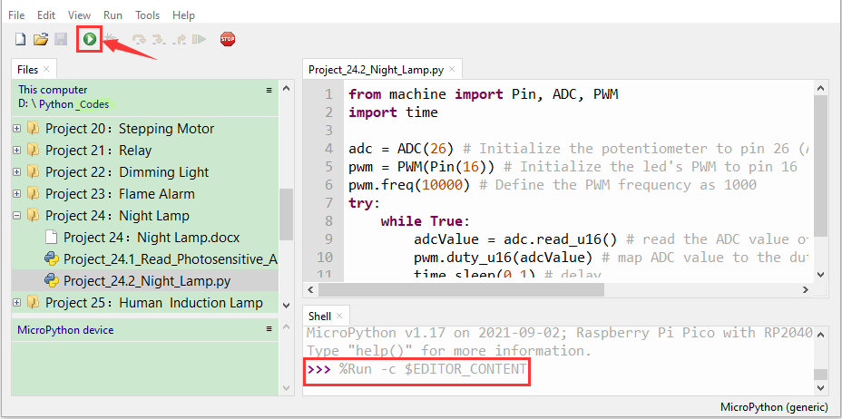

# Project 24：Night Lamp

1.  **Introduction**

Sensors or components are ubiquitous in our daily life. For example, some public street lights turn on automatically at night and turn off automatically during the day. Why? In fact, this make use of a photosensitive element that senses the intensity of external ambient light. When the outdoor brightness decreases at night, the street lights will automatically turn on. In the daytime, the street lights will automatically turn off. The principle of this is very simple. In this lesson we will use Raspberry Pi Pico to control LEDs to implement the function of this street light.

2.  **Components Required**

<table>
<tbody>
<tr class="odd">
<td><p></p></td>
<td></td>
<td></td>
<td></td>
<td></td>
</tr>
<tr class="even">
<td>Raspberry Pi Pico*1</td>
<td>Raspberry Pi Pico Expansion Board*1</td>
<td>Photoresistor*1</td>
<td>Red LED*1</td>
<td>10KΩResistor*1</td>
</tr>
<tr class="odd">
<td></td>
<td></td>
<td></td>
<td></td>
<td></td>
</tr>
<tr class="even">
<td>Breadboard*1</td>
<td>220ΩResistor*1</td>
<td>Jumper Wires</td>
<td>USB Cable*1</td>
<td></td>
</tr>
</tbody>
</table>

3.  **Component Knowledge**


It is a photosensitive resistor, its principle is that the photoresistor surface receives brightness (light) to reduce the resistance. The resistance value will change with the detected intensity of the ambient light . With this property, we can use photoresistors to detect light intensity.  Photoresistors and other electronic symbols are as follows:


The following circuit is used to detect changes in resistance values of photoresistors:


In the circuit above, when the resistance of the photoresistor changes due to the change of light intensity, the voltage between the photoresistor and resistance R2 will also change.  Thus, the intensity of light can be obtained by measuring this voltage.

4.  **Read the Analog Value**

We first use a simple code to read the value of the photoresistor, print it in the serial monitor. For wiring, please refer to the following wiring diagram.


The code used in this tutorial is saved in the file **...\\Python_Codes**. You can move the code to anywhere,for example,we can save the **Python_Codes** file in the Disk(D), the route is <span style="color: rgb(0, 209, 0);">**D:\\Python_Codes**</span>.

Open“Thonny”, click“This computer”→“D:”→“Python_Codes”→“Project 24：Night Lamp”. And double left-click
the“Project\_24.1\_Read\_Photosensitive\_Analog\_Value.py”.



```python
from machine import ADC, Pin
import time
# Initialize the photoresistance to pin 26 (ADC function)
adc = ADC(26)
# Read the current analog value of the photoresistance and return [0, 1023]
def get_value():
return int(adc.read_u16() * 1024 / 65536)
# Print the current value of the photoresistance cyclically, value=[0, 1023]
while True:
value = get_value()
print(value)
time.sleep(0.1)
```


Ensure that the Raspberry Pi Pico is connected to the computer，click “Stop/Restart backend”.



Click “Run current script”, the code starts executing, we will see that the "Shell" window of Thonny IDE will print the analog value read by the photoresistor. When the light intensity around the photoresistor is gradually reduced, the analog value will gradually increase. On the contrary, the analog value decreases gradually. Press“Ctrl+C”or click “Stop/Restart backend”to exit the program.




5.  **Circuit Diagram and Wiring Diagram**

We made a little dimmer in the front, now let's make a light controlled lamp. The principle is the same, the Raspberry Pi Pico will be used to obtain the analog value of the sensor and then adjust the brightness of the LED.  




6.  **Test Code**

The code used in this tutorial is saved in the file **...\\Python_Codes**. You can move the code to anywhere,for example,we can save the **Python_Codes** file in the Disk(D), the route is <span style="color: rgb(0, 209, 0);">**D:\\Python_Codes**</span>.

Open“Thonny”, click“This computer”→“D:”→“Python_Codes”→“Project24：Night Lamp”. And double left-click
the “Project\_24.2\_Night\_Lamp.py”.



```python
from machine import Pin, ADC, PWM
import time
adc = ADC(26) # Initialize the potentiometer to pin 26 (ADC function)
pwm = PWM(Pin(16)) # Initialize the led's PWM to pin 16
pwm.freq(10000) # Define the PWM frequency as 1000
try:
while True:
adcValue = adc.read_u16() # read the ADC value of photoresistance
pwm.duty_u16(adcValue) # map ADC value to the duty cycle of PWM to control led brightness
time.sleep(0.1) # delay
except:
pwm.deinit()
```


7.  **Test Result**
    
Ensure that the Raspberry Pi Pico is connected to the computer，click“Stop/Restart backend”.


Click “Run current script”, the code starts executing, we will see that when the intensity of light around the photoresistor is reduced, the LED will be bright, on the contraty, the LED will be dim. Press“Ctrl+C”or click“Stop/Restart backend”to exit the program.


