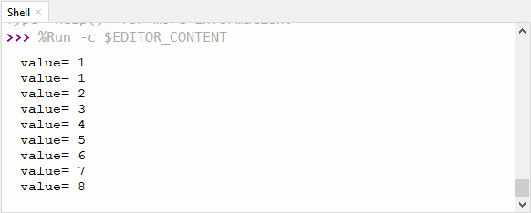

# Project 25：Human Induction Lamp

1.  **Introduction**
    

With the development of science and technology, the use of human induction lamp that usually used in the dark corridor area is very common in our real life, such as the corridor of the community, the bedroom of the room, the garage of the dungeon, the bathroom and so on. The human induction lamp are generally composed of a PIR Motion Sensor, a lamp, a photoresistor sensor and so on. In this project, we will learn how to use a PIR Motion Sensor, LEDs, and a photoresistor to make a human induction lamp .
    
2.  **Components Required**

<table>
<tbody>
<tr class="odd">
<td><p></p></td>
<td></td>
<td></td>
<td></td>
<td></td>
<td></td>
</tr>
<tr class="even">
<td>Raspberry Pi Pico*1</td>
<td>Raspberry Pi Pico Expansion Board*1</td>
<td>Photoresistor*1</td>
<td>Red LED*1</td>
<td>10KΩResistor*1</td>
<td></td>
</tr>
<tr class="odd">
<td></td>
<td></td>
<td></td>
<td></td>
<td></td>
<td></td>
</tr>
<tr class="even">
<td>Breadboard*1</td>
<td>PIR Motion Sensor*1</td>
<td>220ΩResistor*1</td>
<td>F-F Dupont Wires</td>
<td>Jumper Wires</td>
<td>USB Cable*1</td>
</tr>
</tbody>
</table>

3.  **Circuit Diagram and Wiring Diagram**


4.  **Test Code**

The code used in this tutorial is saved in the file **...\\Python_Codes**. You can move the code to anywhere,for example,we can save the **Python_Codes** file in the Disk(D), the route is <span "color: rgb(0, 209, 0);">**D:\\Python_Codes**</span>.

Open“Thonny”, click“This computer”→“D:”→“Python_Codes”→“Project 25：Human Induction Lamp”. And double left-click the “Project\_25\_Human\_ Induction\_Lamp.py”.


```python
from machine import Pin, ADC
import time
# Human infrared sensor pin
human = Pin(2, Pin.IN)
# Initialize the photosensitive sensor pin to GP26 (ADC function)
light = ADC(26)
#create the External LED object from Pin 16, Set Pin 16 to output
led1 = Pin(16, Pin.OUT)
#create the built-in LED on the Pico board from Pin 25, Set Pin 25 to output
led2 = Pin(25, Pin.OUT)
# Turn off the External LED
def led1_off():
led1.value(0)
# Turn on the External LED
def led1_on():
led1.value(1)
# Open the built-in LED on the Pico board
def led2_on():
led2.value(1)
# Close the built-in LED on the Pico board
def led2_off():
led2.value(0)
# Read the current analog value of the photosensitive sensor, range [0, 1023]
# The stronger the light intensity, the smaller the value.
def get_value():
return int(light.read_u16() * 1024 / 65536)
def detect_someone():
if human.value() == 1:
return True
return False
abc = 0
while True:
val = get_value()
# print('val=', val)
if val >= 500:
led2_on()
if detect_someone() == True:
abc += 1
led1_on()
print("value=", abc)
time.sleep(1)
else:
if abc != 0:
abc = 0
led1_off()
else:
led2_off()
led1_off()
time.sleep(0.1)
```


5.  **Test Result**
    
Ensure that the Raspberry Pi Pico is connected to the computer，click “Stop/Restart backend”.
    


Click “Run current script”, the code starts executing, we will see that when your hand covers the light-sensitive part of the photoresistor to simulate darkness, the Raspberry Pi Pico's built-in LED will light up. Then shake it in front of the PIR motion sensor with your other hand, the external LED will light up, too, and after a delay of a few seconds, the external LED will automatically turn off.  

At the same time, the "Shell" window of Thonny IDE will print the delay time when the external LED lights up . If the sensitive part of the photoresistor is not covered, you can see that the the Raspberry Pi Pico's built-in LED lights go out , at this time, shake in front of the PIR motion sensor with your hand, the external LED is off. Press“Ctrl+C”or click“Stop/Restart backend”to exit the program.



