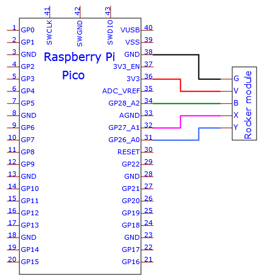
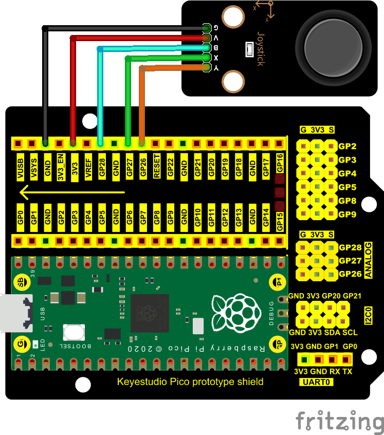
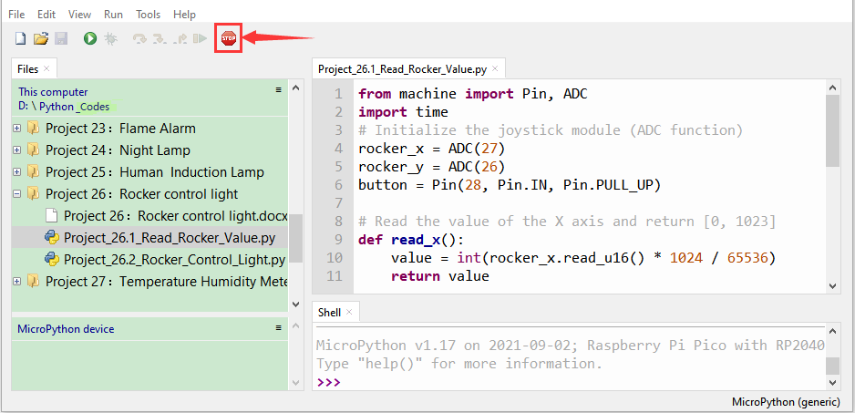
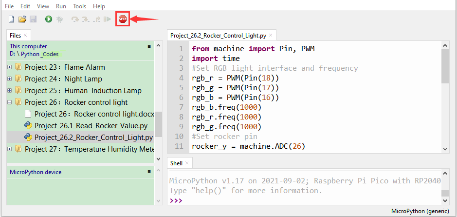

# Project 26：Rocker Control Light

1.  **Introduction**

The joystick module is a component with two analog inputs and one digital input. It is widely used in game operation, robot control, drone control and other fields.

In this project, we will use a Raspberry Pi Pico and a joystick module to control RGB. You can have a deeper understanding of the principle and operation of the joystick module in practice.

2.  **Components Required**

<table>
<tbody>
<tr class="odd">
<td></td>
<td></td>
<td></td>
<td></td>
<td></td>
<td></td>
</tr>
<tr class="even">
<td>Raspberry Pi Pico*1</td>
<td>Raspberry Pi Pico Expansion Board*1</td>
<td>Joystick Module*1</td>
<td></td>
<td></td>
<td></td>
</tr>
<tr class="odd">
<td></td>
<td></td>
<td></td>
<td></td>
<td></td>
<td></td>
</tr>
<tr class="even">
<td>RGB LED*1</td>
<td>220ΩResistor*3</td>
<td>Jumper Wires</td>
<td>USB Cable*1</td>
<td>M-F Dupont Wires</td>
<td>Breadboard*1</td>
</tr>
</tbody>
</table>

3.  **Component Knowledge**


**Joystick module**: It mainly uses PS2 joystick components. In fact, the joystick module has 3 signal terminal pins, which simulate a three-dimensional space. The pins of the joystick module are GND, VCC, and signal terminals (B, X, Y). The signal terminals X and Y simulate the X-axis and Y-axis of the space. When controlling, the X and Y signal terminals of the module are connected to the analog port of the microcontroller. The signal terminal B simulates the Z axis of the space, it is generally connected to the digital port and used as a button.

VCC is connected to the microcontroller power output VCC (3.3V or 5V), GND is connected to the microcontroller GND, the voltage in the original state is about 1.65V or 2.5V. In the X-axis direction, when moving in the direction of the arrow, the voltage value increases, and the maximum voltage can be reached. Moving in the opposite direction of the arrow, the voltage value gradually decreases to the minimum voltage. In the Y-axis direction, the voltage value decreases gradually as it moves in the direction of the arrow on the module, decreasing to the minimum voltage. 

As the arrow is moved in the opposite direction, the voltage value increases and can reach the maximum voltage. In the Z-axis direction, the signal terminal B is connected to the digital port and outputs 0 in the original state and outputs 1 when pressed. In this way, we can read the two analog values and the high and low level conditions of the digital port to determine the operating status of the joystick on the module.

**Features:**

- Input Voltage：DC 3.3V \~ 5V

- Output Signal：X/Y dual axis analog value +Z axis digital signal.

- Range of Application ：Suitable for control point coordinate movement in plane as well as control of two degrees of freedom steering gear, etc.  

- Product feature s：Exquisite appearance, joystick feel superior, simple operation, sensitive response, long service life.  

4.  **Read the Value**

We have to use analog Raspberry Pi Pico pin IO to read the data from X or Y pins, and use digital IO port to read the values of the button. Please follow the wiring diagram below for wiring.





The code used in this tutorial is saved in the file **...\\Python_Codes**. You can move the code to anywhere,for example,we can save the **Python_Codes** file in the Disk(D), the route is <span "color: rgb(0, 209, 0);">**D:\\Python_Codes**</span>.

Open“Thonny”, click“This computer”→“D:”→“Python_Codes”→“Project 26：Rocker control light”. And double left-click the“Project 26：Rocker control light.py”.


```python
from machine import Pin, ADC
import time
# Initialize the joystick module (ADC function)
rocker_x = ADC(27)
rocker_y = ADC(26)
button = Pin(28, Pin.IN, Pin.PULL_UP)
# Read the value of the X axis and return [0, 1023]
def read_x():
value = int(rocker_x.read_u16() * 1024 / 65536)
return value
# Read the value of Y axis and return [0, 1023]
def read_y():
value = int(rocker_y.read_u16() * 1024 / 65536)
return value
# Read the state of the button, press to return to True, release to return to False
def btn_state():
press = False
if button.value() == 0:
press = True
return press
# Print the current value of the X axis,Y axis,Z axis cyclically.
while True:
value_x = read_x()
value_y = read_y()
state = btn_state()
print("x:%d, y:%d, press:%s" % (value_x, value_y, state))
time.sleep(0.1)
```


Ensure that the Raspberry Pi Pico is connected to the computer，click “Stop/Restart backend”.



Click “Run current script”, the code starts executing, we will see that the "Shell" window of Thonny IDE will print the analog and digital values of the current joystick. Moving the joystick or pressing it will change the analog and digital values in "Shell". Press“Ctrl+C”or click“Stop/Restart backend”to exit the program.


5.  **Circuit Diagram and Wiring Diagram**

We just read the value of the joystick module. Now we need to do something with the joystick module and RGB, connecting according to the following diagram.


6.  **Test Code**

The code used in this tutorial is saved in the file **...\\Python_Codes**. You can move the code to anywhere,for example,we can save the **Python_Codes** file in the Disk(D), the route is <span "color: rgb(0, 209, 0);">**D:\\Python_Codes**</span>.

Open“Thonny”, click“This computer”→“D:”→“Python_Codes”→“Project 26：Rocker control light”. And double left-click the“Project 26：Rocker control light.py”.


```python
from machine import Pin, PWM
import time
#Set RGB light interface and frequency
rgb_r = PWM(Pin(18))
rgb_g = PWM(Pin(17))
rgb_b = PWM(Pin(16))
rgb_b.freq(1000)
rgb_r.freq(1000)
rgb_g.freq(1000)
#Set rocker pin
rocker_y = machine.ADC(26)
rocker_x = machine.ADC(27)
y=500
x=500
while True:
y = rocker_y.read_u16()#Get Y value of rocker
x = rocker_x.read_u16()#Get X value of rocker
if x < 6400: #left
 rgb_b.duty_u16(0)
rgb_r.duty_u16(65535)
rgb_g.duty_u16(0)
elif x > 38400: #right
rgb_b.duty_u16(0)
rgb_r.duty_u16(0)
rgb_g.duty_u16(65535)
elif y < 6400: #down
rgb_b.duty_u16(65535)
rgb_r.duty_u16(0)
rgb_g.duty_u16(0)
elif y > 38400: #up
rgb_b.duty_u16(65535)
rgb_r.duty_u16(65535)
rgb_g.duty_u16(65535)
time.sleep(0.01)
```


7.  **Test Result**
    
Ensure that the Raspberry Pi Pico is connected to the computer，click “Stop/Restart backend”.



Click “Run current script”, the code starts executing, we will see that ①If the joystick is moved to the far left in the X direction, the RGB light turns red. ② If the joystick is moved to the far right in the X direction, the RGB light turns green. ③If the joystick is moved to the top in the Y direction, the RGB light turns white. ④If the joystick is moved to the bottom in the Y direction, the RGB light turns blue. Press“Ctrl+C”or click“Stop/Restart backend”to exit the program.


