# KS3025 Keyestudio Raspberry Pi Pico Learning Kit Complete Edition

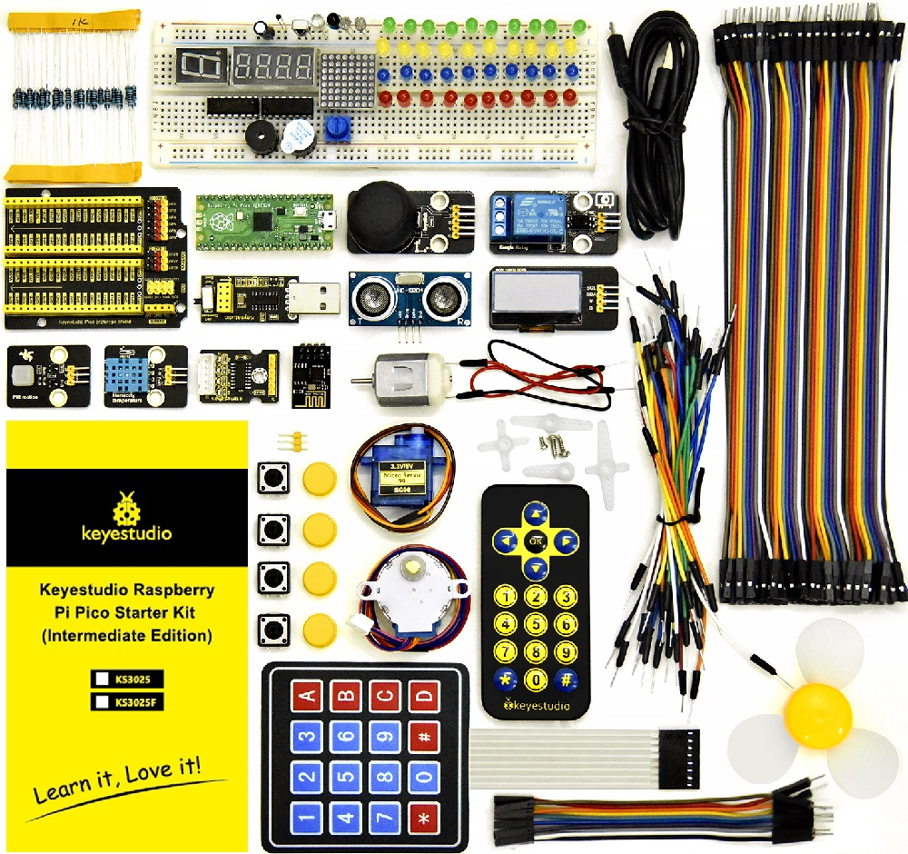

## Resources

**Note:** Download code, libraries and more details, please refer to the following link: [https://fs.keyestudio.com/KS3025](https://fs.keyestudio.com/KS3025)

## Description:

Do you want to learn about programming?

As long as you are passionate about science and dare to explore new things, this kit is surely the best choice for you.

The kit is a learning kit for two programming methods, including Thonny, MicroPython IDE and Arduino IDE.  you can create numerous fascinating experiments with the Raspberry pi, sensors, modules and electronic components. 

Tutorials are provided, which contain detailed wiring diagrams, component knowledge, test code, and so on. 

In addition, you can master the use of electronics, physics, science and programming by building up experiment with this kit.

## Kit List 

|                   NAME                   | QTY  |                             PIC                              |
| :--------------------------------------: | :--: | :----------------------------------------------------------: |
|            Raspberry Pi Pico             |  1   | 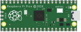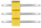 |
|                 Blue LED                 |  10  |  |
|                 Red LED                  |  10  |  |
|                Yellow LED                |  10  |  |
|                Green LED                 |  10  |  |
|                   RGB                    |  1   |  |
|              220Ω Resistor               |  10  | 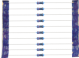 |
|              10KΩ Resistor               |  10  |  |
|               1KΩ Resistor               |  10  |  |
|    Raspberry Pi Pico Expansion Board     |  1   |  |
|            10KΩ Potentiometer            |  1   | 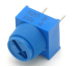 |
|              Active Buzzer               |  1   | 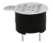 |
|              Passive Buzzer              |  1   |  |
|                  Button                  |  4   | 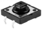 |
|               Tilt Switch                |  1   | 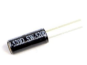 |
|              Photoresistor               |  2   |  |
|               Flame Sensor               |  1   | 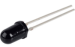 |
|                Yellow Cap                |  4   |  |
|               IC 74HC595N                |  1   |  |
|        ESP8266 Serial WiFi ESP-01        |  1   | 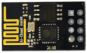 |
|           1-Digit Tube Display           |  1   |  |
|           4-Digit Tube Display           |  1   | 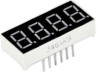 |
|          8*8 Dot Matrix Display          |  1   | 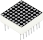 |
|     Temperature and Humidity Sensor      |  1   | 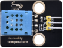 |
|              LCD_128X32_DOT              |  1   |  |
|               IR Receiver                |  1   | 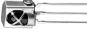 |
|           IR Remote Controller           |  1   |  |
|                  Servo                   |  1   | 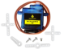 |
|           4*4 Membrane Keypad            |  1   | 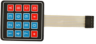 |
|                 IC L293D                 |  1   |                    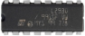                    |
| USB to ESP-01S WiFi Module Serial Shield |  1   | 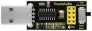 |
|        Stepper Motor Driver Board        |  1   |  |
|              Stepper Motor               |  1   | 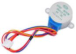 |
|             Joystick Module              |  1   | 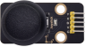 |
|             5V Relay Module              |  1   | 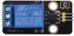 |
|            PIR Motion Sensor             |  1   | 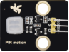 |
|          10CM M-F Dupont Wires           |  10  | 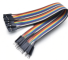 |
|            Ultrasonic Sensor             |  1   | 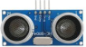 |
|             10KΩ Thermistor              |  1   | 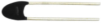 |
|             F-F Dupont Wire              |  40  |  |
|             Resistance Card              |  1   |  |
|               Jumper Wire                |  30  | 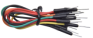 |
|             M-F Dupont Wire              |  40  |  |
|                Breadboard                |  1   | 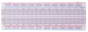 |
|                USB Cable                 |  1   |  |
|                   Fan                    |  1   | 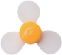 |
|                 DC Motor                 |  1   | 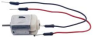 |

## Raspberry Pi Pico Board

### 1. Introduction：

Raspberry Pi Pico is a low-cost, high-performance microcontroller board with flexible digital interfaces. It integrates the RP2040 microcontroller chip designed by Raspberry Pi, with dual-core Arm Cortex M0+ processor running up to 133 MHz, embedded 264KB of SRAM and 2MB of on-board Flash memory, as well as 26 multi-function GPIO pins. 

For software development, either Raspberry Pi's C/C++ SDK, or the MicroPython is available. In this tutorial, we will use MicroPython.

### 2. Features：

- RP2040 microcontroller chip designed by Raspberry Pi

- Dual-core ARM Cortex M0+ processor, flexible clock running up to 133 MHz
    
- 264kB of SRAM, and 2MB of on-board Flash memory

- Castellated module allows soldering direct to carrier boards

- USB 1.1 Host and device support

- Low-power sleep and dormant modes

- Drag & drop programming using mass storage over USB

- 26 multi-function GPIO pins

- 2×SPI, 2×I2C, 2×UART, 3×12-bit ADC, 16×controllable PWM channels

- Accurate on-chip clock and timer

- Temperature sensor

- Accelerated floating point libraries on-chip

- 8×Programmable IO (PIO) state machines for custom peripheral support

### 3. Parameters：

- Microcontroller: RP2040 microcontroller chip

- CPU: Dual-core Arm Cortex-M0+ @ 133MHz

- USB-to-serial chip: Built-in USB1.1 PHY host and device support, drag-and-drop download program through USB identification as mass storage.

- Working voltage: 3.0V-3.6V

- Working current: average 80mA

- Supply current: 500mA

- External power supply: DC power supply is 6-12V (recommended 9V), USB power supply is 5V.

- Flash Memory: Built-in 2MB

- SRAM: Built-in 264KB

- Integrated crystal oscillator: 12MHz

### 4. Dimension Diagram：

### 5. Schematic Diagram：

### 6. Pin out：

| PIN            | FUCTION                                                      |
| -------------- | ------------------------------------------------------------ |
| GND            | Ground pin                                                   |
| Power          | VBUS(microUSB voltage), VSYS(2-5VDC input voltage), 3V3(3.3V output voltage), 3V3\_EN(Enables Pico) |
| System Control | run (enable or disable the RP2040 microcontroller or reset)  |
| ADC            | Raspberry Pi Pico has a total of 5 ADCs with a resolution of 12 bits, namely ADC0 (GP26), ADC1 (GP27), ADC2 (GP28), ADC3 (GP29), ADC4.  ADC3 (GP29) is used to measure VSYS on the Pico board. ADC4 is directly connected to the built-in temperature sensor of RP2040.  ADC\_VREF can be connected to an external accurate voltmeter as ADC reference.  The ADC\_GND pin serves as the ground reference. |
| PWM            | Raspberry Pi Pico has 16 PWM channels，each of channel can control frequency and duty cycle. GPIO pin is switched to PWM |
| UART           | Two UART： UART0, UART1                                      |
| I2C            | Two types of I2C： I2C0, I2C1                                |
| SPI            | Two types of SPI：SPI0, SPI1                                 |
| Debugging      | used in debugging code                                       |

**Related information**：[https://datasheets.raspberrypi.com/pico/pico-datasheet.pdf](https://datasheets.raspberrypi.com/pico/pico-datasheet.pdf)

